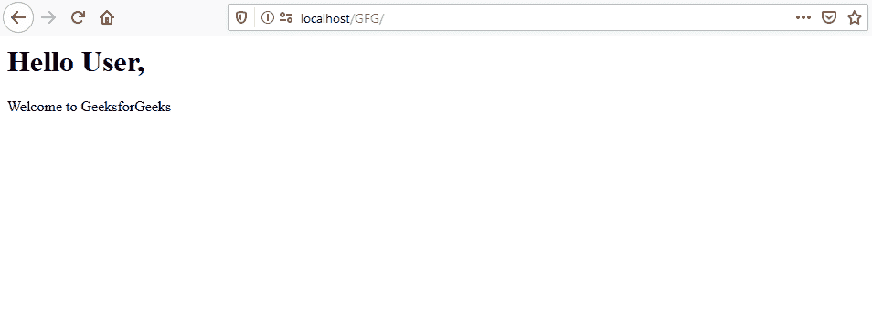
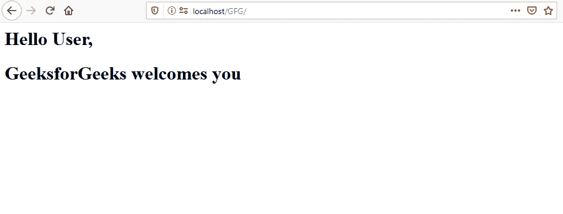
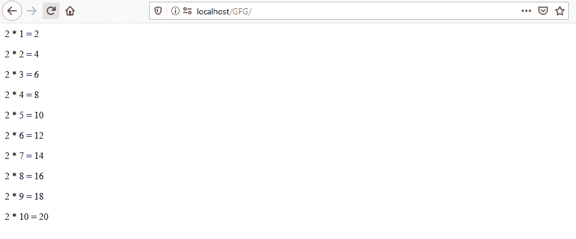
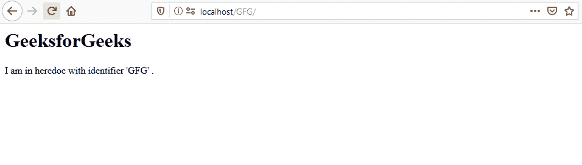

# 如何在 PHP 中回显 HTML？

> 原文:[https://www.geeksforgeeks.org/how-to-echo-html-in-php/](https://www.geeksforgeeks.org/how-to-echo-html-in-php/)

在用 [PHP](https://www.geeksforgeeks.org/php/) 做 web 应用的时候，我们经常需要以 [HTML](https://www.geeksforgeeks.org/html-tutorials/) 的形式打印或者回显一些结果。我们可以用许多不同的方法来完成这项任务。这里描述了一些方法:

1.  **Using [echo or print](https://www.geeksforgeeks.org/php-echo-print/):** PHP echo or print can be used to display HTML markup, javascript, text or variables.

    **示例 1:** 本示例使用 PHP echo 显示结果。

    ```php
    <?php 
        $name = "GeeksforGeeks";
        echo "<h1>Hello User, </h1> <p>Welcome to {$name}</p>";
    ?>
    ```

    **输出:**
    

    **示例 2:** 本示例使用 PHP 打印显示结果。

    ```php
    <?php 
        $name = "GeeksforGeeks";
        print "<h1>Hello User, </h1> <p>Welcome to {$name}</p>";
    ?>
    ```

    **输出:**
    

2.  **Using echo shorthand or separating HTML:** PHP echo shorthand can be used to display the result of any expression, value of any variable or HTML markup.

    **示例 1:** 本示例使用 PHP 回声速记来显示结果。

    ```php
    <?php 
        $name = "GeeksforGeeks";
    ?>

    <?= "<h1>Hello User,</h1>
        <h1>{$name} welcomes you</h1>" ?>
    ```

    **输出:**
    

    **例 2:** 从 PHP 中分离 HTML

    ```php
    <?php
        $num = 2;
        for ($i = 1; $i <= 10; $i++) { 
    ?>

        <p><?= $num ?> * <?= $i ?>
            = <?= $num * $i ?></p>

    <?php
        }
    ?>
    ```

    **输出:**
    

3.  **Using heredoc:** We can use **<<<** heredoc to print the html. **<<<** must be followed by an identifier and line break. The same identifier is used to close the body of heredoc.

    **语法:**

    ```php
    <<<GFG
    // HTML Markup
    GFG;

    ```

    **注意:**结束标识符不能缩进。

    **示例:**

    ```php
    <?php

    echo <<<GFG
        <h1>GeeksforGeeks</h1>
        <p>I am in heredoc with identifier 'GFG' .</p>
    GFG;

    ?>
    ```

    **输出:**
    

PHP 是一种专门为 web 开发设计的服务器端脚本语言。您可以通过以下 [PHP 教程](https://www.geeksforgeeks.org/php-tutorials/)和 [PHP 示例](https://www.geeksforgeeks.org/php-examples/)从头开始学习 PHP。