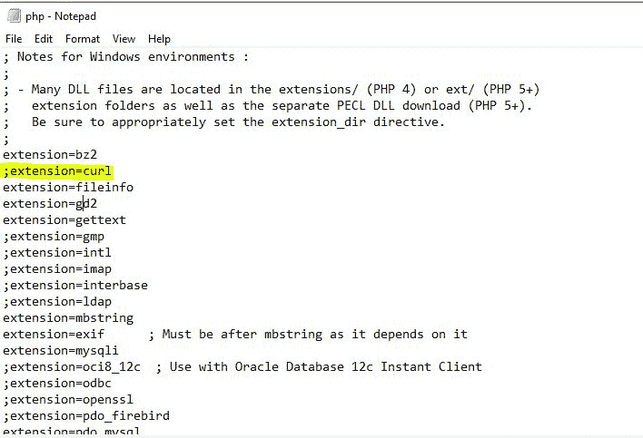
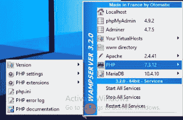
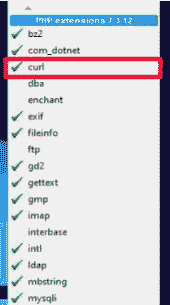
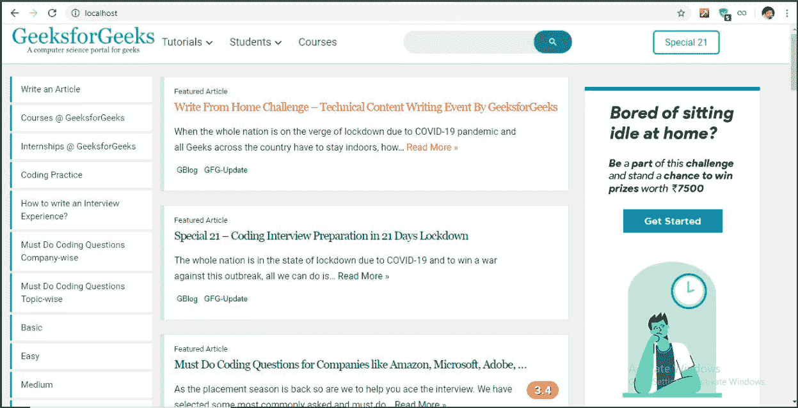

# 如何在 PHP 中启用 cURL？

> 原文:[https://www.geeksforgeeks.org/how-to-enable-curl-in-php/](https://www.geeksforgeeks.org/how-to-enable-curl-in-php/)

通常，网络应用程序需要基于 HTTP 的**用户标识**和**密码**认证、cookies 和表单上传。甚至，使用**谷歌**或**脸书**登录的用户认证都是通过 HTTP 完成的。在这些类型的情况下，我们需要请求一个特定的服务服务器(像谷歌的)在我们的服务器上进行用户验证和认证令牌。整个过程通过服务服务器的 API 进行。**CUlR**帮助我们的网络应用程序在 HTTP 级别上与那些应用程序接口进行交互/通信。

**cURL:** 这是一个由**丹尼尔·斯坦伯格**创建的图书馆。cURL 代表**客户端网址**。它允许我们与其他网址连接，并在我们的代码中使用它们的响应。CUlR 是一种从我们的代码中点击一个网址来获取 html 响应的方法。cURL 也用于数据传输的命令行或脚本中。关于 PHP 的 cURL 是一个库，它允许我们在 PHP 中发出 HTTP 请求。用 **curl_exec** 做 **GET/POST** 请求，接收其他服务器对 JSON 格式数据响应的响应，下载文件更容易。

**需要“启用”cURL:** 默认情况下，Apache 中不启用 cURL。如果我们试图在 Apache 中运行 CURL 程序而不启用 CURL，浏览器将会抛出一个错误。

```
Fatal error: Call to undefined function curl_init()
```

。
为了避免这种情况，我们需要在 Apache 服务器中启用 CURL 扩展，在不同的环境中使用以下方法。

**在 Apache 中启用 CURL:**通过配置 php.ini 文件在 Apache 中启用 CURL。

*   **第一步:**定位 **PHP.ini** 文件，大部分在服务器的根文件夹或者 **public_html** 然后在文本编辑器中打开 **PHP.ini**
*   **第二步:**搜索或找到**；扩展名=php_curl.dll** 用 Ctrl+F 并去掉分号“；”在它激活它之前。
*   **第三步:**用 Ctrl+S 保存并关闭 PHP.ini，从终端/CMD 重启 Apache

**在 WAMP 启用 cURL:**WAMP 是一个可用于 **Windows** 的软件栈，它将 Apache、MySQL 和 PHP 捆绑在一起。这是一个安装包，用于以无障碍图形用户界面引导的方式将三种网络技术一起安装在 Windows 环境中。

*   **步骤 1:** 左键单击屏幕右下角的 WAMP 服务器图标。
*   **第二步:** PHP - > PHP 扩展->T2】卷曲。

**在 Ubuntu 中启用 CURL:**运行以下命令:

*   这个命令安装 PHP CURL。

    ```
    sudo apt-get install php5-curl
    ```

*   该命令从 Apache 服务器开始。

    ```
    sudo service apache2 restart
    ```

**检查 cURL 是否启用:**如果我们尝试在没有启用 CURL 的情况下运行一个 cURL PHP 程序，浏览器会抛出以下错误。
T3】

*   **例:**

    ```
    <?php
            // Create curl resource
            $ch = curl_init();

            // set url
            curl_setopt($ch, CURLOPT_URL, "https://www.geeksforgeeks.org/");

            // Return the transfer as a string
            curl_setopt($ch, CURLOPT_RETURNTRANSFER, 1);

            // $output contains the output string
            $output = curl_exec($ch);

            echo $output;

            // Close curl resource to free up system resources
            curl_close($ch);     
    ?>
    ```

*   **输出:**这一页 GeekforGeeks 现在在我运行 Apache 服务器的本地主机上呈现。HTML 内容作为输出被“回显”。

PHP 是一种专门为 web 开发设计的服务器端脚本语言。您可以通过以下 [PHP 教程](https://www.geeksforgeeks.org/php-tutorials/)和 [PHP 示例](https://www.geeksforgeeks.org/php-examples/)从头开始学习 PHP。