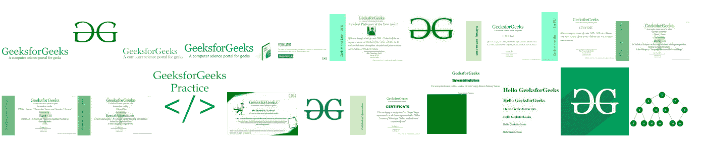
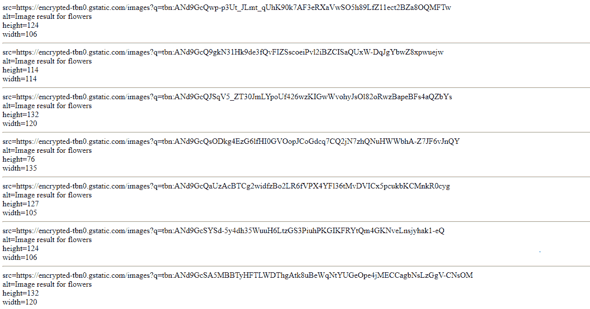

# 如何用 PHP 从 html 中提取 img src 和 alt？

> 原文:[https://www . geesforgeks . org/how-extract-img-src-and-alt-from-html-using-PHP/](https://www.geeksforgeeks.org/how-to-extract-img-src-and-alt-from-html-using-php/)

使用 PHP 从网页中提取图像属性，如“src”、“alt”、“height”、“width”等。这项任务可以通过以下步骤完成。

*   在变量(DOM 变量)中加载 HTML 内容。
*   选择该文档中的每个图像。
*   选择属性并将其内容保存到变量中。
*   输出为 HTML img 对象或所需的普通值。

**示例 1:** 本示例将图像对象显示为输出。

```php
<?php
// error_reporting(0);

function crawl_page($url) {

    $dom = new DOMDocument('1.0');

    // Loading HTML content in $dom
    @$dom->loadHTMLFile($url);

    // Selecting all image i.e. img tag object
    $anchors = $dom -> getElementsByTagName('img');

    // Extracting attribute from each object
    foreach ($anchors as $element) {

        // Extracting value of src attribute of
        // the current image object
        $src = $element -> getAttribute('src');

        // Extracting value of alt attribute of
        // the current image object
        $alt = $element -> getAttribute('alt');

        // Extracting value of height attribute
        // of the current image object
        $height = $element -> getAttribute('height');

        // Extracting value of width attribute of
        // the current image object
        $width = $element -> getAttribute('width');

        // Given Output as image with extracted attribute,
        // you can print value of those attributes also
        echo '';
    }
} 

crawl_page("https://www.google.com/search?q=geeksforgeeks&tbm=isch");

?>
```

**输出:**


**示例 2:** 本示例显示图像对象的属性。

```php
<?php
// error_reporting(0);

function crawl_page($url) {

    $dom = new DOMDocument('1.0');

    // Loading HTML content in $dom
    @$dom->loadHTMLFile($url);

    // Selecting all image i.e. img tag object
    $anchors = $dom -> getElementsByTagName('img');

    // Extracting attribute from each object
    foreach ($anchors as $element) {

        // Extracting value of src attribute of
        // the current image object
        $src = $element -> getAttribute('src');

        // Extracting value of alt attribute of
        // the current image object
        $alt = $element -> getAttribute('alt');

        // Extracting value of height attribute
        // of the current image object
        $height = $element -> getAttribute('height');

        // Extracting value of width attribute of
        // the current image object
        $width = $element -> getAttribute('width');

        // Display Output as value of those attributes
        echo 'src='.$src.'<br> alt='.$alt.'<br> height='
                . $height.'<br> width='.$width.'<hr>';
    }
} 

crawl_page("https://www.google.com/search?q=flowers&tbm=isch");

?>
```

**输出:**
