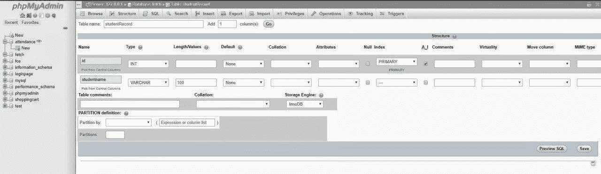
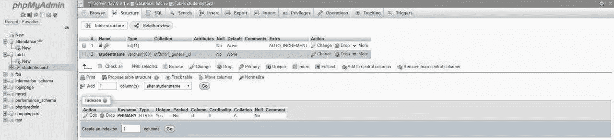
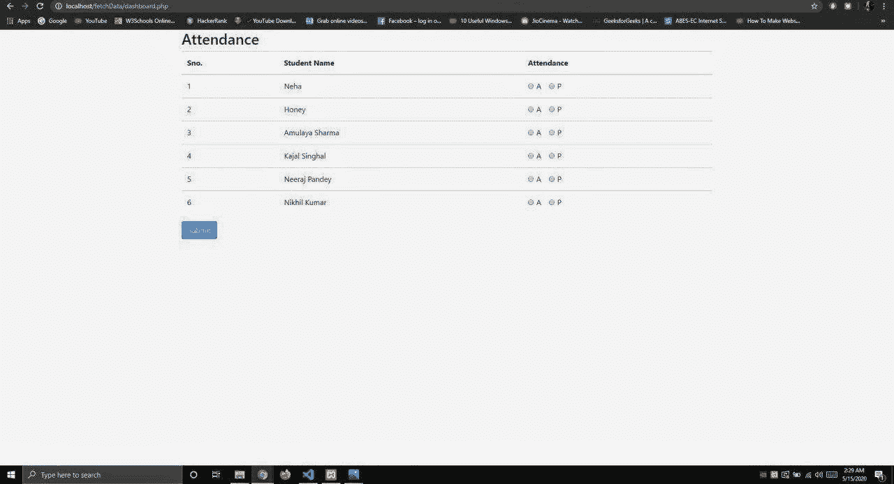

# 如何使用循环从 PHP PDO 的数据库中获取数据？

> 原文:[https://www . geesforgeks . org/如何从 PHP-PDO-use-loop 数据库中获取数据/](https://www.geeksforgeeks.org/how-to-fetch-data-from-database-in-php-pdo-using-loop/)

PDO (PHP 数据对象)定义了用 PHP 访问数据库的轻量级、一致的接口。

**按照 PHP pdo 中的步骤从数据库中获取数据:**

**1。创建数据库:**使用 XAMPP 创建一个数据库，这个数据库在这里被命名为“fetch”。你可以给你的数据库起任何名字。
T3】

**2。创建表:**在“提取”数据库中创建表“studentRecord”。
T3】

**3。创建表结构:**包含 2 个字段的表“学生记录”。

*   id-主键-自动递增
*   studentname-varchar(100)

学生名称的数据类型是 **varchar** 。尺寸可以根据需要改变。但是，100 就足够了，“id”的数据类型是 **int** ，并且是**主键**。将主键设置为自动递增，以便 id 的值自动增加。
一个**主键**，也称为主关键字，是关系数据库中的一个键，对于每个记录都是唯一的。它是一个唯一的标识符，例如驾照号码、电话号码(包括区号)或车辆识别号(VIN)。


表格的结构会是这样的


**4。插入学生记录:**这里我只取了学生的姓名和身份证。您可以根据需要添加更多字段。
T3】

**或**可以编写 sql 查询来插入值。
T3】

插入信息后，表格将如下所示。


**5。创建一个文件夹“fetch”，其中包括以下两个文件:**该文件夹应该在**“D:\ xampp \ htdocs \ "**(或安装您的 xampp 的地方)。

**5.1。index.php:** 这里 **foreach** 构造提供了一种迭代数组的简单方法。foreach 仅适用于数组和对象，当您试图在具有不同数据类型的变量或未初始化的变量上使用它时，它会发出错误。有两种语法:

```html
foreach (array_expression as $value)
    statement

foreach (array_expression as $key => $value)
    statement 
```

下面的 SQL 查询用于从表中获取所有数据。

```html
SELECT * FROM studentrecord;
```

**示例:**

```html
<!DOCTYPE html>
<html lang="en">

<head>
    <meta charset="UTF-8">
    <meta name="viewport" content=
        "width=device-width, initial-scale=1.0">
    <meta http-equiv="X-UA-Compatible" content="ie=edge">

    <link rel="stylesheet" href=
"https://maxcdn.bootstrapcdn.com/bootstrap/4.3.1/css/bootstrap.min.css">
    <title>Attendance Page</title>
</head>

<body>
    <div class="container">
        <div class="row">
            <h2>Attendance</h2>
            <table class="table table-hover">
                <thead>
                    <tr>
                        <th>Sno.</th>
                        <th>Student Name</th>
                        <th>Attendance</th>
                    </tr>
                </thead>

                <tbody>
                    <?php 
                           include_once('connection.php');
                           $a=1;
                           $stmt = $conn->prepare(
                                "SELECT * FROM studentrecord");
                           $stmt->execute();
                           $users = $stmt->fetchAll();
                           foreach($users as $user) 
                        {  
                    ?>
                    <tr>
                        <td>
                            <?php echo $user['id']; ?>
                        </td>
                        <td>
                            <?php echo $user['studentname']; ?>
                        </td>

                        <td>
                            <div class="form-check form-check-inline">
                                <input class="form-check-input" 
                                        type="radio" name="''" 

                                        id="inlineRadio1"
                                    value="'..$a..'">
                                <label class="form-check-label" 
                                    for="inlineRadio1">A</label>
                            </div>

                            <div class="form-check form-check-inline">
                                <input class="form-check-input" 
                                    type="radio" name="'..$a..'"
                                    id="inlineRadio2" value="option2">

                                <label class="form-check-label" 
                                    for="inlineRadio2">P</label>
                            </div>
                        </td>
                    </tr>
                    <?php
                    }
                    ?>
                </tbody>
            </table>

            <input class="btn btn-primary" 
                    type="submit" value="Submit">
        </div>
    </div>
</body>

</html>
```

**5.2。connection.php:**

```html
<?php

$conn = "";

try {
    $servername = "localhost:3306";
    $dbname = "fetch";
    $username = "root";
    $password = "";

    $conn = new PDO(
        "mysql:host=$servername; dbname=fetch",
        $username, $password
    );

    $conn->setAttribute(PDO::ATTR_ERRMODE, 
                PDO::ERRMODE_EXCEPTION);

} catch(PDOException $e) {
    echo "Connection failed: " 
        . $e->getMessage();
}

?>
```

**6。完成所有这些步骤后，现在执行以下步骤:**

1.  经营 XAMPP
2.  启动 Apache 服务器和 MySQL
3.  在浏览器中输入 *<u>。</u>*

这个表看起来像这样，这就是在 PHP PDO 中从数据库获取信息的方式。
