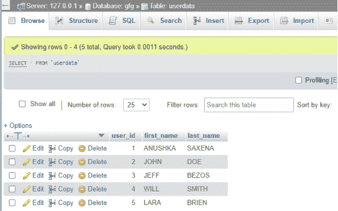

# 如何使用 PHP 在一个文本框中输入输入，从数据库自动填充所有输入字段？

> 原文:[https://www . geeksforgeeks . org/如何使用-php/](https://www.geeksforgeeks.org/how-to-fill-all-input-fields-automatically-from-database-by-entering-input-in-one-textbox-using-php/) 通过在一个文本框中输入输入来自动填充所有输入字段

[XAMPP](https://www.geeksforgeeks.org/how-to-install-xampp-on-windows/) 是 Apache Friends 开发的免费开源跨平台 web 服务器解决方案，主要由 Apache HTTP Server、MySQL 数据库和用 PHP 编程语言编写的脚本解释器组成。XAMPP 服务器帮助启动 Apache 和 MySQL，并用 PHP 文件连接它们。

**方法:**我们需要使用 [phpMyAdmin](https://www.geeksforgeeks.org/basics-of-phpmyadmin/) 工具在本地主机服务器中创建一个 MySQL 数据库。我们创建一个 HTML 表单，其中包含用 PHP 代码链接的输入字段。PHP 用于连接本地主机服务器，并通过执行 MySQL 查询从数据库表中获取数据。参考 GFG 的文章: [使用 XAMPP](https://www.geeksforgeeks.org/php-program-fetch-data-localhost-server-database-using-xampp/) 从本地主机服务器数据库获取数据的 PHP 程序

考虑一下，我们有一个名为 *gfg* 的数据库，一个名为 *userdata* 的表。对于[从数据库中获取](https://www.geeksforgeeks.org/php-program-fetch-data-localhost-server-database-using-xampp/)数据而不重新加载页面或提交对应于一个字段的用户输入的其他输入字段，实现如下。提取的数据以相同的 HTML 形式显示。

**创建数据库:**



**它是如何工作的？**

[XMLHttpRequest](https://www.geeksforgeeks.org/ajax-introduction/) 对象可用于向网络服务器请求数据，更新网页而无需重新加载页面。您可以按向上键、向下键或模糊第一个文本框来触发调用。

**示例:**假设在相应的输入字段中输入*用户 id* 。如果数据库中存在*用户 id* ，则 XMLHttpRequest 对象从数据库中获取与该*用户 id* 对应的*名*和*姓*的值。它会用您在响应中获得的数据替换其他输入文本框的 *innerHtml* 。

**执行步骤:**

**创建你的 HTML 网页**

## 超文本标记语言

```phphtml
<html>

<head>
    <script src=
        "https://code.jquery.com/jquery-3.2.1.min.js">
    </script>

    <script src=
"https://maxcdn.bootstrapcdn.com/bootstrap/3.3.7/js/bootstrap.min.js"
        type="text/javascript">
    </script>

    <link rel="stylesheet" href=
"https://maxcdn.bootstrapcdn.com/bootstrap/3.3.7/css/bootstrap.min.css">

    <script src=
"https://ajax.googleapis.com/ajax/libs/jquery/3.4.1/jquery.min.js">
    </script>
</head>

<body>
    <div class="container">
        <h1>GeeksForGeeks</h1>
        <div class="row">
            <div class="col-lg-6">
                <div class="form-group">
                    <label>User Id</label>
                    <input type='text' name="user_id" 
                        id='user_id' class='form-control'
                        placeholder='Enter user id'
                        onkeyup="GetDetail(this.value)" value="">
                </div>
            </div>
        </div>
        <div class="row">
            <div class="col-lg-6">
                <div class="form-group">
                    <label>First Name:</label>
                    <input type="text" name="first_name" 
                        id="first_name" class="form-control"
                        placeholder='First Name'
                        value="">
                </div>
            </div>
        </div>
        <div class="row">
            <div class="col-lg-6">
                <div class="form-group">
                    <label>Last Name:</label>
                    <input type="text" name="last_name" 
                        id="last_name" class="form-control"
                        placeholder='Last Name'
                        value="">
                </div>
            </div>
        </div>
    </div>
    <script>

        // onkeyup event will occur when the user 
        // release the key and calls the function
        // assigned to this event
        function GetDetail(str) {
            if (str.length == 0) {
                document.getElementById("first_name").value = "";
                document.getElementById("last_name").value = "";
                return;
            }
            else {

                // Creates a new XMLHttpRequest object
                var xmlhttp = new XMLHttpRequest();
                xmlhttp.onreadystatechange = function () {

                    // Defines a function to be called when
                    // the readyState property changes
                    if (this.readyState == 4 && 
                            this.status == 200) {

                        // Typical action to be performed
                        // when the document is ready
                        var myObj = JSON.parse(this.responseText);

                        // Returns the response data as a
                        // string and store this array in
                        // a variable assign the value 
                        // received to first name input field

                        document.getElementById
                            ("first_name").value = myObj[0];

                        // Assign the value received to
                        // last name input field
                        document.getElementById(
                            "last_name").value = myObj[1];
                    }
                };

                // xhttp.open("GET", "filename", true);
                xmlhttp.open("GET", "gfg.php?user_id=" + str, true);

                // Sends the request to the server
                xmlhttp.send();
            }
        }
    </script>
</body>

</html>
```

2.获取请求的 *user_id* ，执行 MySQL 查询，从数据库表中获取该 *user_id* 对应的数据，并将 JSON 格式的数据打印回***gfg.php*文件中的服务器。**

## **服务器端编程语言（Professional Hypertext Preprocessor 的缩写）**

```phphtml
<?php

// Get the user id 
$user_id = $_REQUEST['user_id'];

// Database connection
$con = mysqli_connect("localhost", "root", "", "gfg");

if ($user_id !== "") {

    // Get corresponding first name and 
    // last name for that user id    
    $query = mysqli_query($con, "SELECT first_name, 
    last_name FROM userdata WHERE user_id='$user_id'");

    $row = mysqli_fetch_array($query);

    // Get the first name
    $first_name = $row["first_name"];

    // Get the first name
    $last_name = $row["last_name"];
}

// Store it in a array
$result = array("$first_name", "$last_name");

// Send in JSON encoded form
$myJSON = json_encode($result);
echo $myJSON;
?>
```

****输出:****

**<video class="wp-video-shortcode" id="video-546995-1" width="640" height="360" preload="metadata" controls=""><source type="video/mp4" src="https://media.geeksforgeeks.org/wp-content/uploads/20210110201442/GeeksForGeeks---Google-Chrome-2021-01-10-20-13-46_Trim.mp4?_=1">[https://media.geeksforgeeks.org/wp-content/uploads/20210110201442/GeeksForGeeks---Google-Chrome-2021-01-10-20-13-46_Trim.mp4](https://media.geeksforgeeks.org/wp-content/uploads/20210110201442/GeeksForGeeks---Google-Chrome-2021-01-10-20-13-46_Trim.mp4)</video>**