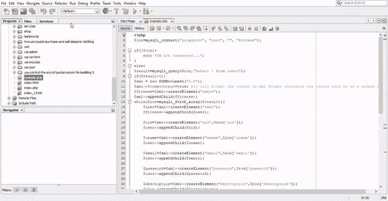

# 如何使用 PHP 动态生成一个 XML 文件？

> 原文:[https://www . geesforgeks . org/如何使用 php 动态生成 xml 文件/](https://www.geeksforgeeks.org/how-to-generate-an-xml-file-dynamically-using-php/)

可以使用 PHP 从数据库中生成一个文件，并且可以通过 PHP 中的静态或动态方法来完成。可以直接调用静态方法，而无需创建类的实例。这里我们将讨论如何动态创建一个 XML 文件。

*   我们需要做的第一件事是从数据库中获取数据。为此，我们需要编写一个选择查询，从表中获取所有细节。

```
$result=mysqli_query($con, "Select * from Table_name"); 
```

*   现在我们需要使用 DOMDocument 创建一个 XML 文件，我们将在其中指定版本。DOMDocument 表示整个 HTML 或 XML 文档，充当文档树的根。

```
$xml = new DOMDocument("1.0");
```

*   现在，我们将创建 XML 文档的元素。它将使用 createElement()函数创建新的元素节点。它创建了一个新的类 DOMElement 的实例。此节点不会显示在文档中，除非插入了(例如) **DOMNode::appendChild()** 。

```
$fitness=$xml->createElement("users");
```

*   到目前为止，我们已经创建了一个 XML 文件。为了显示这一点，我们将使用一个 echo 标记，它以 XML 格式显示文件中的数据。要保存 XML 文件，我们将使用 save 命令。

```
echo "".$xml->saveXML()."";
```

我们需要做的下一件事是从表中获取元素。
**示例:**如果一个表有两个元素，那么它应该创建两个 XML 元素。为此，我们将简单地使用 while 循环，其中将有 mysql_fetch_array 函数从表中获取所有数据。
由于数据库连接到本地服务器，它不会在您的 ide 中运行，但是一旦您创建了数据库，它就会正常工作。按照下面提到的步骤
创建数据库

*   使用本地服务器在 mysql 中创建数据库适应性。
*   然后创建一个表用户。
*   然后添加列-uid，uname，电子邮件，密码，描述，角色，pic。

**程序:**

## 服务器端编程语言（Professional Hypertext Preprocessor 的缩写）

```
<?php
$con=mysqli_connect("localhost", "root", "", "fitness");

if(!$con){
    echo "DB not Connected...";
}
else{
$result=mysqli_query($con, "Select * from users");
if($result>0){
$xml = new DOMDocument("1.0");

// It will format the output in xml format otherwise
// the output will be in a single row
$xml->formatOutput=true;
$fitness=$xml->createElement("users");
$xml->appendChild($fitness);
while($row=mysqli_fetch_array($result)){
    $user=$xml->createElement("user");
    $fitness->appendChild($user);

    $uid=$xml->createElement("uid", $row['uid']);
    $user->appendChild($uid);

    $uname=$xml->createElement("uname", $row['uname']);
    $user->appendChild($uname);

    $email=$xml->createElement("email", $row['email']);
    $user->appendChild($email);

    $password=$xml->createElement("password", $row['password']);
    $user->appendChild($password);

    $description=$xml->createElement("description", $row['description']);
    $user->appendChild($description);

    $role=$xml->createElement("role", $row['role']);
    $user->appendChild($role);

    $pic=$xml->createElement("pic", $row['pic']);
    $user->appendChild($pic);

}
echo "<xmp>".$xml->saveXML()."</xmp>";
$xml->save("report.xml");
}
else{
    echo "error";
}
}
?>
```

**输出:**

