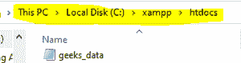
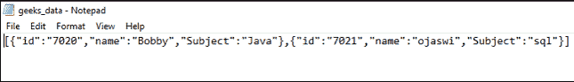

# 如何用 PHP 生成 Json 文件？

> 原文:[https://www . geesforgeks . org/how-generate-JSON-file-in-PHP/](https://www.geeksforgeeks.org/how-to-generate-json-file-in-php/)

在本文中，我们将使用数组在 PHP 中生成一个 [JSON](https://www.geeksforgeeks.org/javascript-json/) 文件。JSON 代表 JavaScript 对象符号，用于存储和交换数据。JSON 是文本，用 JavaScript 对象符号编写。

**结构**:

```
{"data":[
 { "sub_data1":"value1", "sub_data2":"value2","sub_data_n":"value n" },
 { "sub_data2":"value2","sub_data2":"value2", "sub_data_n":"value n" },
 { "sub_data n":"value n ", "sub_data2":"value2","sub_data_n":"value n" }
]}
```

**例**:

```
[{"id":"7020","name":"Bobby","Subject":"Java"},
 {"id":"7021","name":"ojaswi","Subject":"sql"}]
```

**属性**:

1.  JSON 不使用结束标记
2.  它更短。
3.  读写更快。
4.  它可以使用数组。

**逼近**:在本文中，我们可以使用数组生成 JSON 数据。，创建数组

**语法**:

```
$array = Array (
   "number" => Array (
       "data1" => "value1",
       "data2" => "value2",
       "data n" => "valuen"
   ),
   "number" => Array (
      "data1" => "value1",
      "data2" => "value2",
      "data n" => "valuen"
   )
);
```

**示例:**

```
$array = Array (
   "0" => Array (
       "id" => "7020",
       "name" => "Bobby",
       "Subject" => "Java"
   ),
   "1" => Array (
        "id" => "7021",
       "name" => "ojaswi",
       "Subject" => "sql"
   )
);
```

使用 [json_encode()](https://www.geeksforgeeks.org/php-json_encode-function/) 将数组转换为 json。它用于将数组转换为 JSON

**语法**:

```
json_encode(array_input);
```

**示例**:使用 [file_put_contents()](https://www.geeksforgeeks.org/php-file_put_contents-function/) 将文件放置在路径中

```
$json = json_encode($array);
```

文件名是要保存的 json，json_object 是创建数组中的 JSON 后的对象。

**语法**:

```
*file_put_contents(file_name.json.json_object);*
```

**例**:

```
file_put_contents("geeks_data.json", $json);
```

**PHP 代码:**

## 服务器端编程语言（Professional Hypertext Preprocessor 的缩写）

```
<?php 

// input data  through array
$array = Array (
    "0" => Array (
        "id" => "7020",
        "name" => "Bobby",
        "Subject" => "Java"
    ),
    "1" => Array (
         "id" => "7021",
        "name" => "ojaswi",
        "Subject" => "sql"
    )
);

// encode array to json
$json = json_encode($array);
//display it 
echo "$json";
//generate json file
file_put_contents("geeks_data.json", $json);

?>
```

**输出:**

```
[{"id":"7020","name":"Bobby","Subject":"Java"},
 {"id":"7021","name":"ojaswi","Subject":"sql"}]
```

*   JSON 文件在您的路径中创建。

    

*   创建的文件中的数据

    

    极客数据