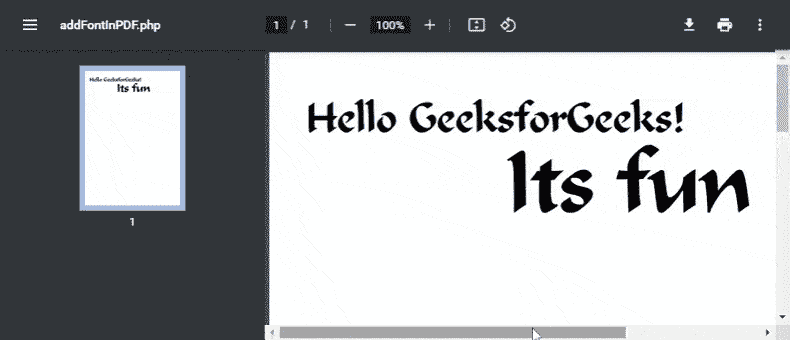

# 如何使用 PHP 生成 PDF 文件并添加 TrueType 字体？

> 原文:[https://www . geesforgeks . org/how-generate-pdf-file-and-add-truetype-font-use-PHP/](https://www.geeksforgeeks.org/how-to-generate-pdf-file-and-add-truetype-fonts-using-php/)

在本文中，我们将学习如何使用 FPDF 生成 PDF 文件，并使用 PHP 添加新的 TrueType 字体。这是一个免费的 PHP 类，包含许多创建和修改 pdf 的函数。FPDF 类包括许多功能，如页面格式、页眉、页脚、自动分页符、换行符、图像支持、颜色、链接等。

**进场:**

*   **第一步:**你需要[从](http://www.fpdf.org/en/download.php) [FPDF 网站](http://www.fpdf.org/)下载 FPDF 类，并将其包含在你的 PHP 脚本中。

    ```
    require('fpdf/fpdf.php');
    ```

*   **第二步:**将以下文件添加到您使用 TrueType 或 Type1 字体的代码中，这样您就不局限于标准字体。

    ```
    define('FPDF_FONTPATH','./');
    ```

*   **步骤 3:** 根据需要实例化并使用 FPDF 类，如下例所示。

    ```
    $pdf=new FPDF();
    ```

**注意:**下载完 FPDF 类后，确保文件“ *calligra.z* ”和“*calligra.php*”在生成 PDF 文件时放置 PHP 代码的同一个工作目录中。

**示例:**以下示例生成带有新书法或字体的 PDF 文件。可以根据需要下载或预览该文件。

## 服务器端编程语言（Professional Hypertext Preprocessor 的缩写）

```
<?php
  define('FPDF_FONTPATH','./');

  require('fpdf/fpdf.php');

  $pdf=new FPDF();

  // Add new font from the calligra.php file
  $pdf->AddFont('Calligrapher','','calligra.php');

  //Add a new page
  $pdf->AddPage();

  // Set the font for the text
  $pdf->SetFont('Calligrapher','',35);

  // Prints a cell with given text 
  $pdf->Cell(60,20,'Hello GeeksforGeeks!');

  // Set the font for the text
  $pdf->SetFont('Calligrapher','',72);

  // Prints a cell with given text 
  $pdf->Cell(60,60,'Its fun');

  // return the generated output
  $pdf->Output();
?>
```

**输出:**



添加书法字体

**在 PDF 中使用新字体的优点:**优点是 PDF 文件更轻。如果标准字体不可用，则使用替代字体。确保在客户端系统上安装所需的字体总是更可取的。如果文件要被很多人或大量观众观看，最好嵌入。