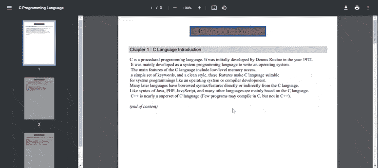

# 如何使用 PHP 从外部文本文件生成 PDF 文件？

> 原文:[https://www . geesforgeks . org/如何使用-php/](https://www.geeksforgeeks.org/how-to-generate-pdf-file-from-external-text-files-using-php/) 从外部生成-pdf-file-text-file

在本文中，我们将学习如何使用 FPDF 从外部文本文件生成 PDF 文件。这是一个免费的 PHP 类，包含许多创建和修改 pdf 的函数。FPDF 类包括许多功能，如页面格式、页眉、页脚、自动分页符、换行符、图像支持、颜色、链接等。

**进场:**

*   你需要从 [FPDF 网站](http://www.fpdf.org/)下载[FPDF 类](http://www.fpdf.org/en/download.php)，并将其包含在你的 PHP 脚本中。

    ```
    require('fpdf/fpdf.php');
    ```

*   如下例所示，根据您的需要实例化并使用 FPDF 类。

    ```
    $pdf=new FPDF();
    ```

**示例:**下面的代码根据外部文本文件生成一个 PDF 文件，即“cIntro.txt”、“cStandard.txt”和“cPrototype.txt”。请参考代码中的注释，以便根据应用程序的需要更好地理解和定制。

## 服务器端编程语言（Professional Hypertext Preprocessor 的缩写）

```
<?php
require('fpdf/fpdf.php');

class PDF extends FPDF {

    // Function to set the document header
    function Header() {

        global $title;

        // Sets font to Arial bold 15
        $this->SetFont('Arial', 'B', 15);

        // Calculate string length 
        $w = $this->GetStringWidth($title) + 6;
        $this->SetX((210 - $w) / 2);

        // Set drawing color
        $this->SetDrawColor(0, 80, 180);

        // It defines the grey color for filling
        $this->SetFillColor(105, 105, 105);

        // Sets the text color
        $this->SetTextColor(255, 0, 0);

        // Set the line width to 1 mm)
        $this->SetLineWidth(1);

        // Prints a cell Title
        $this->Cell($w, 9, $title, 1, 1, 'C', 1);

        // Line break
        $this->Ln(10);
    }

    // Function to set the document footer
    function Footer() {

        // Set Y Position from bottom
        $this->SetY(-20);

        // Sets font to Arial italic 10
        $this->SetFont('Arial', 'I', 10);

        // Sets the Text color in gray
        $this->SetTextColor(128);

        // Prints a cell with Page number
        $this->Cell(0, 10, 'Page ' 
            . $this->PageNo(), 0, 0, 'C');
    }

    // Function to set the title for a tutorial
    function tutorialTitle($num, $label) {

        // Sets font to Arial 12
        $this->SetFont('Arial', '', 12);

        // Sets to fill Background color with Light grey 
        $this->SetFillColor(211, 211, 211);

        // Prints a cell with Title for tutorial
        $this->Cell(0, 6, "Chapter $num : $label", 0, 1, 'L', 1);

        // Line break
        $this->Ln(4);
    }

    // Function to set the content from a external file 
    function tutorialContent($file) {

        // Read text file
        $f   = fopen($file, 'r');
        $txt = fread($f, filesize($file));
        fclose($f);

        // Sets the font to Times 12
        $this->SetFont('Times', '', 12);

        // It prints texts with line breaks
        $this->MultiCell(0, 5, $txt);

        //Puts a Line break
        $this->Ln();

        // Set font in italics
        $this->SetFont('', 'I');

        // Prints a cell
        $this->Cell(0, 5, '(end of content)');
    }

    function showTutorial($num, $title, $file) {

        // Add a new page
        $this->AddPage();
        $this->tutorialTitle($num, $title);
        $this->tutorialContent($file);
    }
}

// Initiate a PDF object
$pdf   = new PDF();
$title = 'C Programming Language';

// Sets the document title
$pdf->SetTitle($title);

// Sets the document author name
$pdf->SetAuthor('gfg author name');

$pdf->showTutorial(
    1, 
    'C Language Introduction', 
    'cIntro.txt'
);

$pdf->showTutorial(
    2, 
    'C Programming Language Standard', 
    'cStandard.txt'
);

$pdf->showTutorial(
    3, 
    'Importance of function prototype in C', 
    'cPrototype.txt'
);

$pdf->Output();
?>
```

**【四. txt】文件:**

> c 是一种过程编程语言。它最初是由丹尼斯·里奇在 1972 年开发的。
> 它主要是作为一种系统编程语言来开发编写操作系统的。
> C 语言的主要特性包括低级的内存访问、一组简单的关键字和干净的风格，这些特性使 C 语言适合像操作系统或编译器开发这样的系统编程。
> 许多后来的语言都直接或间接地借用了 C 语言的语法/特征。
> 像 Java 的语法一样，PHP、JavaScript 等很多语言主要基于 C 语言。
> C++几乎是 C 语言的超集(很少有程序可以用 C 编译，但不能用 C++)。

**【cststandard . txt】文件:**

> 最新的 C 标准是 ISO/IEC 9899:2011，也称为 C11，因为最终草案于 2011 年发布。C11 之前，有 C99。C11 最终稿在此提供。有关 C 标准的完整历史，请参见此处。
> 
> 我们能从 C 标准知道所有程序的行为吗？
> C 标准将许多 C 构造的一些行为保留为未定义的，一些保留为未指定的，以简化规范并允许实现中的一些灵活性。
> 例如，在 C 语言中，在任何自动变量被初始化之前使用它会产生未定义的行为，并且子表达式的求值顺序是未指定的。
> 如果提交了这样一个程序，这特别使编译器可以做任何最容易或最有效的事情。

**“cprototype . txt”文件:**

> 函数原型告诉编译器函数接受的参数数量、参数的数据类型和函数的返回类型。
> 通过使用这些信息，编译器用函数定义和函数调用交叉检查函数参数及其数据类型。
> 如果忽略函数原型，程序可能会编译时出现警告，可能无法正常工作。
> 但是有些时候，它会给出奇怪的输出，很难发现这样的编程错误。
> 上述程序检查命令行提供的文件是否存在，如果给定的文件存在，则程序打印“文件存在”，否则打印适当的错误信息。
> 让我们提供一个文件系统中不存在的文件名，并检查 x86_64 架构上程序的输出。

**输出:**

