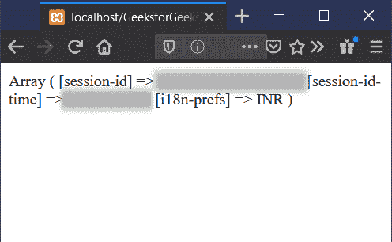
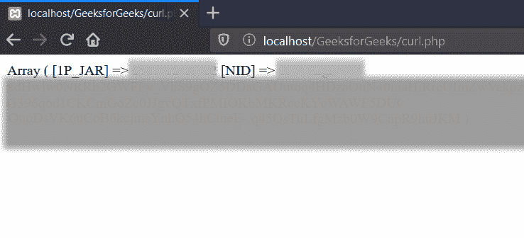

# 如何在 PHP 中把 cookies 从 curl 变成变量？

> 原文:[https://www . geesforgeks . org/how-to-cookies-from-curl-to-a-variable-in-PHP/](https://www.geeksforgeeks.org/how-to-get-cookies-from-curl-into-a-variable-in-php/)

代表**客户端 URL** 的 cURL 指的是使用支持**cookie、HTTP、FTP、IMAP、POP3、HTTPS(具有 SSL 认证)、**等各种协议传输数据的库。这个例子将说明如何将 cookies 从一个 PHP cURL 获取到一个变量中。这些函数提供了一个选项来设置将为每个响应标题行调用的回调。该函数将接收 curl 对象和带有标题行的字符串。下面描述了该示例所需的功能及其用途:

*   **curl_init():** 用于初始化一个 curl 对象。
*   **curl_setopt(对象，参数，值):**用于设置某个 curl 对象的参数值。
*   **curl_exec(对象):**用于执行当前的 curl 会话。设置所需卷曲参数值后调用。
*   **preg_match_all(regExp，inputVariable，OutputVariable):** 用于执行全局正则表达式检查。

**示例 1:** 本示例说明如何从**www.amazon.com**获取饼干

```
<?php

// URL to fetch cookies
$url = "https://www.amazon.com/";

// Initialize cURL object
$curlObj = curl_init();

/* setting values to required cURL parameters.
CURLOPT_URL is used to set the URL to fetch 
CURLOPT_RETURNTRANSFER is enabled curl
response to be saved in a variable 
CURLOPT_HEADER enables curl to include
protocol header CURLOPT_SSL_VERIFYPEER
enables to fetch SSL encrypted HTTPS request.*/
curl_setopt($curlObj,  CURLOPT_URL,  $url);
curl_setopt($curlObj,  CURLOPT_RETURNTRANSFER,  1);
curl_setopt($curlObj,  CURLOPT_HEADER,  1);
curl_setopt($curlObj,  CURLOPT_SSL_VERIFYPEER,  false);
$result = curl_exec($curlObj);

// Matching the response to extract cookie value
preg_match_all('/^Set-Cookie:\s*([^;]*)/mi',
          $result,  $match_found);

$cookies = array();
foreach($match_found[1] as $item) {
    parse_str($item,  $cookie);
    $cookies = array_merge($cookies,  $cookie);
}

// Printing cookie data
print_r( $cookies);

// Closing curl object instance
curl_close($curlObj);
?>
```

**注意:**每个网站根据其要求有自己的存储 cookies 的格式。因此，cookies 没有任何特定的格式。
**输出:**


**例 2:** 这个例子说明了如何从**www.google.com**获取饼干

```
<?php

$url = "https://www.google.com/";
$curlObj = curl_init();

curl_setopt($curlObj, CURLOPT_URL, $url);
curl_setopt($curlObj, CURLOPT_RETURNTRANSFER, 1);
curl_setopt($curlObj, CURLOPT_HEADER, 1);
curl_setopt($curlObj, CURLOPT_SSL_VERIFYPEER, false);
$result = curl_exec($curlObj);

preg_match_all('/^Set-Cookie:\s*([^;]*)/mi',
                $result, $match_found);
$cookies = array();

foreach($match_found[1] as $item) {
    parse_str($item, $cookie);
    $cookies = array_merge($cookies, $cookie);
}

print_r( $cookies);
curl_close($curlObj);
?>
```

**输出:**


**注:**个人资料模糊不清。