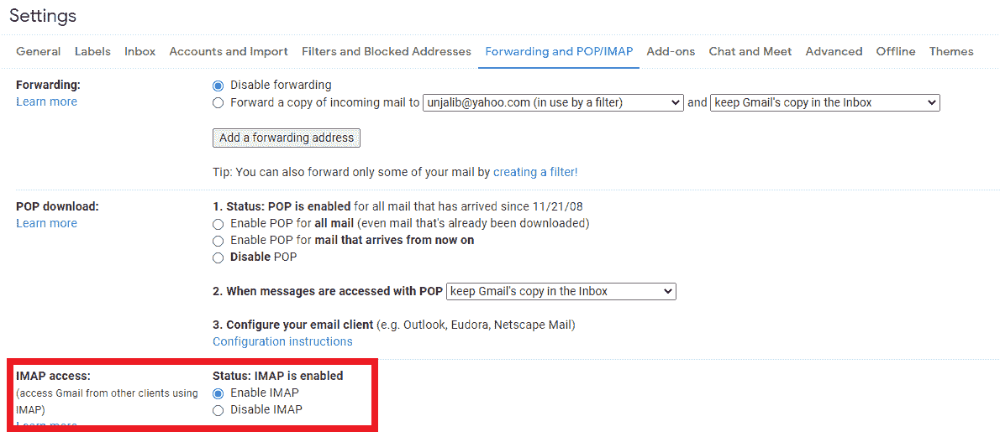
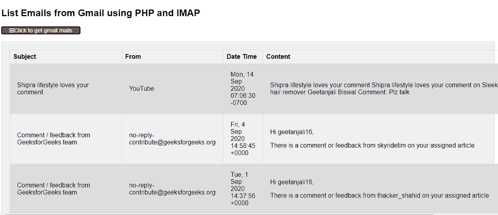

# 如何使用 PHP 和 IMAP 获取邮件？

> 原文:[https://www . geeksforgeeks . org/如何使用-php 和-imap/](https://www.geeksforgeeks.org/how-to-get-emails-using-php-and-imap/) 获取电子邮件

使用 PHP 从 Gmail 账户中读取电子邮件对于网络开发人员来说将是一项丰富的任务，因为它通过 IMAP(互联网消息访问协议)实现了简单的代码。有时，网络项目或客户可能会有这样的要求，即需要全面管理收件箱电子邮件或从其 Gmail 帐户访问电子邮件内容。此功能在电子邮件营销或电子邮件简讯中也很有用，这些简讯将按照特定的时间表自动发送。因此，在研究 Gmail 帐户访问时，应该尝试使用 PHP 及其 IMAP 功能扩展列出来自 Gmail 帐户的电子邮件。

IMAP 是一种互联网标准协议，客户端使用它通过具有 SSL 安全性的 TCP/IP 连接从邮件服务器获取电子邮件。PHP 库中可用的 IMAP 扩展提供了对其电子邮件结构的有效处理，并通过与电子邮件服务器通信来访问电子邮件。
我们使用 PHP 代码连接到 Gmail 服务器，并使用标准 IMAP 功能打开 Gmail 账户，根据一定标准访问或获取电子邮件。

**基本要求:**功能开发需要以下内容。

1.  PHP5 或最新 PHP 版本。
2.  在 PHP 安装中启用 IMAP 扩展。
3.  在 Gmail 帐户设置中，应该启用 IMAP。



**在 XAMPP 启用 IMAP 的步骤:**

1.  转到 php.ini 配置文件
2.  搜索”；扩展名=php_imap.dll "
3.  去掉分号的开头，应该是“扩展名=php_imap.dll”
4.  同时编辑最大执行时间= 4000

**在 Gmail 账户中启用 IMAP 的步骤:**

1.  打开 Gmail。
2.  单击设置。
3.  选择转发和 POP/IMAP 蓝色标签。
4.  选择“IMAP 访问:”部分并启用 IMAP 单选按钮。
5.  单击保存更改。
6.  不要忘记为 Gmail 帐户打开不太安全的应用程序的访问权限。

**注意:**对于正常应用，IMAP 服务器监听 143 端口号。

**PHP 代码:**以下是列出来自 Gmail 账户的邮件的 HTML 和 PHP 代码。为了连接到 Gmail，开发人员需要在代码中设置个人的“用户名”和“密码”。连接后，我们使用 **imap_search()** 功能根据特定标准搜索所有电子邮件。电子邮件以相反的方式排序，以便使用 PHP **rsort()** 功能在顶部提供最新的邮件。这个 PHP 函数按降序对数组进行排序。对于返回的每封电子邮件，都会捕获主题、发件人、部分内容和日期时间消息。 **imap_fetchbody()** 函数获取电子邮件正文的特定部分。因此，要获得电子邮件的纯文本部分，我们可以使用“1.1”选项作为第三个参数。

## 超文本标记语言

```phphtml
<!DOCTYPE html>
<html>

<head>
    <link rel="stylesheet" href=
"https://cdnjs.cloudflare.com/ajax/libs/font-awesome/4.7.0/css/font-awesome.min.css">
    <link rel="stylesheet" href="style.css">

    <script>
        function getEmails() {
            document.getElementById('dataDivID')
                .style.display = "block";
        }
    </script>
</head>

<body>
    <h2>List Emails from Gmail using PHP and IMAP</h2>

    <div id="btnContainer">
        <button class="btn active" onclick="getEmails()">
            <i class="fa fa-bars"></i>Click to get gmail mails
        </button>
    </div>
    <br>

    <div id="dataDivID" class="form-container" style="display:none;">
        <?php
            /* gmail connection,with port number 993 */
            $host = '{imap.gmail.com:993/imap/ssl/
                    novalidate-cert/norsh}INBOX';
            /* Your gmail credentials */
            $user = 'YOUR-EMAIL@GMAIL.COM';
            $password = 'YOUR-PASSWORD';

            /* Establish a IMAP connection */
            $conn = imap_open($host, $user, $password) 
                 or die('unable to connect Gmail: ' . imap_last_error());

            /* Search emails from gmail inbox*/
            $mails = imap_search($conn, 'SUBJECT "Comment"');

            /* loop through each email id mails are available. */
            if ($mails) {

                /* Mail output variable starts*/
                $mailOutput = '';
                $mailOutput.= '<table><tr><th>Subject </th><th> From  </th> 
                           <th> Date Time </th> <th> Content </th></tr>';

                /* rsort is used to display the latest emails on top */
                rsort($mails);

                /* For each email */
                foreach ($mails as $email_number) {

                    /* Retrieve specific email information*/
                    $headers = imap_fetch_overview($conn, $email_number, 0);

                    /*  Returns a particular section of the body*/
                    $message = imap_fetchbody($conn, $email_number, '1');
                    $subMessage = substr($message, 0, 150);
                    $finalMessage = trim(quoted_printable_decode($subMessage));

                    $mailOutput.= '<div class="row">';

                    /* Gmail MAILS header information */                   
                    $mailOutput.= '<td><span class="columnClass">' .
                                $headers[0]->subject . '</span></td> ';
                    $mailOutput.= '<td><span class="columnClass">' . 
                                $headers[0]->from . '</span></td>';
                    $mailOutput.= '<td><span class="columnClass">' .
                                 $headers[0]->date . '</span></td>';
                    $mailOutput.= '</div>';

                    /* Mail body is returned */
                    $mailOutput.= '<td><span class="column">' . 
                    $finalMessage . '</span></td></tr></div>';
                }// End foreach
                $mailOutput.= '</table>';
                echo $mailOutput;
            }//endif 

            /* imap connection is closed */
            imap_close($conn);
            ?>
    </div>
</body>

</html>
```

**CSS 代码:**以下是上述代码中使用的文件“style.css”的代码。

## 半铸钢ˌ钢性铸铁(Cast Semi-Steel)

```phphtml
body {
   font-family: Arial;
 }
  table {
     font-family: arial, sans-serif;
     border-collapse: collapse;
     width: 100%;
 }
  tr:nth-child(even) {
     background-color: #dddddd;
 }
 td, th {
     padding: 8px;
     width:100px;
     border: 1px solid #dddddd;
     text-align: left;                
 }
 .form-container {
     padding: 20px;
     background: #F0F0F0;
     border: #e0dfdf 1px solid;                
     border-radius: 2px;
 }
 * {
     box-sizing: border-box;
 }

 .columnClass {
     float: left;
     padding: 10px;
 }

 .row:after {
     content: "";
     display: table;
     clear: both;
 }

 .btn {
     background: #333;
     border: #1d1d1d 1px solid;
     color: #f0f0f0;
     font-size: 0.9em;
     width: 200px;
     border-radius: 2px;
     background-color: #f1f1f1;
     cursor: pointer;
 }

 .btn:hover {
     background-color: #ddd;
 }

 .btn.active {
     background-color: #666;
     color: white;
 }
```

**输出:**以下是主题为“注释”的电子邮件的输出。

