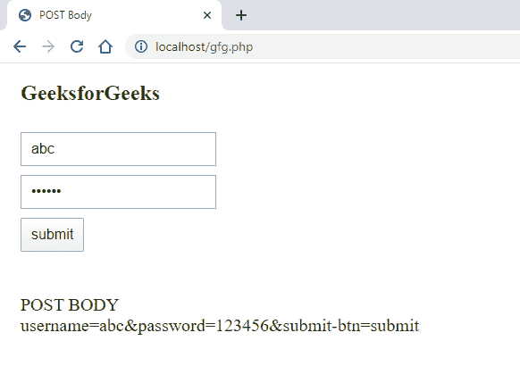
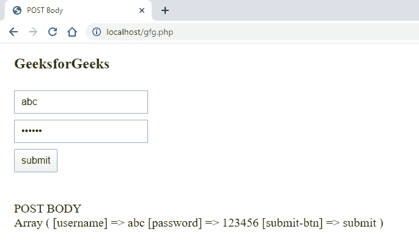
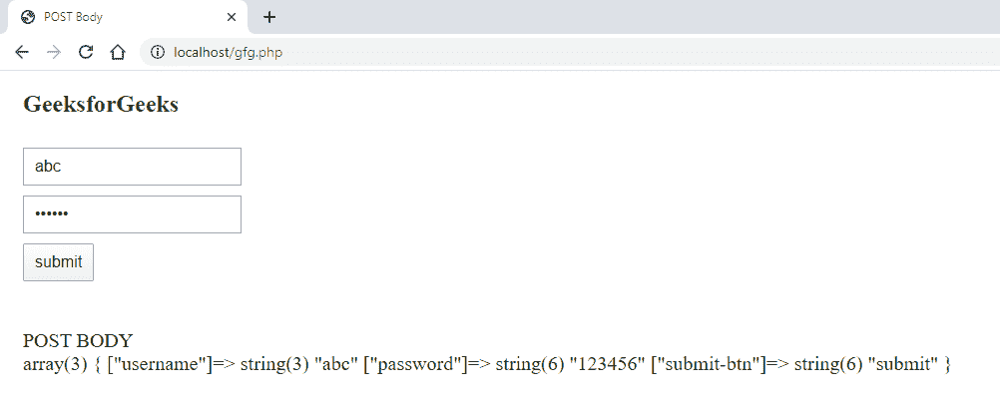

# 如何在 PHP 中使用 POST 方法获取表单数据？

> 原文:[https://www . geesforgeks . org/如何使用 php 中的 post 方法获取表单数据/](https://www.geeksforgeeks.org/how-to-get-form-data-using-post-method-in-php/)

php 提供了一种使用 **php://** 读取 HTML 表单原始 POST 数据的方法，用于访问 PHP 的输入和输出流。在本文中，我们将以三种不同的方式使用上述方式。我们将使用 [php://input](https://www.php.net/manual/en/wrappers.php.php) ，这是一个只读的 php 流。

我们将创建一个基本的 HTML 表单页面，在这里我们可以一次一个地使用所有可能的方法。
**HTML 代码:**

```php
<!DOCTYPE html>
<html>
<head>
    <title>POST Body</title>
    <style>
        form {
            margin: 30px 0px;
        }
        input {
            display: block;
            margin: 10px 15px;
            padding: 8px 10px;
            font-size: 16px;
        }
        div {
            font-size: 20px;
            margin: 0px 15px;
        }
        h2 {
            color: green;
            margin: 20px 15px;
        }
    </style>
</head>
<body>
    <h2>GeeksforGeeks</h2>
    <form method="post">
        <input type="text" name="username"  
                           placeholder="Enter Username">
        <input type="password" name="password"
                               placeholder="Enter Password">
        <input type="submit" name="submit-btn" 
                             value="submit">
    </form>
    <br>
</body>
</html>
```

**下面的例子说明了方法:**
**例 1:** 在这个例子中，我们将使用**[file _ get _ contents()](https://www.geeksforgeeks.org/php-file_get_contents-function/)**函数。file_get_contents()函数用于获取字符串格式的数据。

*   **语法:**

    ```php
    file_get_contents('php://input');
    ```

*   **PHP 代码:**

    ```php
    <?php 
        if (isset($_POST["submit-btn"])) {
            $post_data = file_get_contents('php://input');
            echo "<div> POST BODY <br>".$post_data."</div>";        
        }
    ?>
    ```

*   **输出:**
    

**例 2:** 在本例中，我们将使用 **[print_r()](https://www.geeksforgeeks.org/php-print_r-function/)** 函数。获得开机自检数据的一种更简单的方法是使用 print_r()函数。这将以数组的形式给出输出。

*   **语法:**

    ```php
    print_r($_POST);
    ```

*   **PHP 代码:**

    ```php
    <?php 
        if (isset($_POST["submit-btn"])) {
            echo "<div> POST BODY <br>";
            print_r($_POST);
            echo "</div>";
        }
    ?>
    ```

*   **输出:**
    

**示例 3:** 我们还可以使用 **[var_dump()](https://www.geeksforgeeks.org/php-var_dump-function/)** 函数，该函数也将为我们提供一个数组，但会包含更多的信息。

*   **语法:**

    ```php
    var_dump($_POST);
    ```

*   **PHP 代码:**

    ```php
    <?php 
        if (isset($_POST["submit-btn"])) {
            echo "<div> POST BODY <br>";
            var_dump($_POST);
            echo "</div>";
        }
    ?>
    ```

*   **输出:**
    