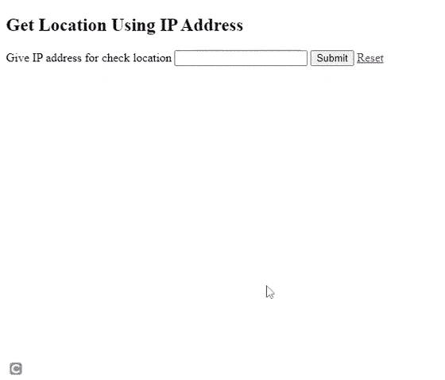

# 如何利用 PHP-cURL 从 IP 地址获取地理位置？

> 原文:[https://www . geesforgeks . org/how-to-get-geolocation-using-PHP-curl-from-IP-address/](https://www.geeksforgeeks.org/how-to-get-geolocation-using-php-curl-from-ip-address/)

地理定位指的是用户或计算机设备的地理位置的识别。

在本文中，我们将创建一个网页，用户可以在其中输入任何设备的 IP 地址，然后服务器将提供 IP 地址的地理定位，并使用 IP 地理定位应用编程接口获取以下详细信息。

*   大陆名称
*   国家名称
*   国家代码 Alpha-2
*   国家阿尔法-3 代码
*   国家数字代码
*   国家/地区国际呼叫前缀代码
*   货币代码
*   纬度
*   经度

**进场:**

*   使用 PHP 中的 [cURL](https://www.geeksforgeeks.org/php-curl/) 通过 [HTTP GET](https://www.geeksforgeeks.org/http-get-post-methods-php/) 请求调用 API。
*   使用**【PHP】**[**JSON _ decode()**](https://www.geeksforgeeks.org/php-json_decode-function/)函数将 API JSON 响应转换为数组。****
*   ****从 API 响应中检索 IP 数据。****

******示例:**下面的代码使用 PHP cURL 从 IP 地址获取位置。****

## ****服务器端编程语言（Professional Hypertext Preprocessor 的缩写）****

```
**<?php 

if(isset($_POST['submit']))
{

    $userIP = $_POST['ip']; 

    $apiURL = 'https://api.ipgeolocationapi.com/geolocate/'.$userIP;  

    $ch = curl_init($apiURL); 

    curl_setopt($ch, CURLOPT_RETURNTRANSFER, true); 

    $apiResponse = curl_exec($ch); 

    curl_close($ch); 

    $ipData = json_decode($apiResponse, true); 

    if(!empty($ipData)){ 
        $continent = $ipData['continent']; 
        $country_code_alpha2 = $ipData['alpha2']; 
        $country_code_alpha3 = $ipData['alpha3']; 
        $country_name = $ipData['name']; 
        $country_code_numeric = $ipData['country_code']; 
        $international_prefix = $ipData['international_prefix']; 
        $currency_code = $ipData['currency_code']; 
        $latitude = $ipData['geo']['latitude']; 
        $longitude = $ipData['geo']['longitude']; 

        echo 'Continent Name: '.$continent.'<br/>'; 
        echo 'Country Name: '.$country_name.'<br/>'; 
        echo 'Country Alpha-2 Code: '.$country_code_alpha2.'<br/>'; 
        echo 'Country Alpha-3 Code: '.$country_code_alpha3.'<br/>'; 
        echo 'Country Numeric Code: '.$country_code_numeric.'<br/>'; 
        echo 'Country International Call Prefix Code: '
                . $international_prefix.'<br/>'; 
        echo 'Currency Code: '.$currency_code.'<br/>'; 
        echo 'Latitude: '.$latitude.'<br/>'; 
        echo 'Longitude: '.$longitude; 
    }
    else{
        echo 'Not a valid IP';
    }
}

?>

<!DOCTYPE html>
<html lang="en">

<head>
    <meta charset="UTF-8">
    <meta name="viewport" content=
        "width=device-width, initial-scale=1.0">
    <title>Get Location</title>
</head>

<body>
    <h1>Get Location Using IP Address</h1>

    <form method='post' enctype='multipart/form-data'>
        <label>Give IP address for check location</label>
        <input type='text' name='ip' />
        <input type='submit' value='Submit' name='submit' />
        <a href="index.php">Reset</a>

    </form>
</body>

</html>**
```

******输出:******

*   ******有效 IP 地址:**当用户输入有效 IP 地址时。
    T3】****
*   ******无效 IP 地址:**当用户在输入文本控件中输入无效 IP 地址时。****