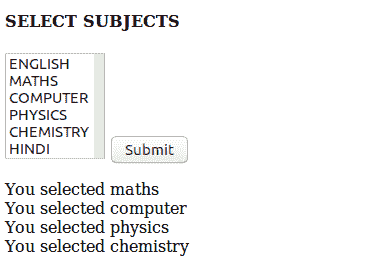

# 如何在 php 中获取选择框的多个选择值？

> 原文:[https://www . geesforgeks . org/如何获取 php 中选择框的多个选定值/](https://www.geeksforgeeks.org/how-to-get-multiple-selected-values-of-select-box-in-php/)

给定一个项目列表，任务是使用 PHP 从选择框中检索多个选定的值。
在 HTML 中使用多个属性从下拉列表中选择多个值。在 HTML 中选择多个值取决于操作系统和浏览器。

*   对于窗口用户–按住 CTRL 键选择多个选项
*   对于 mac 用户–按住 command 键选择多个选项

**示例:**本示例使用 HTML 创建项目列表。

## 超文本标记语言

```php
<html>
    <body>
        <form method = "post" action = "name.php">
            <h4>SELECT SUBJECTS</h4>
            <!--Using multiple to select multiple value-->
            <select name = "subject" multiple size = 6> 
                <option value = "english">ENGLISH</option>
                <option value = "maths">MATHS</option>
                <option value = "computer">COMPUTER</option>
                <option value = "physics">PHYSICS</option>
                <option value = "chemistry">CHEMISTRY</option>
                <option value = "hindi">HINDI</option>
            </select>
            <input type = "submit" name = "submit" value = Submit>
        </form>
    </body>
</html>
```

现在，任务是从列表中检索或打印多个选定的值。使用表单方法和循环在 PHP 中检索选定的值。
**例:**

## 服务器端编程语言（Professional Hypertext Preprocessor 的缩写）

```php
<html>
    <body>
        <!--name.php to be called on form submission-->
        <form method = 'post'>
            <h4>SELECT SUBJECTS</h4>

            <select name = 'subject[]' multiple size = 6> 
                <option value = 'english'>ENGLISH</option>
                <option value = 'maths'>MATHS</option>
                <option value = 'computer'>COMPUTER</option>
                <option value = 'physics'>PHYSICS</option>
                <option value = 'chemistry'>CHEMISTRY</option>
                <option value = 'hindi'>HINDI</option>
            </select>
            <input type = 'submit' name = 'submit' value = Submit>
        </form>
    </body>
</html>
<?php

    // Check if form is submitted successfully
    if(isset($_POST["submit"]))
    {
        // Check if any option is selected
        if(isset($_POST["subject"]))
        {
            // Retrieving each selected option
            foreach ($_POST['subject'] as $subject)
                print "You selected $subject<br/>";
        }
    else
        echo "Select an option first !!";
    }
?>
```

**输出:**



**注意:**可以使用 *$_GET* 方法提交表格。这取决于 form method=？”价值。

PHP 是一种专门为 web 开发设计的服务器端脚本语言。您可以通过以下 [PHP 教程](https://www.geeksforgeeks.org/php-tutorials/)和 [PHP 示例](https://www.geeksforgeeks.org/php-examples/)从头开始学习 PHP。