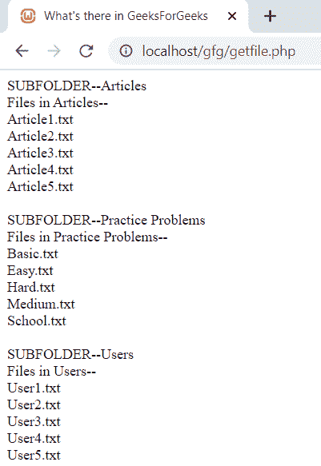

# 如何用 PHP 获取一个目录中存在的所有子文件夹和文件的名称？

> 原文:[https://www . geeksforgeeks . org/如何使用 php 获取目录中所有子文件夹和文件的名称/](https://www.geeksforgeeks.org/how-to-get-names-of-all-the-subfolders-and-files-present-in-a-directory-using-php/)

给定文件夹的路径，任务是打印其中存在的子文件夹和文件的名称。
**解释:**在我们的 PHP 代码中，最初使用 *is_dir()* 函数检查提供的路径或文件名是否为目录。现在，我们使用 *opendir()* 功能打开目录，然后检查它是否正在打开或有一些错误。然后，我们使用 while 循环来获取所有子文件夹的名称，以及在 *readdir()* 函数的帮助下出现在目录中的文件。现在我们进入每个子文件夹，按照类似的步骤读取其中所有文件的名称。
**文件夹结构:**


**代码:**
*注:本代码已保存为 PHP 文件，通过 wampserver*
访问

## 服务器端编程语言（Professional Hypertext Preprocessor 的缩写）

```
<?php
$gfg_folderpath = "GeeksForGeeks/";
// CHECKING WHETHER PATH IS A DIRECTORY OR NOT
if (is_dir($gfg_folderpath)) {
    // GETTING INTO DIRECTORY
    $files = opendir($gfg_folderpath); {
        // CHECKING FOR SMOOTH OPENING OF DIRECTORY
        if ($files) {
            //READING NAMES OF EACH ELEMENT INSIDE THE DIRECTORY
            while (($gfg_subfolder = readdir($files)) !== FALSE) {
                // CHECKING FOR FILENAME ERRORS
             if ($gfg_subfolder != '.' && $gfg_subfolder != '..') {
                    echo "SUBFOLDER--" .$gfg_subfolder . "<br>
                    "."Files in ".$gfg_subfolder."--<br>";

                $dirpath = "GeeksForGeeks/" . $gfg_subfolder . "/";
                    // GETTING INSIDE EACH SUBFOLDERS
                    if (is_dir($dirpath)) {
                        $file = opendir($dirpath); {
                            if ($file) {
                //READING NAMES OF EACH FILE INSIDE SUBFOLDERS
               while (($gfg_filename = readdir($file)) !== FALSE) {
                if ($gfg_filename != '.' && $gfg_filename != '..') {
                        echo $gfg_filename . "<br>";
                           }
                         }
                      }
                   }
               }
                    echo "<br>";
                }
            }
        }
    }
}
?>
<!DOCTYPE html>
<html>
<head>
  <title>What's there in GeeksForGeeks </title>
</head>
<body>
</body>
</html>
```

**输出:**

