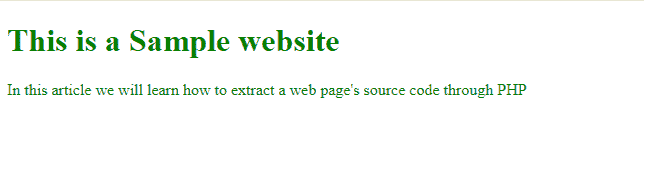
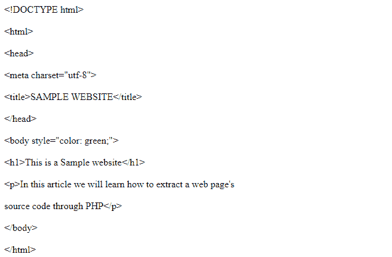
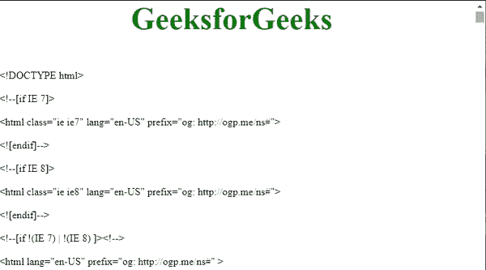

# 如何用 PHP 获取网页的源代码？

> 原文:[https://www . geesforgeks . org/如何使用 php 获取网页源代码/](https://www.geeksforgeeks.org/how-to-get-the-source-code-of-a-web-page-using-php/)

给定一个网页，我们需要用 PHP 找到它的源代码。为此，我们将使用 PHP **htmlspecialchars()** 函数，该函数将任何预定义的字符转换为其后续的 HTML 实体。

**示例 1:** 假设我们取一个看起来像下图的示例网站，让我们看看代码会产生什么样的输出。

**HTML 代码:**

## 超文本标记语言

```
<!DOCTYPE html>
<html>

<head>
    <meta charset="utf-8">
    <title>SAMPLE WEBSITE</title>
</head>

<body style="color: green;">
    <h1>This is a Sample website</h1>

    <p>
        In this article we will learn 
        how to extract a web page's 
        source code through PHP
    </p>
</body>

</html>
```

**输出:**



**作为源代码内容输出:**



现在让我们假设上面的网站托管在 *localhost* 上，在这种情况下代码将无法加载源代码。产生的输出将类似于此。

**输出:**

> 警告:文件(文件:///D:/Html % 20 网站/gfg % 20 示例% 20 网站/索引. Html):无法打开流:C:\ xampp \ htdocs \ programs \ source code.php 第 2 行没有这样的文件或目录
> 
> 警告:foreach()参数的类型必须是数组|对象，bool 在 C:\ xampp \ htdocs \ programs \ source code.php 第 3 行给出

**例 2:**

**进场:**

*   将其元素存储到数组中。
*   使用 PHP 编程循环遍历数组。
*   将每个字符转换并打印到其后续的 HTML 实体中。

**PHP 代码:**下面是上述方法的实现。

## 服务器端编程语言（Professional Hypertext Preprocessor 的缩写）

```
<?php

// Storing the elements of the webpage into an array
$source_code = file('https://www.geeksforgeeks.org');

// 1\. traversing through each element of the array
// 2.printing their subsequent HTML entities
foreach ($source_code as $line_number => $last_line) {
    echo nl2br(htmlspecialchars($last_line) . "\n");
}

?>
```

**输出:**

