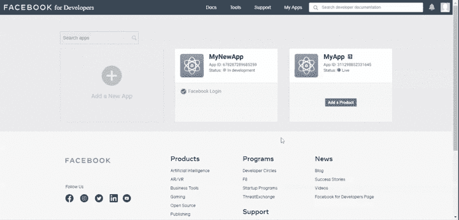
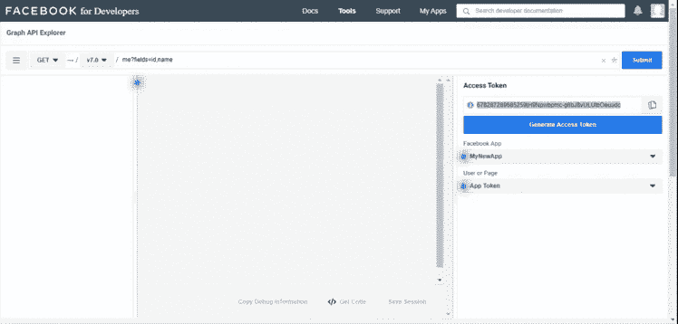

# 如何使用脸书 SDK 和 PHP 获取用户档案？

> 原文:[https://www . geesforgeks . org/如何获取用户配置文件-使用-Facebook-SDK-和-php/](https://www.geeksforgeeks.org/how-to-get-user-profile-using-facebook-sdk-and-php/)

脸书图形应用程序接口在网络或社交网络世界的 Facebook 开发者中大量使用。这完全是基于 HTTP 的协议，有助于获取或发布数据、上传照片、视频、围绕社交图发送群请求。脸书软件开发工具包有助于提供出色的功能，增强用户与 Facebook 数据的界面。

**常见应用:**

*   使用脸书登录集成工具开发网页。
*   简单的注册过程使更多的用户能够访问网站。

**先决条件:**

*   PHP5 及以上
*   通过取消对行

    ```
    extension=mbstring
    ```

    的注释，在“php.ini”文件中启用 mbstring 扩展名

**脸书 SDK 下载链接:**

请下载以下链接并将其保存到您的工作文件夹中，以便在您的 PHP 代码中包含所需的文件或库。PHP 脸书软件开发工具包非常容易实现，允许开发人员访问 Facebook 图形应用编程接口。

```
https://github.com/facebookarchive/php-graph-sdk
```

**创建 FaceBook App 的步骤:**

1.  请转到[链接](https://developers.facebook.com/)创建应用程序标识和应用程序密钥，并记下
    以便在 PHP 代码中使用。
2.  通过单击添加新应用程序创建新应用程序。输入所有必需的详细信息，如姓名、电子邮件 id，然后单击创建应用程序 ID 以获取应用程序 ID 和应用程序机密，从而访问脸书应用程序接口。您必须更改一些基本设置才能获得所需的密钥。参考下图。
3.  从该特定应用的[链接](https://developers.facebook.com/tools/explorer/APP_ID)获取用户访问令牌。参考下图。在链接中使用自己的 APP_ID。

下图显示了应用程序标识和应用程序密钥的快照。



下图显示了用户访问令牌的快照。



**PHP 代码:**下面的示例代码演示了，如何使用 FaceBook SDK 访问当前用户名并打印出来，以及使用 PHP 的 Graph API。

```
<?php
 require_once 'facebook-graph-sdk/src/Facebook/Facebook.php'; 
 require_once 'facebook-graph-sdk/src/Facebook/autoload.php';
 require_once 'facebook-graph-sdk/src/Facebook/
               Exceptions/FacebookResponseException.php';
 require_once 'facebook-graph-sdk/src/Facebook/
               Exceptions/FacebookSDKException.php';
 require_once 'facebook-graph-sdk/src/Facebook/Helpers/
               FacebookRedirectLoginHelper.php';

// Include required libraries
use Facebook\Facebook;
use Facebook\Exceptions\FacebookResponseException;
use Facebook\Exceptions\FacebookSDKException;

$appId = 'YOUR APP ID'; 
$appSecret = 'YOUR APP SECRET KEY'; 

$fb = new Facebook([
    'app_id' => $appId,
    'app_secret' => $appSecret,
    'default_graph_version' => 'v3.1',    
]);

// YOUR user's access token, refer 
// "https://developers.facebook.com/tools/explorer/"
$accessToken='YOUR ACCESS TOKEN';

$response= "";

try 
{
    $response = $fb->get('/me', $accessToken);
    $response = $fb->get('/me?fields=id, name', $accessToken);    
} 
catch(FacebookResponseException $e)
{
     echo 'Graph returned an error:' . $e->getMessage();
     exit();
} 
catch(FacebookSDKException $e)
{
    echo 'Facebook SDK returned an error:' . $e->getMessage();
     exit();
}
$me = $response->getGraphUser();
echo 'Logged in as (username) : ' . $me->getName().'<br/>';
?>
```

**输出:**FaceBook 用户名打印在以下输出文本“用户名”中。

```
  Logged in as (username) : "User name"

```