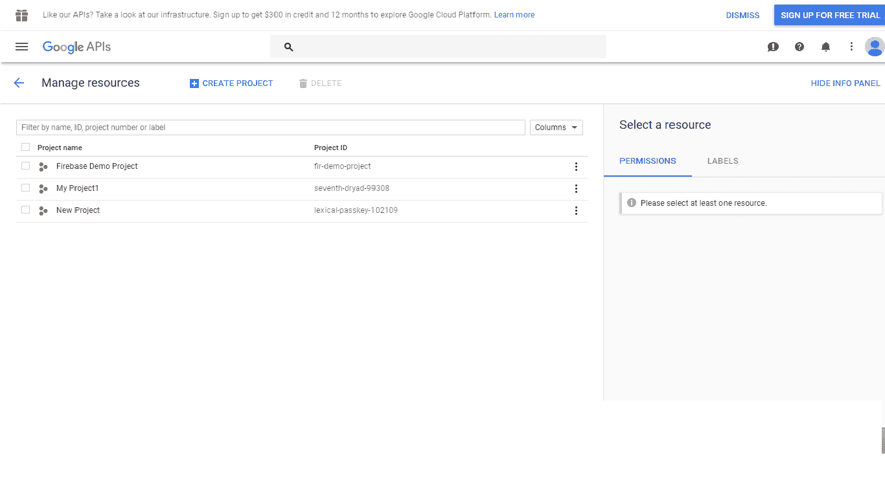
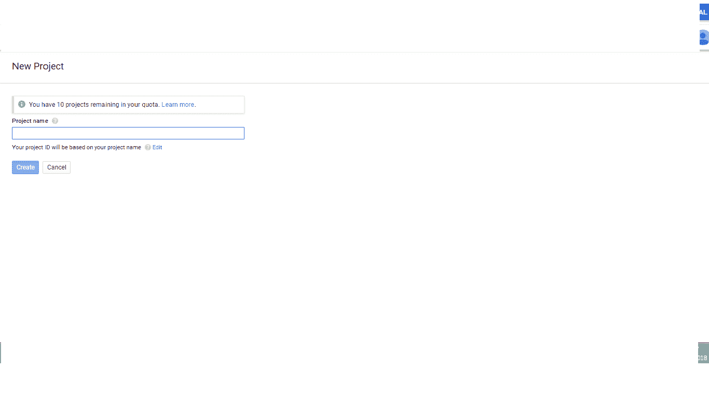
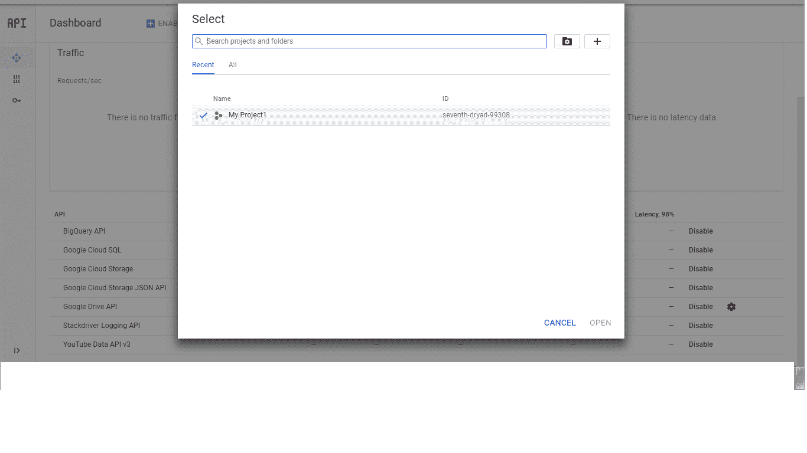
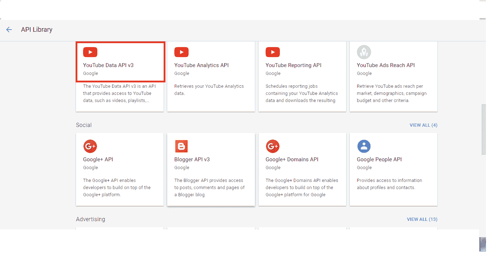
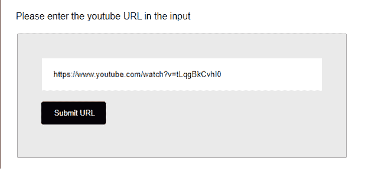
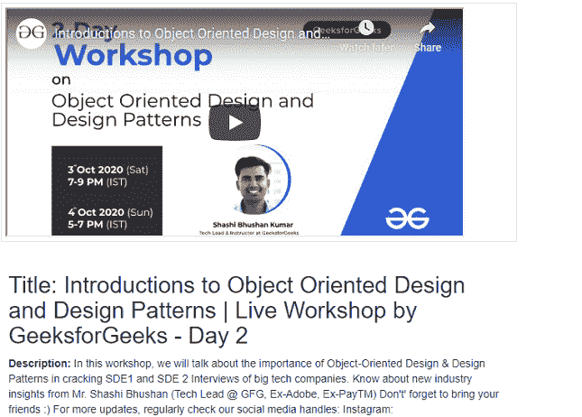

# 如何利用 YouTube 数据 API 和 PHP 获取 YouTube 视频数据？

> 原文:[https://www . geesforgeks . org/how-to-YouTube-video-data-by-use-YouTube-data-API-and-PHP/](https://www.geeksforgeeks.org/how-to-get-youtube-video-data-by-using-youtube-data-api-and-php/)

**缩略图**用于在单个浏览器窗口中预览单个或一组媒体实体。
它节省了时间，更好地集中了用户的注意力，帮助我们抓住注意力，教育观众增强网页设计项目。

**描述**比标题多了几个字。YouTube 视频描述中的单词越多，就有可能出现更多确切的关键词来表示，这对于在搜索引擎中找到非常重要。
视频频道应该了解视频的数据，才能更好地排名，获得更多的公众浏览量，因为没人能看到视频内容到底是什么，所以需要数据。

**标题**的主要目的是以最好的方式表示和描述每个结果，并且可以与用户的搜索查询相关联。标题是用来决定点击哪个链接的最重要的信息，所以在你的网页上检索容易理解的标题变得很重要。

标题有助于搜索引擎抓取相关数据。

标题和描述在使视频变得重要和搜索引擎排名因素中起着关键作用。

**目的:**文章显示了特定 YouTube URL 链接的标题、描述和缩略图。HTML 表单为给定输入请求一个 YouTube 视频网址。

当用户将网址粘贴到输入字段并提交时，这个网址变量将被发送到 PHP 文件。从网址获取数据后，将在浏览器上预览。

**YouTube 视频数据 API 键:**

*   YouTube 数据应用编程接口可以免费使用。
*   我们需要 YouTube 数据 API 密钥来实现下面的示例程序。
*   每个 YouTube 视频都将有一个与之相关联的特定标识，该标识将被传递给应用编程接口调用以进行数据检索。让我们一步步看看如何创建一个 YouTube 数据 API 密钥。

**进场:**

*   转到谷歌开发者控制台[链接](https://developers.google.com/)并登录到自己的谷歌账户。
*   登录后，进入[链接](https://console.developers.google.com/project)，点击蓝色的创建项目按钮。
*   我们必须等待一段时间，直到谷歌准备开发人员的项目。

<figure class="image">

*   填写您自己选择的项目名称。



*   在谷歌应用编程接口控制台，点击“选择一个项目链接”。
*   然后点按加号按钮(+)来创建项目。



*   输入您自己选择的项目名称，并选择其他选项>>单击创建按钮。
*   设置开发人员的新项目需要几秒钟的时间。一旦完成，选择你的项目。
*   单击左侧导航菜单上的库链接。在 YouTube 应用编程接口部分，点击 **YouTube 数据应用编程接口**链接。
*   通过单击上方的启用按钮，启用 YouTube 数据应用编程接口 v3 来访问 YouTube 数据。



*   单击左侧导航菜单上的凭据链接。选择应用编程接口键，按“创建凭证按钮”。
*   将出现一个对话框，显示您新创建的应用编程接口密钥。在 **YouTube 数据 API v3 API** 请求中使用此 API 密钥。

**HTML 代码:**以下代码显示了请求给定输入的 YouTube 视频 URL 的 HTML 表单。当用户将网址粘贴到输入字段中时，这个网址变量将被发送到“显示细节. php”文件中。从网址获取数据后，将在浏览器上预览。

## 超文本标记语言

```html
<!DOCTYPE html>
<html>

<head>
    <link rel="stylesheet" href="style.css">
</head>

<body>
    <br />

    <p>
        Please enter the youtube 
        URL in the input
    </p>

    <div id="divID" class="container-class">
        <form method="post" action="showDetails.php">
            <input class="input-class" 
                type="text" name="url" 
                placeholder="Enter your URL">
            <br />
            <br />
            <input class="submit-class" 
                type="submit" name="submit" 
                value="Submit URL">
        </form>
    </div>
</body>

</html>
```

**PHP 代码:**以下代码演示了上述 HTML 网页中使用的“showDetails.php”文件。

## 超文本标记语言

```html
<?php
    error_reporting (E_ALL ^ E_NOTICE); 

    /*Just for your server-side code*/
    header('Content-Type: text/html; charset=ISO-8859-1');
?>
<!DOCTYPE html>
<html>

<head>
    <meta charset="utf-8">
    <meta name="viewport" content=
        "width=device-width, initial-scale=1">

    <style>
        .thumbnail-class {
            width: 50%;
            margin: 10px;
            padding: 5px;
            border-radius: 1px;
        }

        #titleDescID {
            width: 50%;
            margin: 10px;
            padding: 10px;
        }
    </style>
</head>
<br />

<body>
    <div id="thumbnailID" class="thumbnail-class">
        <?php
        if (isset($_POST['submit'])){
            $url = $_POST['url'];
            /* Extracting the v element from the link*/
            $vString = explode("v=", $url);
            $youtubeId = $vString[1];
        }
        ?>

        <div id="videoDivID" 
            style="width:600px;height:317px;">
            <iframe id="iframe" 
                style="width:100%;height:100%"
                src=
"https://www.youtube.com/embed/<?php echo $youtubeId; ?>"
                data-autoplay-src="
https://www.youtube.com/embed/<?php echo $youtubeId; ?>?autoplay=1">
            </iframe>
        </div>
    </div>
    <?php
        //Its different for all users
        $myApiKey = 'ENTER YOUR API KEY'; 
        $googleApi = 
            'https://www.googleapis.com/youtube/v3/videos?id ='
            . $youtubeId . '&key=' . $myApiKey . '&part=snippet';

        /* Create new resource */
        $ch = curl_init();

        curl_setopt($ch, CURLOPT_HEADER, 0);
        curl_setopt($ch, CURLOPT_RETURNTRANSFER, 1);
        /* Set the URL and options  */
        curl_setopt($ch, CURLOPT_URL, $googleApi);
        curl_setopt($ch, CURLOPT_FOLLOWLOCATION, 1);
        curl_setopt($ch, CURLOPT_VERBOSE, 0);
        curl_setopt($ch, CURLOPT_SSL_VERIFYPEER, false);
        /* Grab the URL */
        $curlResource = curl_exec($ch);

       /* Close the resource */
        curl_close($ch);

        $youtubeData = json_decode($curlResource);

        $youtubeVals = json_decode(
            json_encode($youtubeData), true);

        $urlTitle = $youtubeVals
            ['items'][0]['snippet']['title'];

        $description = $youtubeVals
            ['items'][0]['snippet']['description'];

    ?>
    <div id="titleDescID">
        <?php
            echo '<b>Title: ' . $urlTitle . '</b>';
            echo '<b>Description: </b>' . $description;
        ?>
    </div>
</body>

</html>
```

**CSS 代码:**以下代码演示了上述 HTML 代码中使用的“style.css”文件。

## 半铸钢ˌ钢性铸铁(Cast Semi-Steel)

```html
body{
    font-family: Sans-serif,Arial;
    width: 600px;
}     
.container-class{
    background: #e9e9e9;
    border: #B3B2B2 1px solid;
    border-radius: 2px;
    margin: 20px;
    padding: 40px;
}    
.input-class{
    width: 100%;
    border-radius: 2px;
    padding: 20px;
    border: #e9e9e9 1px solid;
}
.submit-class{
    padding: 10px 20px;
    background: #000;        
    color: #fff;
    font-size: 0.8em;
    width: 110px;
    border-radius: 4px;
    cursor:pointer;
    border: black 2px solid;
}
```

**输出:**

下图显示了用户单击“提交网址”按钮之前的屏幕:



用户输入并提交 YouTube 链接后，会显示以下图像:



</figure>