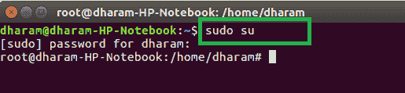
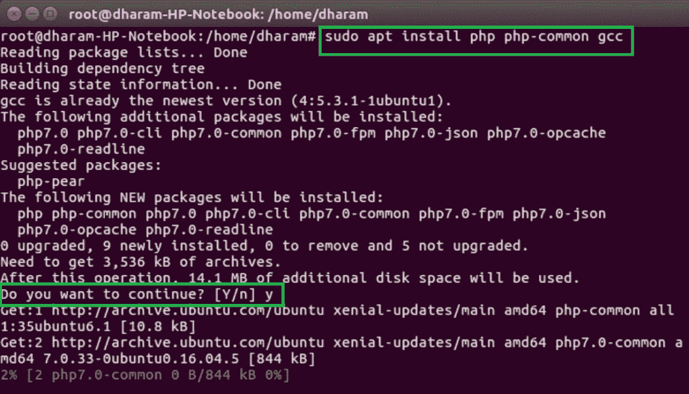
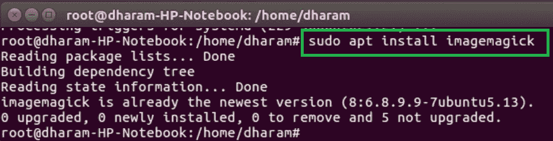
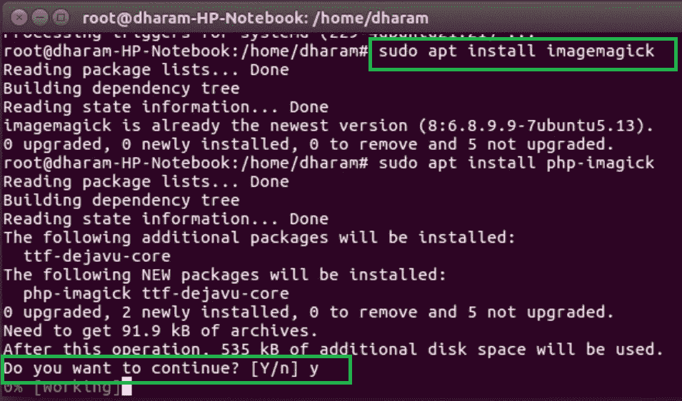
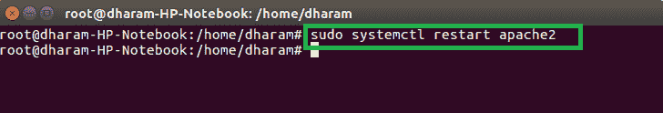

# 如何在 Ubuntu 中安装 ImageMagick 和 Imagick PHP 扩展？

> 原文:[https://www . geesforgeks . org/how-install-imagemagick-and-imag ick-PHP-extension-in-Ubuntu/](https://www.geeksforgeeks.org/how-to-install-imagemagick-and-imagick-php-extension-in-ubuntu/)

Imagick 函数用于使用 ImageMagick 应用编程接口创建和修改图像。ImageMagick 是用于创建、编辑和修改合成位图图像的软件套件。该功能可以读取、写入和转换多种格式的图像，包括 DPX、EXR、GIF、JPEG、JPEG-2000、PDF、PhotoCD、PNG、Postscript、SVG 和 TIFF。

**要求:**安装 ImageMagick 所需的 PHP 5.1.3 和 ImageMagick 6.2.4 版本。

**在 Ubuntu 上安装 ImageMagick (Imagick)的过程:**在 Ubuntu 16.04、18.04 及以上版本上安装 ImageMagick 和 Imagick PHP 扩展有一些步骤，下面列出:

*   **安装 apache 服务器:**如果您的系统中没有安装 Apache 服务器，那么首先安装 apache2 服务器。
*   **Make Superuser:** Open terminal and use following command to make yourself superuser.

    ```php
    sudo su
    ```

    

*   **Install Required Packages:** Use the following command to Install the required packages of ImageMagick and Imagick PHP extension.

    ```php
    $ sudo apt install php php-common gcc
    ```

    

*   **Install ImageMagick extension:** Now install the ImageMagick PHP extension by using the following command.

    ```php
    $ sudo apt install imagemagick
    ```

    

*   **Install Imagick extension:** After completion of ImageMagick package, the Imagick PHP extension will install.

    ```php
    $ sudo apt install php-imagick
    ```

    

*   **Restart Apache Server:** Restart the apache server by using the following command.

    ```php
    $ sudo systemctl restart apache2
    ```

    

*   **Verify the Imagick extension:** The Imagick extension can be verified by using the following command.

    ```php
    $ php -m | grep imagick
    ```

    