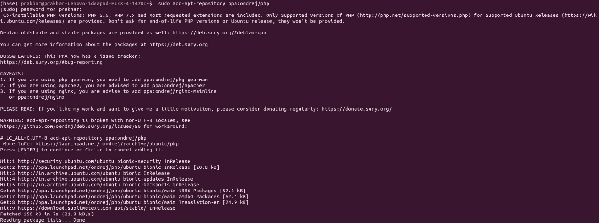
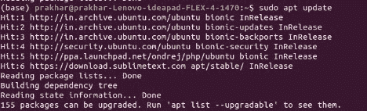
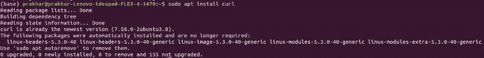
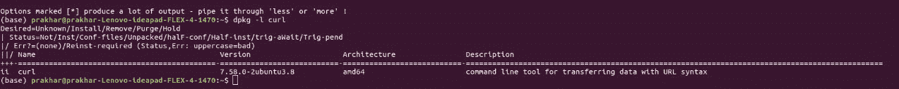

# 如何在 Ubuntu 中安装 php-curl？

> 原文:[https://www . geesforgeks . org/how-install-PHP-curl-in-Ubuntu/](https://www.geeksforgeeks.org/how-to-install-php-curl-in-ubuntu/)

代表客户网址。这是一个 Linux 终端命令，用于将数据从一台服务器传输到另一台服务器。它是一个免费的开源数据传输工具，使用以下协议:IMAP、IMAPS、POP、POP3、POP3S、DICT、FILE HTTP、HTTPS、SMB、SMBS、SMTP、SMTPS、FTP、FTPS、TELNET、RTSP、RMTP 和 TFTP。

它在运行时显示一个类似仪表的进度条，并指示各种参数，如传输的数据量、数据传输速度和预计剩余时间。

以下是在 Ubuntu 系统上安装 PHP-CURL 的步骤:

*   **Step 1:** Install PHP libraries for the server by running the following command:

    ```php
    $ sudo add-apt-repository ppa:ondrej/php
    ```

    

*   **Step 2:** Then, update the server:

    ```php
    $ sudo apt update
    ```

    

*   **Step 3:** Now, install CURL.

    ```php
    $ sudo apt install curl
    ```

    

*   **Step 4:** You can check the version of curl installed by the command:

    ```php
    $ dpkg -l curl
    ```

    

*   **Step 5:** Once you have installed CURL on Ubuntu 18.04 PHP server, you need to restart your webserver on which PHP is running:

    如果您使用的是 Apache 服务器，请使用以下任一命令重新启动服务器:

    ```php
    $ sudo service apache2 restart
    ```

    或者

    ```php
    $ sudo /etc/init.d/apache2 restart
    ```

    同样，如果您使用的是 Nginx 服务器，请使用以下任一命令:

    ```php
    $ sudo systemctl restart nginx
    ```

    或者

    ```php
    $ sudo /etc/init.d/nginx restart
    ```

PHP 是一种专门为 web 开发设计的服务器端脚本语言。您可以通过以下 [PHP 教程](https://www.geeksforgeeks.org/php-tutorials/)和 [PHP 示例](https://www.geeksforgeeks.org/php-examples/)从头开始学习 PHP。