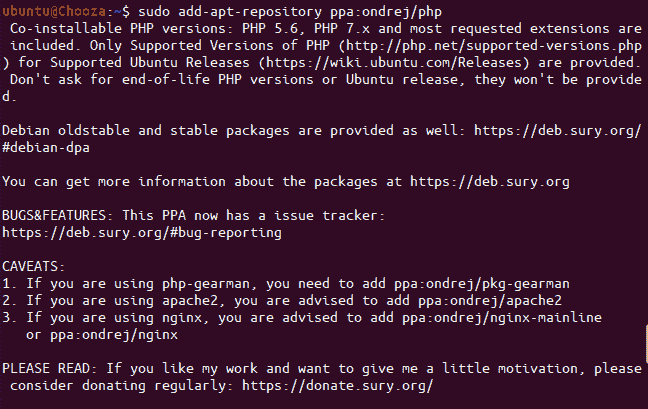
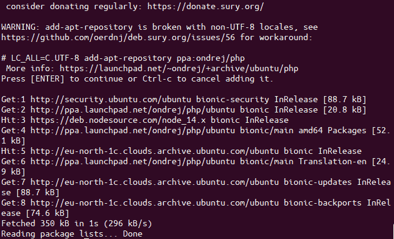
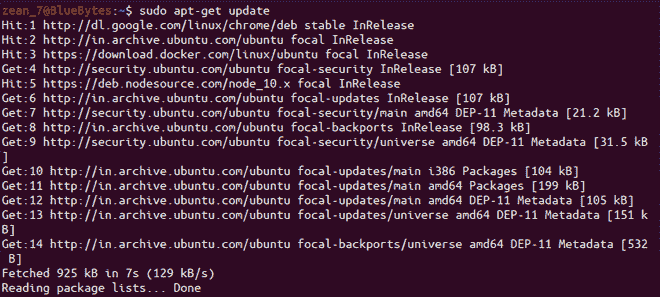
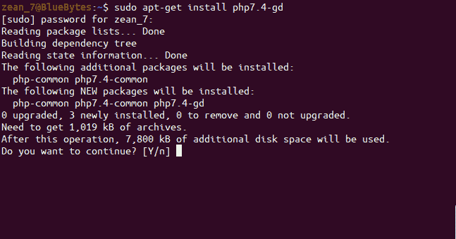

# 如何在 Ubuntu 上安装 php70-gd？

> 原文:[https://www . geesforgeks . org/how-install-PHP 70-GD-on-Ubuntu/](https://www.geeksforgeeks.org/how-to-install-php70-gd-on-ubuntu/)

**Graphics Draw** 或 **GD** 库是一个用于动态创建图像的开源库。它用于创建和操作各种不同图像格式的图像文件，包括 GIF、PNG、JPEG、WBMP 和 XPM。

这个 PHP 7 的软件包可以通过 Ondrej sur 通过 [PPA 安装。使用终端在 ubuntu 上安装 php7.0-gd。遵循以下步骤](https://launchpad.net/~ondrej/+archive/ubuntu/php)

*   First, you need to update your system with unsupported packages from this untrusted PPA by adding **ppa:ondrej/php** to your system’s Software Sources. This step is required only for Ubuntu 15 or less. Type the below command in your terminal and when prompted press ENTER to enable the repository

    ```
    sudo add-apt-repository ppa:ondrej/php
    ```

    

    向系统软件源添加 PPA 存储库-1

    

    向系统软件源添加 PPA 存储库-2

    .

*   Next, update your repositories using the command 

    ```
    sudo apt-get update
    ```

    

    Ubuntu 中更新命令的示例输出

*   Now, we are ready to install the gd library for PHP. Run the below command to install the required version of php7.x-gd, where x should be replaced by the version required for you to install.

    ```
    sudo apt-get install php7.x-gd

    for php version 7.0 replace x with 0,
    sudo apt-get install php7.0-gd
    ```

    

    Ubuntu 中的 sudo apt-get install php7.4-gd 命令

**注意:** PHP v7.0 已经过时，不再支持，所以上面安装 php7.0-gd 的命令可能无法工作。但是，安装 php7.4-gd 会很好。因为它相对较新，官方支持。