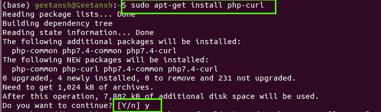

# 如何用 PHP 7 安装 ext-curl 扩展？

> 原文:[https://www . geesforgeks . org/如何安装-ext-curl-extension-with-PHP-7/](https://www.geeksforgeeks.org/how-to-install-the-ext-curl-extension-with-php-7/)

**ext-curl** curl 代表客户端用户，在 Linux 中 Curl 是一个 PHP 扩展，允许我们通过 URL 语法接收和发送信息。ext-curl 是最新的 PHP-7 的扩展，它装载了一些基本 curl 的高级特性。

**以下是在 Ubuntu 中添加 ext-curl 扩展的步骤–**

**1。更新扩展**

```php
sudo apt-get update
```


**2。安装 PHP-curl**

```php
sudo apt-get install php-curl
             OR
sudo apt-get install php7.0-curl
```

在此命令期间，系统会要求您确认，如果您必须安装，您必须按“y”键



**3。通过分机**重启分机，避免以后出现任何问题

```php
sudo service apache2 restart
```

经过以上所有步骤，您的 ext-curl PHP-7 已经成功安装，可以使用了。