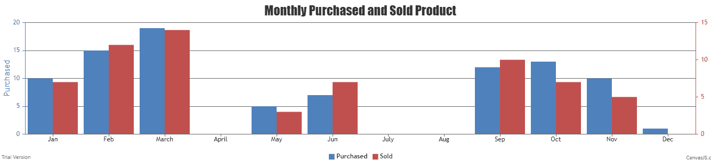

# 如何用 canvasJS 在 PHP 中制作动态图表？

> 原文:[https://www . geesforgeks . org/如何使用-canvasjs/](https://www.geeksforgeeks.org/how-to-make-dynamic-chart-in-php-using-canvasjs/) 制作动态 php 图表

CanvasJS 是一个 JavaScript 库，用于为网页轻松制作不同类型的图表。例如条形图、饼图、柱形图、面积图、折线图等。

让我们举一个例子，它需要创建一个图表，我们可以在其中显示每月售出和购买的产品。我们将考虑两个数组，也可以从我们的数据库中考虑。一旦我们从数据库中获取数据并存储在数组中，它就可以使用库 canvasJS 轻松绘制动态图。

创建一个文件并将其保存在项目文件夹中。文件名 **chart_sample.php** 包含数组形式的数据，其中第一个数组代表购买的产品，第二个数组代表 sols 产品列表。现在，使用 canvasJS 绘制一个图表。

**示例:**

```
<?php

// First array for purchased product
$purchased= array(10, 15, 19, 0, 5, 7, 0, 0, 12, 13, 10, 1);

// Second array for sold product
$sold= array(7, 12, 14, 0, 3, 7, 0, 0, 10, 7, 5, 0);

// Data to draw graph for purchased products
$dataPoints = array(
    array("label"=> "Jan", "y"=> $purchased[0]),
    array("label"=> "Feb", "y"=> $purchased[1]),
    array("label"=> "March", "y"=> $purchased[2]),
    array("label"=> "April", "y"=> $purchased[3]),
    array("label"=> "May", "y"=> $purchased[4]),
    array("label"=> "Jun", "y"=> $purchased[5]),
    array("label"=> "July", "y"=> $purchased[6]),
    array("label"=> "Aug", "y"=> $purchased[7]),
    array("label"=> "Sep", "y"=> $purchased[8]),
    array("label"=> "Oct", "y"=> $purchased[9]),
    array("label"=> "Nov", "y"=> $purchased[10]),
    array("label"=> "Dec", "y"=> $purchased[11])
);

// Data to draw graph for sold products
$dataPoints2 = array(
    array("label"=> "Jan", "y"=> $sold[0]),
    array("label"=> "Feb", "y"=> $sold[1]),
    array("label"=> "March", "y"=> $sold[2]),
    array("label"=> "April", "y"=> $sold[3]),
    array("label"=> "May", "y"=> $sold[4]),
    array("label"=> "Jun", "y"=> $sold[5]),
    array("label"=> "July", "y"=> $sold[6]),
    array("label"=> "Aug", "y"=> $sold[7]),
    array("label"=> "Sep", "y"=> $sold[8]),
    array("label"=> "Oct", "y"=> $sold[9]),
    array("label"=> "Nov", "y"=> $sold[10]),
    array("label"=> "Dec", "y"=> $sold[11])
);

?>

<!DOCTYPE HTML>
<html>
<head>  
    <script src="https://canvasjs.com/assets/script/canvasjs.min.js">
    </script>
    <script>
        window.onload = function () {

            var chart = new CanvasJS.Chart("chartContainer", {
                animationEnabled: true,
                title:{
                    text: "Monthly Purchased and Sold Product"
                },    
                axisY: {
                    title: "Purchased",
                    titleFontColor: "#4F81BC",
                    lineColor: "#4F81BC",
                    labelFontColor: "#4F81BC",
                    tickColor: "#4F81BC"
                },
                axisY2: {
                    title: "Sold",
                    titleFontColor: "#C0504E",
                    lineColor: "#C0504E",
                    labelFontColor: "#C0504E",
                    tickColor: "#C0504E"
                },    
                toolTip: {
                    shared: true
                },
                legend: {
                    cursor:"pointer",
                    itemclick: toggleDataSeries
                },
                data: [{
                    type: "column",
                    name: "Purchased",
                    legendText: "Purchased",
                    showInLegend: true, 
                    dataPoints:<?php echo json_encode($dataPoints,
                            JSON_NUMERIC_CHECK); ?>
                },
                {
                    type: "column",    
                    name: "Sold",
                    legendText: "Sold",
                    axisYType: "secondary",
                    showInLegend: true,
                    dataPoints:<?php echo json_encode($dataPoints2,
                            JSON_NUMERIC_CHECK); ?>
                }]
            });
            chart.render();

            function toggleDataSeries(e) {
                if (typeof(e.dataSeries.visible) === "undefined"
                            || e.dataSeries.visible) {
                    e.dataSeries.visible = false;
                }
                else {
                    e.dataSeries.visible = true;
                }
                chart.render();
            }

        }
    </script>
</head>

<body>
    <div id="chartContainer" style="height: 300px; width: 100%;"></div>
</body>
</html>
```

**输出:**


**参考:**T2】can vasjs