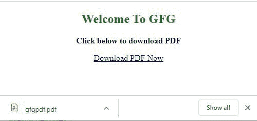
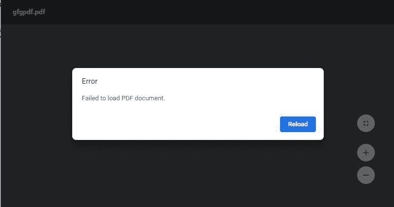

# 如何用 PHP 让 PDF 文件以 HTML 链接下载？

> 原文:[https://www . geesforgeks . org/how-to-make-pdf-file-in-html-link-use-PHP/](https://www.geeksforgeeks.org/how-to-make-pdf-file-downloadable-in-html-link-using-php/)

借助 php 中的 **[头文件()功能](https://www.geeksforgeeks.org/php-header-function/)** ，使用 PHP 从 HTML 链接下载 PDF。**报头()功能**用于发送原始的 HTTP 报头。有时它希望提示用户保存数据，如生成的 PDF。

**语法:**

*   **下载任何应用的 http 响应头**

    ```
    header("Content-Type: application/octet-stream");
    ```

    *   **http 响应头设置组成和文件下载**

    ```
    header('Content-Disposition: attachment; filename="downloaded.pdf"');
    ```

    *   **请求文件的长度需要下载**

    ```
    header("Content-Length: " . filesize("download.pdf"));
    ```

    *   **Reads a file and writes it to the output buffer.**

    ```
    readfile('original.pdf');

    ```

    。

    **注意:**请记住，在发送任何实际输出之前，都必须调用 HTTP header()，无论是通过正常的 HTML 标记、文件中的空行还是从 PHP 发送。

    **示例 1:** 将下面的 HTML 文件保存为 htmllinkpdf.html，将 PHP 文件保存为 downloadpdf.php

    *   下面的例子来说明使用 HTML 链接下载 PDF 文件的概念。
    *   这里下载的文件似乎是 PDF 格式，但没有任何内容，显示在任何应用程序打开错误
    *   **HTML 代码:**

        ```
        <!DOCTYPE html>
        <html>

        <head>
            <title>Download PDF using PHP from HTML Link</title>
        </head>

        <body>
            <center>
                <h2 style="color:green;">Welcome To GFG</h2>
                <p><b>Click below to download PDF</b>
                </p>
                <a href="gfgpdf.php?file=gfgpdf">Download PDF Now</a></center>
        </body>

        </html>
        ```

    *   **PHP 代码:**

        ```
        <?php

        $file = $_GET["file"] .".pdf";

        // We will be outputting a PDF
        header('Content-Type: application/pdf');

        // It will be called downloaded.pdf
        header('Content-Disposition: attachment; filename="gfgpdf.pdf"');

        $imagpdf = file_put_contents($image, file_get_contents($file)); 

        echo $imagepdf;
        ?>
        ```

    *   **Output:**
        

        

    以下示例说明了使用 HTML 链接在本地下载 PDF 文件(即从本地读取 gfgpdf.pdf 文件)的概念。

    **示例 2:** 将 HTML 文件保存为 htmllinkpdf.html，将 PHP 文件保存为 downloadpdf.php

    *   **HTML 代码:**

        ```
        <!DOCTYPE html>
        <html>

        <head>
            <title>Download PDF using PHP from HTML Link</title>
        </head>

        <body>
            <center>
                <h2 style="color:green;">Welcome To GFG</h2>
                <p><b>Click below to download PDF</b>
                </p>
                <a href="downloadpdf.php?file=gfgpdf">Download PDF Now</a>
            </center>
        </body>

        </html>
        ```

    *   **PHP 代码:**

        ```
        <?php

        header("Content-Type: application/octet-stream");

        $file = $_GET["file"]  . ".pdf";

        header("Content-Disposition: attachment; filename=" . urlencode($file));   
        header("Content-Type: application/download");
        header("Content-Description: File Transfer");            
        header("Content-Length: " . filesize($file));

        flush(); // This doesn't really matter.

        $fp = fopen($file, "r");
        while (!feof($fp)) {
            echo fread($fp, 65536);
            flush(); // This is essential for large downloads
        } 

        fclose($fp); 
        ?>
        ```

    *   **输出:**
        
        

    PHP 是一种专门为 web 开发设计的服务器端脚本语言。您可以通过以下 [PHP 教程](https://www.geeksforgeeks.org/php-tutorials/)和 [PHP 示例](https://www.geeksforgeeks.org/php-examples/)从头开始学习 PHP。