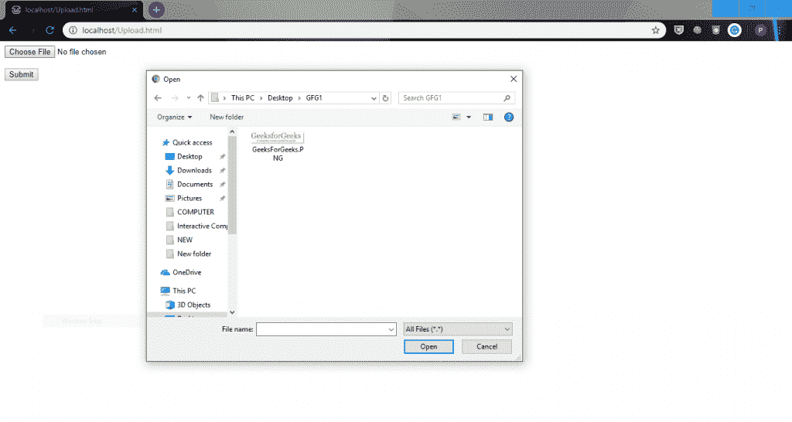

# 如何使用 PHP 将文件移动到服务器上的不同文件夹？

> 原文:[https://www . geesforgeks . org/如何使用 php 将文件移动到服务器上的不同文件夹中/](https://www.geeksforgeeks.org/how-to-move-a-file-into-a-different-folder-on-the-server-using-php/)

**move_uploaded_file()函数**和 rename()函数用于将文件移动到服务器上的不同文件夹中。在这种情况下，我们已经在服务器的临时目录中上传了一个文件，新目录是由方法分配的。文件临时已完全移动到新位置。move_uploaded_file()只允许移动那些通过 PHP 上传的文件，从而确保了此操作的安全性。因此，要移动已经上传的文件，我们使用 rename()方法。

**语法:**

```
move_uploaded_file ( string $Sourcefilename, string $destination ) : bool
rename ( string $oldname, string $newname [, resource $context ] ) : bool

```

*   **move_upload_file()方法:**此函数检查以确保语法中的源文件或“$Sourcefilename”是有效的上传文件(意味着它是通过 PHP 的 HTTP POST 上传机制上传的)。如果该文件有效，它将被移动到目标给定的文件名或语法中的“$destination”。
    如果对上传文件所做的任何操作有可能向用户，甚至同一系统中的其他用户泄露其内容，这种检查就尤为重要。请注意，如果目标文件已经存在，它将被覆盖。由于这个原因，应该首先检查文件的可用性，然后必须采取唯一的措施。
*   **rename()方法:**该方法尝试将 oldname 重命名为 newname，必要时在目录之间移动。如果新名称文件存在，那么它将被覆盖。如果重命名 newname 目录存在，那么这个函数将发出警告。

**示例:**这个示例是一个代码，它在一个名为 uploads 的目录中上传一个文件，然后将其路径更改为另一个名为 New 的目录。

**Upload.html**

```
<!DOCTYPE html>
<html>

<head>
    <title>
         Move a file into a different
         folder on the server
    </title>
</head>

<body>
    <form action="upfile.php" method="post"
            enctype="multipart/form-data">

        <input type="file" name="file" id="file">

        <br><br>

        <input type="submit" name="submit" value="Submit">
    </form>
</body>

</html>                    
```

**更新文件.php**

```
<?php

// The target directory of uploading is uploads
$target_dir = "uploads/";
$target_file = $target_dir . basename($_FILES["file"]["name"]);
$uOk = 1;

if(isset($_POST["submit"])) {

    // Check if file already exists
    if (file_exists($target_file)) {
        echo "file already exists.<br>";
        $uOk = 0;
    }

    // Check if $uOk is set to 0 
    if ($uOk == 0) {
        echo "Your file was not uploaded.<br>";
    } 

    // if uOk=1 then try to upload file
    else {

        // $_FILES["file"]["tmp_name"] implies storage path
        // in tmp directory which is moved to uploads
        // directory using move_uploaded_file() method
        if (move_uploaded_file($_FILES["file"]["tmp_name"],
                                            $target_file)) {
            echo "The file ". basename( $_FILES["file"]["name"])
                        . " has been uploaded.<br>";

            // Moving file to New directory 
            if(rename($target_file, "New/". 
                        basename( $_FILES["file"]["name"]))) {
                echo "File moving operation success<br>";
            }
            else {
                echo "File moving operation failed..<br>";
            }
        }
        else {
            echo "Sorry, there was an error uploading your file.<br>";
        }
    }
}

?>
```

**注意:**上传和新建目录已经存在一次，因此如果它们在服务器中不可用，您将不得不创建它们。


**代码运行:**

代码运行使用重命名方法(移动到新)


**重要方法:**

*   **file _ exists($ target _ file):**此方法用于检查路径的存在。如果它存在，则返回真，否则返回假。
*   **base name($ _ FILES[“file”][“name”]):**该方法用于获取所选文件的名称，其特点在于对用户提供的输入字符串进行操作，不知道实际的文件系统，并提供浏览器提供的安全功能的使用。