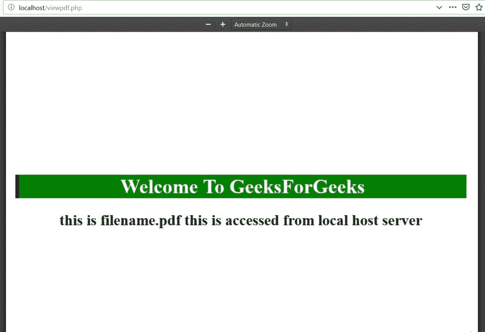

# 如何使用 PHP 在网页浏览器中打开一个 PDF 文件？

> 原文:[https://www . geesforgeks . org/how-open-a-pdf-files-in-web-browser-use-PHP/](https://www.geeksforgeeks.org/how-to-open-a-pdf-files-in-web-browser-using-php/)

PHP 使用标准代码在网页浏览器中显示 pdf 文件。显示 pdf 的过程涉及到 PDF 文件在服务器上的位置，它使用各种类型的标题来定义类型、处置、传输编码等形式的内容组成。PHP 传递 PDF 文件，以便在浏览器上读取。浏览器要么显示它，要么从本地主机服务器下载，然后显示 pdf。

**注意:** PHP 实际上并不是在读取 PDF 文件。它无法将文件识别为 pdf。它只将 PDF 文件传递给浏览器，以便在那里读取。如果将 pdf 文件复制到 XAMPP 的 htdocs 文件夹中，则不需要指定文件路径。

**示例 1:** 本示例在浏览器上显示 pdf 文件。

```
<?php

// Store the file name into variable
$file = 'filename.pdf';
$filename = 'filename.pdf';

// Header content type
header('Content-type: application/pdf');

header('Content-Disposition: inline; filename="' . $filename . '"');

header('Content-Transfer-Encoding: binary');

header('Accept-Ranges: bytes');

// Read the file
@readfile($file);

?>
```

**输出:**


**示例 2:**
这些示例显示了一种格式，并解释了代码的每个部分

```
<?php

// The location of the PDF file
// on the server
$filename = "/path/to/the/file.pdf";

// Header content type
header("Content-type: application/pdf");

header("Content-Length: " . filesize($filename));

// Send the file to the browser.
readfile($filename);
?> 
```

**输出:**


PHP 是一种专门为 web 开发设计的服务器端脚本语言。您可以通过以下 [PHP 教程](https://www.geeksforgeeks.org/php-tutorials/)和 [PHP 示例](https://www.geeksforgeeks.org/php-examples/)从头开始学习 PHP。