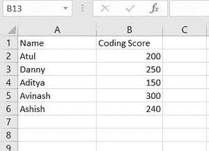
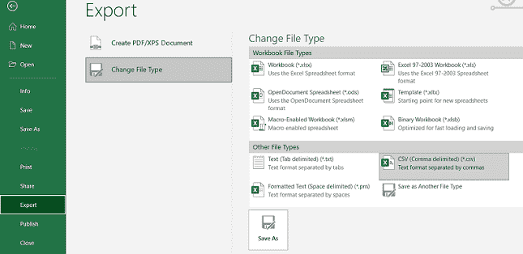
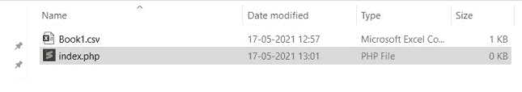

# 如何用 PHP 解析一个 CSV 文件？

> 原文:[https://www . geesforgeks . org/how-parse-a-CSV-file-in-PHP/](https://www.geeksforgeeks.org/how-to-parse-a-csv-file-in-php/)

在本文中，我们学习使用 PHP 代码解析 CSV 文件。

**进场:**

**第一步。**将数据添加到 excel 文件中。下面给出了一个示例数据，其列标题为“名称”和“编码分数”。



**第二步。**按照路径转换成 CSV 文件。转到文件>导出>更改文件类型> CSV 类型。将文件保存在名为“Book1.csv”的工作文件夹中。



**使用 PHP 解析 CSV 文件:**

**第一步。**创建一个文件夹，添加那个 CSV 文件，并在其中创建一个新的 PHP 文件。



文件路径

**第二步。**打开 PHP 文件，在里面写下下面的代码，下面的步骤会解释。

1.  使用 fopen 函数打开 CSV 的数据集。

    ```php
    $open = fopen("filename.csv", "r");
    ```

2.  读一行使用**[**fgetcsv()**](https://www.geeksforgeeks.org/how-to-display-data-from-csv-file-using-php/)功能。**

    ```php
    $data = fgetcsv($Open, 1000, ",");
    ```

3.  **使用循环迭代每一行数据。**

    ```php
    while (($data = fgetcsv($Open, 1000, ",")) !== FALSE) 
    {
      // Read the data    
    }
    ```

4.  **使用 PHP [**fclose()**](https://www.geeksforgeeks.org/php-fclose-function/) 方法关闭该文件。**

    ```php
    fclose($open);
    ```

****示例:****

## **服务器端编程语言（Professional Hypertext Preprocessor 的缩写）**

```php
<?php

  if (($open = fopen("Book1.csv", "r")) !== FALSE) 
  {

    while (($data = fgetcsv($open, 1000, ",")) !== FALSE) 
    {        
      $array[] = $data; 
    }

    fclose($open);
  }
  echo "<pre>";
  //To display array data
  var_dump($array);
  echo "</pre>";
```

****输出:****

```php
array(6) {
  [0]=>
  array(2) {
    [0]=>
    string(5) "Name "
    [1]=>
    string(12) "Coding Score"
  }
  [1]=>
  array(2) {
    [0]=>
    string(4) "Atul"
    [1]=>
    string(3) "200"
  }
  [2]=>
  array(2) {
    [0]=>
    string(5) "Danny"
    [1]=>
    string(3) "250"
  }
  [3]=>
  array(2) {
    [0]=>
    string(6) "Aditya"
    [1]=>
    string(3) "150"
  }
  [4]=>
  array(2) {
    [0]=>
    string(7) "Avinash"
    [1]=>
    string(3) "300"
  }
  [5]=>
  array(2) {
    [0]=>
    string(6) "Ashish"
    [1]=>
    string(3) "240"
  }
}
```