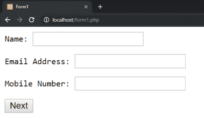
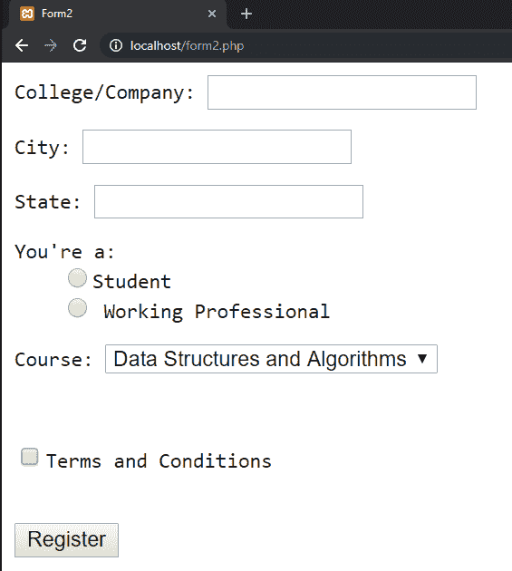

# 如何在 PHP 中将表单变量从一个页面传递到另一个页面？

> 原文:[https://www . geesforgeks . org/如何在 php 中将表单变量从一页传递到另一页/](https://www.geeksforgeeks.org/how-to-pass-form-variables-from-one-page-to-other-page-in-php/)

表单是一个 HTML 元素，用于以有序和有组织的方式从用户那里收集信息。如果后端服务需要，这些信息可以发送到后端服务，也可以存储在使用数据库管理系统(如 MySQL)的数据库中。将表单拆分为多个步骤或页面可以更好地处理数据和分层信息。这可以通过创建浏览器会话来实现。HTML 会话是变量的集合，当用户在当前域的页面之间切换时，这些变量可以用来维护表单属性的状态。一旦用户关闭浏览器或离开网站，会话条目将被删除。

**语法:**

```
<?php
     session_start();
     session_register('variable_name');
     $_SESSION['variable_name']=variable_value;
?>

```

**示例:**这个示例将说明使用 PHP 和 Browser Sessions 创建三页表单的步骤。这是指教练学院的登记表。表单的第一页将要求用户输入他们的姓名、电子邮件和手机号码，这将被转移到另一个 PHP 页面。信息将存储在会话目录中。

*   **代码 1:** 启动你的本地主机服务器，比如 Apache 等。完成 HTML 标记的编写，并在 BODY 部分中编写下面的代码。将格式为**‘form 1 . PHP’**的文件保存在本地主机的本地目录中。打开你的网络浏览器，输入你的本地主机地址，后跟 **'\form1.php'** 。

    ```
    <form method="POST" action="form2.php">
        <pre>Name: <input type="text"
            name="user_name">
        </pre>

        <pre>Email Address: <input type="text"
            name="user_email_address">
        </pre>

        <pre>Mobile Number: <input type="number"
            name="user_mobile_number">
        </pre>

        <input type="submit" value="Next">
    </form>
    ```

*   **输出:**它会像这样打开你的表单，询问的信息会被传递到与表单链接的 PHP 页面 **(action="form2.php")** 使用 POST 方法。在下一步中，提交的信息将存储在会话数组中。
    
*   **代码 2:** 重复上述保存文件的过程。请使用文件名“form2.php”。当你点击 form1.php 页面的“下一步”时。该页面将询问学院/公司名称、城市、用户所在州以及他/她申请的课程。

    ```
    <?php

    // Initialize the session
    session_start();

    // Store the submitted data sent
    // via POST method, stored 

    // Temporarily in $_POST structure.
    $_SESSION['name'] = $_POST['user_name'];

    $_SESSION['email_address']
            = $_POST['user_email_address'];

    $_SESSION['mobile_number']
            = $_POST['user_mobile_number'];

    ?>

    <!-- Form for other details-->
    <form method="POST" action="form3.php">

        <pre>
            Company/College: 
            <input type="text" name="college_name">
        </pre>

        <pre>
            City: 
            <input type="text" name="city">
        </pre>

        <pre>
            State: 
            <input type="text" name="state">
        </pre>

        <pre>
            You're a: 
            <input type="radio" name="profession"
                    value="Student">Student

            <input type="radio" name="profession"
                    value="Working Professional">
                    Working Professional
        </pre>

        <pre>
            Course: 
            <select name="course">
                <option value="DSnA">
                    Data Structures and Algorithms
                </option>

                <option value="Gate_test">
                    GATE Mock Test
                </option>

                <option value="Mock_interview">
                    Mock Interviews
                </option>

                <option value="Machine_learning">
                    Machine Learning
                </option>
            </select>
        </pre>
        <br>

        <pre>
            <input type="checkbox" 
                name="terms_and_conditions"> 
                Terms and Conditions 
        </pre>
        <br>

        <input type="submit" value="Register">

    </form>
    ```

*   **输出:**会把你重定向到这个页面，看起来是这样的:
    
*   **代码 3:** 在这一步中，我们将从会话数组中提取信息，并将其存储在我们的 MySQL 数据库中。制作第三个名为“form3.php”的文件，在 BODY 部分中编写以下代码，并应用必要的 HTML 标记。

    ```
    <?php
        //Initializing the session
        session_start();

        //writing MySQL Query to insert the details
        $insert_query = 'insert into subscriptions (
                        name,
                        email_address,
                        mobile_number,
                        college_name,
                        city,
                        state,
                        profession,
                        course,
                        terms_and_conditions,
                        ) values (
                        ' . $_SESSION['name'] . ",
                        " . $_SESSION['email_address'] . ",
                        " . $_SESSION['mobile_number'] . ",
                        " . $_POST['college_name']. ",
                        " . $_POST['city']. ",
                        " . $_POST['state']. ",
                        " . $_POST['profession']. ",
                        " . $_POST['course']. ",
                        " . $_POST['terms_and_conditions']. "
                        );"

        //let's run the query
        mysql_query($insert_query);
        ?>
    <pre>Successfully Registered</pre>
    ```

*   **输出:**点击第 2 页的注册，会将你重定向到这个页面，你的数据会被提交到数据库中。作为先决条件，您必须将页面链接到 MySQL 数据库。为此，你可以参考[这个](https://www.geeksforgeeks.org/php-inserting-into-mysql-database/)
    T5】

**结论:**会话可用于保持表单数据处于活动状态，直到浏览器关闭或网站离开。请注意，在编写最终查询时，我们使用了$_SESSION 数组中的数据，以及从表单最后一步发布的$_POST 数组中的数据。

PHP 是一种专门为 web 开发设计的服务器端脚本语言。您可以通过以下 [PHP 教程](https://www.geeksforgeeks.org/php-tutorials/)和 [PHP 示例](https://www.geeksforgeeks.org/php-examples/)从头开始学习 PHP。