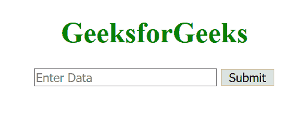
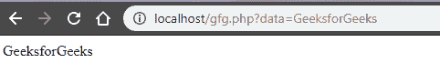

# 如何将 JavaScript 变量传递给 PHP？

> 原文:[https://www . geesforgeks . org/如何将 javascript 变量传递给 php/](https://www.geeksforgeeks.org/how-to-pass-javascript-variables-to-php/)

JavaScript 是客户端，PHP 是服务器端脚本语言。将 JavaScript 变量传递给 PHP 的方法是通过请求。

**方法 1:** 本例使用表单元素和 GET/POST 方法将 JavaScript 变量传递给 PHP。内容的形式可以通过 PHP 中的 GET 和 POST 操作来访问。当提交表单时，客户端以 URL 的形式发送表单数据，例如:

```
https://example.com?name=value
```

这种类型的网址只有在我们使用 GET 操作时才可见，POST 操作隐藏了网址中的信息。

**客户端:**

```
<!DOCTYPE html>
<html>

<head>
    <title>
        Passing JavaScript variables to PHP
    </title>
</head>

<body>
    <h1 style="color:green;">
        GeeksforGeeks
    </h1>

    <form method="get" name="form" action="destination.php">
        <input type="text" placeholder="Enter Data" name="data">
        <input type="submit" value="Submit">
    </form>
</body>

</html>
```



**服务器端(PHP):** 在服务器端 PHP 页面，我们请求表单提交的数据并显示结果。

```
<?php
$result = $_GET['data'];
echo $result;
?>
```

**输出:**


**方法二:使用 Cookie 存储信息:**
**客户端:**使用 Cookie 存储信息，然后在 PHP 页面中请求。在下面的代码中创建了一个名为 *gfg* 的 cookie，并存储了值*geeks forgeks*。创建 cookie 时，还应指定过期时间，在这种情况下为 *10* 天。

```
<script>

// Creating a cookie after the document is ready
$(document).ready(function () {
    createCookie("gfg", "GeeksforGeeks", "10");
});

// Function to create the cookie
function createCookie(name, value, days) {
    var expires;

    if (days) {
        var date = new Date();
        date.setTime(date.getTime() + (days * 24 * 60 * 60 * 1000));
        expires = "; expires=" + date.toGMTString();
    }
    else {
        expires = "";
    }

    document.cookie = escape(name) + "=" + 
        escape(value) + expires + "; path=/";
}

</script>
```

**服务器端(PHP):** 在服务器端，我们通过指定名称 *gfg* 来请求 cookie，并提取数据显示在屏幕上。

```
<?php
    echo $_COOKIE["gfg"];
?>
```

**输出:**


JavaScript 最出名的是网页开发，但它也用于各种非浏览器环境。您可以通过以下 [JavaScript 教程](https://www.geeksforgeeks.org/javascript-tutorial/)和 [JavaScript 示例](https://www.geeksforgeeks.org/javascript-examples/)从头开始学习 JavaScript。

PHP 是一种专门为 web 开发设计的服务器端脚本语言。您可以通过以下 [PHP 教程](https://www.geeksforgeeks.org/php-tutorials/)和 [PHP 示例](https://www.geeksforgeeks.org/php-examples/)从头开始学习 PHP。