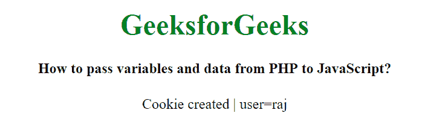

# 如何将变量和数据从 PHP 传递到 JavaScript？

> 原文:[https://www . geesforgeks . org/如何将变量和数据从 php 传递到 javascript/](https://www.geeksforgeeks.org/how-to-pass-variables-and-data-from-php-to-javascript/)

在本文中，让我们看看如何将数据和变量从 PHP 传递到 JavaScript。

根据具体情况，我们可以通过两种方式将数据从 PHP 传递到 JavaScript。首先，如果我们想在同一个页面上执行操作，我们可以使用简单赋值运算符传递数据。否则我们可以使用 Cookies 将数据从 PHP 传递到 JavaScript。Cookie 在客户端工作。

**程序 1:** 这个程序使用赋值运算符将变量和数据从 PHP 传递给 JavaScript。

```
<!DOCTYPE html>
<html>

<head>
    <title>
        How to pass variables and data
        from PHP to JavaScript?
    </title>
</head>

<body style="text-align:center;">

    <h1 style="color:green;">GeeksforGeeks</h1>

    <h4>
        How to pass variables and data
        from PHP to JavaScript?
    </h4>

    <?php
        $name = "Hello World";
    ?>

    <script type="text/javascript">
        var x = "<?php echo"$name"?>";
        document.write(x);
    </script>
</body>

<html>
```

**输出:**


这里，我们只是静态或动态地获取输入，并使用赋值操作符将其传递给 JavaScript 变量。JavaScript 块中的 PHP 代码会将其转换为结果输出，然后将其传递给变量 x，然后打印 x 的值。

**程序 2:** 这个程序使用 Cookies 将变量和数据从 PHP 传递给 JavaScript。

```
<!DOCTYPE html>
<html>

<head>
    <title>
        How to pass variables and data
        from PHP to JavaScript?
    </title>
</head>

<body style="text-align:center;">

    <h1 style="color:green;">GeeksforGeeks</h1>

    <h4>
        How to pass variables and data
        from PHP to JavaScript?
    </h4>

    <?php

        // Initialize cookie name
        $cookie_name = "user";
        $cookie_value = "raj";

        // Set cookie
        setcookie($cookie_name, $cookie_value);

        if(!isset($_COOKIES[$cookie_name])) {
            print("Cookie created | ");
        }
    ?>

    <script type="text/javascript">
        var x = document.cookie;
        document.write(x);
    </script>
</body>

<html>
```

**输出:**


PHP 提供了一种使用 setCookie()方法设置 cookie 的方法。在这里，我们可以在 PHP cookie 中设置数据或变量，并使用 document.cookie 从 JavaScript 中检索它。

**运行程序的步骤:**

*   在您的系统中安装本地服务器，如 XAMPP 服务器。
*   使用名称`geeks.php`将文件保存在`htdocs`文件夹中
*   启动 Apache 服务器。
*   打开浏览器，在地址栏中输入`localhost/geeks.php`，点击回车按钮。
*   它会显示结果。

PHP 是一种专门为 web 开发设计的服务器端脚本语言。您可以通过以下 [PHP 教程](https://www.geeksforgeeks.org/php-tutorials/)和 [PHP 示例](https://www.geeksforgeeks.org/php-examples/)从头开始学习 PHP。