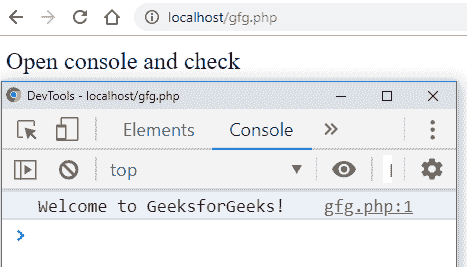
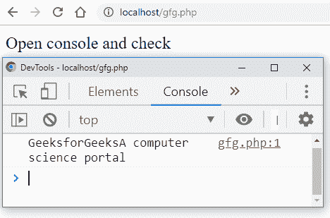

# 如何用 PHP 打印 JavaScript 控制台？

> 原文:[https://www . geesforgeks . org/how-print-JavaScript-console-with-PHP/](https://www.geeksforgeeks.org/how-to-print-javascript-console-with-php/)

PHP 中使用 echo 命令来打印 HTML 文档的任何值。使用

**语法:**

```
echo "This is GeeksforGeeks Tutorial.";
echo variable_name;

```

**注意:**echo 命令将打印 HTML 文档。这个特性可以用来在 HTML 页面中放置 JavaScript 语句。

**示例 1:** 本示例说明如何使用 echo 关键字显示内容。

```
<?php 

// Declare variable and store the string
$var1 = "GeeksforGeeks";
$var2 = "A computer science portal";

// Use echo keyword to display result
echo $var1 . "\n" . $var2 ;
?>
```

**输出:**

```
GeeksforGeeks
A computer science portal
```

点“.”运算符用于连接 PHP 中的两个字符串。您可以通过用点“.”连接来打印多个变量操作员。echo 关键字用于将变量 var1 和 var2 的值显示到浏览器正常可读的 HTML 文档中。在使用 PHP 编写 JavaScript 控制台时，可以利用这个属性。JavaScript 代码可以写在回显部分，并被带到 HTML 文档中。

**示例 2:** 此示例说明如何将字符串打印到控制台中。

```
<?php 

// Use echo keyword to display result
echo "Open console and check";

echo '<script>console.log("Welcome to GeeksforGeeks!"); </script>';
?>
```

**输出:**


现在，我们将看到如何将 PHP 变量的值写入控制台行。

**示例 3:** 这个示例说明了如何将 PHP 变量值打印到控制台。

```
<?php 

// Declare variable and store the string
$var1 = "GeeksforGeeks";
$var2 = "A computer science portal";

echo "Open console and check";

echo '<script>console.log("'$var1 . "\n" . $var2'"); </script>';
?>
```

**输出:**
