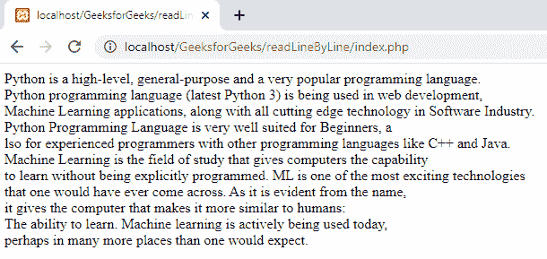

# 如何在 PHP 中逐行读取一个大文件？

> 原文:[https://www . geesforgeks . org/如何用 php 逐行读取大文件/](https://www.geeksforgeeks.org/how-to-read-a-large-file-line-by-line-in-php/)

我们将使用一些文件操作来逐行读取并显示一个大文件。

1.  **Read a file:** We will read the file by using [**fopen()**](https://www.geeksforgeeks.org/php-fopen-function-open-file-or-url/) function. This function is used to read and open a file.

    **语法:**

    ```php
     fopen("filename", access_mode);
    ```

    **参数:**

    *   **文件名:**文件名是文件的名称
    *   **access_mode:** 是文件的模式，包括 r-read 模式和 w- write 模式。
2.  **Traverse through the end of the file:** We can traverse by using [**feof()**](https://www.geeksforgeeks.org/php-feof-function/) function. This function is used to traverse till the end of the file.

    **语法:**

    ```php
    feof($file)
    ```

    **参数:**

    *   **$file:** 是文件名

    **逐行获取数据:**我们可以使用 [**fgets()**](https://www.geeksforgeeks.org/php-fgets-function/) 方法逐行获取数据。

    **语法:**

    ```php
    fgets($file)
    ```

    **参数:**

    *   **$file:** 是文件名

**示例:**让我们考虑数据存储在“myfile.txt”中的文件。下面是一行行读取文件并显示的 PHP 代码。

## 服务器端编程语言（Professional Hypertext Preprocessor 的缩写）

```php
<?php

    // Open your file in read mode
    $input = fopen("myfile.txt", "r");

    // Display a line of the file until the end 
    while(!feof($input)) {

        // Display each line
        echo fgets($input). "<br>";
    }
?>
```

**my file . txt:**my file . txt 的内容如下:

> Python 是一种高级、通用和非常流行的编程语言。Python 编程语言(最新的 Python 3)正被用于网络开发、机器学习应用以及软件行业的所有前沿技术。Python 编程语言非常适合初学者，也适合使用其他编程语言(如 C++和 Java)的有经验的程序员。机器学习是一个研究领域，它使计算机能够在没有明确编程的情况下进行学习。ML 是人们可能遇到的最令人兴奋的技术之一。从名字中可以明显看出，它赋予了计算机更类似于人类的能力:学习能力。今天，机器学习正在被积极地使用，也许在比人们预期的更多的地方。

**输出:**



逐行归档