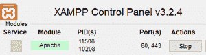
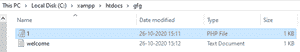
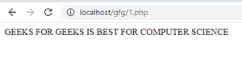

# 如何使用 PHP 从 XAMPP 网络服务器存储的文件中读取数据？

> 原文:[https://www . geesforgeks . org/如何从文件中读取数据-存储在 xampp-web server-使用-php/](https://www.geeksforgeeks.org/how-to-read-data-from-a-file-stored-in-xampp-webserver-using-php/)

我们给出了一个存储在 XAMPP 服务器上的文件，任务是从服务器读取文件，并使用 PHP 在屏幕上显示文件内容。我们用一些 PHP 函数来解决这个问题。

**文件:**文件是以不同格式存储在磁盘上的一组数据。例如–。txt，。exe。pdf 等

[**fopen()函数:**](https://www.geeksforgeeks.org/php-fopen-function-open-file-or-url/)**[](https://www.geeksforgeeks.org/php-fopen-function-open-file-or-url/)**PHP 中的 *fopen()* 函数是一个内置函数，用于打开文件或 URL。它用于使用特定的文件名将资源绑定到流。要检查的文件名和模式作为参数发送到 *fopen()* 函数，如果发现匹配，则返回文件指针资源，如果失败，则返回 False。通过在函数名前添加“@”可以隐藏错误输出。****

******语法:******

```php
**fopen('filename', filemode)** 
```

****这里，文件名是文件的名称，文件模式包括读(r)模式、
写(w)和二进制(b)模式等。****

*   ****fopen($geek，r) — *这里我们以读取模式打开 geek 文件。*****
*   ****fopen($geek，r+) — *这里我们以读写模式*打开 geek 文件。****
*   ****fopen($geek，w) — *这里我们以写模式打开 geek 文件。*****
*   ****fopen($geek，w+) — *这里我们以读写模式打开 geek 文件。*****
*   ****fopen($geek，b) — *这里我们以读写模式*打开 geek 文件。****

******要求:******

******XAMPP 网络服务器—** 如果您尚未安装 XAMPP/WAMP 网络服务器，请按照以下步骤进行安装:****

****安装链接:[https://www.apachefriends.org/download.html](https://www.apachefriends.org/download.html)****

****启动 XAMPP 服务器****

********

****打开记事本，输入以下代码:****

## ****服务器端编程语言（Professional Hypertext Preprocessor 的缩写）****

```php
**<?php

// File to be read
$file = "./welcome.txt";

// Opening file
$f = fopen($file, "r") or 
    exit("Unable to open file!");

// Read file line by line until
// the end of file (feof)
while(!feof($f)) {
    echo fgets($f)."<br />";
}

// Closing file
fclose($f);
?>**
```

*****welcome.txt* 文件中的数据有:****

```php
**GEEKS FOR GEEKS IS BEST FOR COMPUTER SCIENCE**
```

****将这两个文件放在文件夹中(路径显示在这里)****

****

小路**** 

******运行脚本**在浏览器中输入以下网址: *localhost/gfg/1.php*****

******输出:******

********