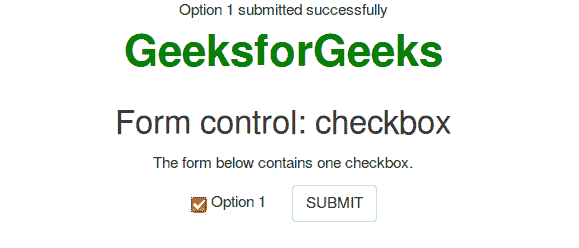

# 在 PHP 中勾选了复选框如何阅读？

> 原文:[https://www . geeksforgeeks . org/checkbox-in-PHP/](https://www.geeksforgeeks.org/how-to-read-if-a-checkbox-is-checked-in-php/)如何阅读

**使用 isset()功能**

isset()函数是 PHP 中的一个内置函数，它检查变量是否被设置并且不为空。此函数还检查声明的变量、数组或数组键是否有 null 值，如果有，isset()返回 false，在所有其他可能的情况下返回 true。这个问题可以借助 isset()函数解决。

**语法:**

```php
*bool* isset( $var, mixed )
```

**说明:**该函数接受多个参数。这个函数的第一个参数是$var。此参数用于存储变量值。

**程序:**

```php
<?php 

if(isset($_GET['submit'])) {
    $var = $_GET['option1'];
    if(isset($var)) {
        echo "Option 1 submitted successfully";
    }
}
?>
<html lang="en">
<head>
    <title>GeeksforGeeks Example</title>
    <meta charset="utf-8">
    <meta name="viewport" content="width=device-width, initial-scale=1">
    <link rel="stylesheet" href=
    "https://maxcdn.bootstrapcdn.com/bootstrap/3.3.7/css/bootstrap.min.css">
    <style>
        .gfg {
            font-size:40px;
            font-weight:bold;
            color:green;
        }
        body {
            text-align:center;
        }
    </style>
</head>
<body>
    <div class="container">
        <div class = "gfg">GeeksforGeeks</div>
        <h2>Form control: checkbox</h2>
        <p>The form below contains one checkbox.</p>
        <form method="get">
            <div class="checkbox">
                <label><input type="checkbox" name = "option1" 
                        value="Option 1">Option 1</label>
                <label><button name="submit" value='true' 
                    class="btn btn-default">SUBMIT</button>
            </div>
        </form>
    </div>
</body>
</html>
```

**输出:**


**[使用空()功能](https://www.geeksforgeeks.org/php-empty-function/)**

empty()函数是 PHP 中的一个内置函数，用于检查变量是否为空。

**语法:**

```php
*bool* empty( $var )
```

**描述:**该函数决定变量是否为空。

**示例:**

```php
<?php
if(!empty($_GET['submit'])) {
    $var = $_GET['option1'];
    if(isset($var)){
        echo "Option 1 submitted successfully";
    }
}
?>
<!DOCTYPE html>
<html lang="en">
<head>
    <title>GeeksforGeeks Example</title>
    <meta charset="utf-8">
    <meta name="viewport" content="width=device-width, initial-scale=1">
    <link rel="stylesheet" href=
    "https://maxcdn.bootstrapcdn.com/bootstrap/3.3.7/css/bootstrap.min.css">
    <script src="https://ajax.googleapis.com/ajax/libs/jquery/3.3.1/jquery.min.js">
    </script>
    <script src="https://maxcdn.bootstrapcdn.com/bootstrap/3.3.7/js/bootstrap.min.js">
    </script>
    <style>
        .gfg {
            font-size:40px;
            font-weight:bold;
            color:green;
        }
        body {
            text-align:center;
        }
    </style>
</head>
<body>
    <div class="container">
        <div class = "gfg">GeeksforGeeks</div>
        <h2>Form control: checkbox</h2>
        <p>The form below contains one checkbox.</p>
        <form method="get">
            <div class="checkbox">
                <label><input type="checkbox" name = "option1" 
                            value="Option 1">Option 1</label>
                <label><button name="submit" value="true"
                class="btn btn-default">SUBMIT</button>
            </div>
        </form>
    </div>
</body>
</html>
```

**输出:**


**参考:**

*   [http://php.net/manual/en/function.isset.php](http://php.net/manual/en/function.isset.php)
*   [http://php.net/manual/en/function.empty.php](http://php.net/manual/en/function.empty.php)