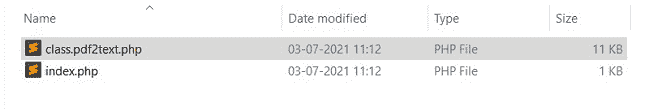

# 如何用 PHP 读取 PDF 文件？

> 原文:[https://www . geesforgeks . org/how-read-pdf-file-using-PHP/](https://www.geeksforgeeks.org/how-to-read-pdf-file-using-php/)

在本文中，我们将学习如何使用 PHP 在浏览器上显示 PDF 文件内容。

我们必须包含一个名为“[class.pdf2text.php](https://github.com/jpwright/debcite/blob/master/class.pdf2text.php)”的外部 PHP 文件。使用 PHP 将其包含在所需的网页中。创建一个 HTML 表单，我们可以在其中从您的计算机中选择一个 PDF 文件，并检查其文件扩展名是否为 PDF。

**项目结构:**为您的项目创建一个文件夹，添加 class.pdf2text.php 并创建一个新的 index.php 文件。



文件结构

**示例:**

## index.php

```
<?php

require('class.pdf2text.php');
extract($_POST);
if(isset($readpdf)){

    if($_FILES['file']['type']=="application/pdf") {
        $a = new PDF2Text();
        $a->setFilename($_FILES['file']['tmp_name']); 
        $a->decodePDF();
        echo $a->output(); 
    }

    else {
        echo "<p style='color:red;text-align:center'>
            Wrong file format</p>";
    }
}    

?>

<html>

<head>
    <title>Read pdf php</title>
</head>

<body>
    <form method="post" enctype="multipart/form-data">
        Choose Your File
        <input type="file" name="file" />
        <br>
        <input type="submit" value="Read PDF" name="readpdf" />
    </form>
</body>

</html>
```

**输出:**以下输出为上述的视频格式。


阅读 PDF 文件