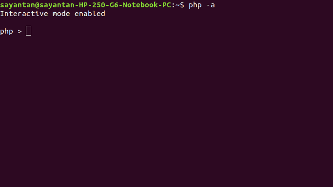

# PHP 中如何读取用户或控制台输入？

> 原文:[https://www . geesforgeks . org/how-read-user-or-console-input-in-PHP/](https://www.geeksforgeeks.org/how-to-read-user-or-console-input-in-php/)

在 PHP 中，控制台是一个命令行界面，也叫**交互外壳**。我们可以通过在终端中键入以下命令来访问它:

```php
php -a
```

如果我们在 shell 中键入任何 PHP 代码并点击 enter，它将直接执行并显示输出，或者在出现任何错误时显示错误消息。从 PHP 控制台读取输入的 PHP 代码示例如下所示:



在本文中，我们将讨论 PHP 中读取控制台或用户输入的两种方法:
**方法 1:** 使用 **readline()函数**是 PHP 中的内置函数。该功能用于读取控制台输入。
通过 **readline()功能**可以实现以下事情:

*   **通过提示用户接受单次输入:**

## 服务器端编程语言（Professional Hypertext Preprocessor 的缩写）

```php
<?php

// For input
// Hello World
$a = readline('Enter a string: ');

// For output
echo $a;   
?>
```