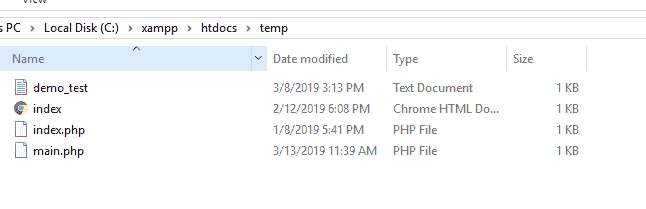
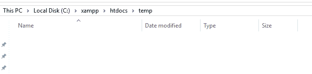
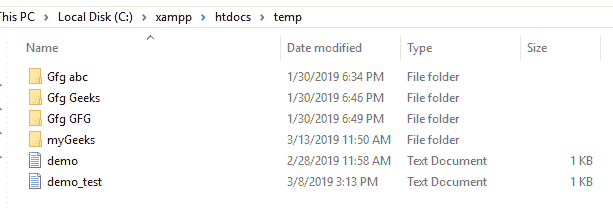

# 如何在 PHP 中递归删除一个目录及其全部内容(文件+子目录)？

> 原文:[https://www . geesforgeks . org/如何递归删除目录及其全部内容-文件-php 中的子目录/](https://www.geeksforgeeks.org/how-to-recursively-delete-a-directory-and-its-entire-contents-files-sub-dirs-in-php/)

在 PHP 中，如果您想删除文件或目录，那么请记住一件事，您不能直接删除文件或目录，这是有条件的，即存在一些安全问题，所以最好的方法是您首先必须删除文件中存在的数据或其中存在的子文件或目录。那么只有你能删除目录。删除子目录或文件后，使用 **rmdir** 功能删除主目录。

**删除所有文件的 PHP 函数:**在下面的代码中，首先传递需要删除的目录的路径。它检查需要删除的文件或目录是否真实存在。如果它确实存在，那么它将打开文件，检查该文件中是否有内容。如果没有，则使用 rmdir 目录删除该目录。但是如果目录中存在任何其他文件，那么它将使用 unlink 函数删除这些文件。和..指系统文件。删除所有内容后，使用 rmdir 函数完全删除目录。

**示例:**

```
<?php

// Variable to store directory name
// which need to delete
$folder = 'temporary_files';

// Get the list of all of file names
// in the folder.
$files = glob($folder . '/*');

// Loop through the file list
foreach($files as $file) {

    // Check for file
    if(is_file($file)) {

        // Use unlink function to 
        // delete the file.
        unlink($file);
    }
}
?>
```

*   **删除文件前:**
    
*   **删除文件后:**
    

**描述:**

*   在上面的例子中，从名为“temp”的文件夹中删除所有文件。
*   用 PHP glob 函数列出这个目录下的文件。glob 函数基本上是“找到符合特定模式的路径名”。在这种情况下，使用通配符*(星号)选择“temp”文件夹中的所有内容。
*   glob 函数返回指定文件夹中的文件名数组。
*   循环遍历这个数组。
*   使用 is_file 函数检查它是否是文件，而不是父目录或子目录。
*   Finally, use the unlink function, which deletes the file (if PHP has valid permissions – if not, an E_WARNING error will be thrown and the function will return a boolean FALSE value).

    **删除一个目录中的所有文件和子目录:**要删除所有子目录中的所有文件和目录，我们可以使用递归。下面是一个递归 PHP 函数的例子，它删除指定目录中的每个文件和文件夹。

    **示例:**

    ```
    <?php

    // Function to delete all files
    // and directories
    function deleteAll($str) {

        // Check for files
        if (is_file($str)) {

            // If it is file then remove by
            // using unlink function
            return unlink($str);
        }

        // If it is a directory.
        elseif (is_dir($str)) {

            // Get the list of the files in this
            // directory
            $scan = glob(rtrim($str, '/').'/*');

            // Loop through the list of files
            foreach($scan as $index=>$path) {

                // Call recursive function
                deleteAll($path);
            }

            // Remove the directory itself
            return @rmdir($str);
        }
    }

    // Function call
    deleteAll('temporary_files'); 

    ?>
    ```

    **输出:**

    *   **删除目录前:**
        
    *   **删除目录后:**目录被完全删除。

    该函数检查$str 变量是否表示文件的路径，然后使用 unlink 函数删除文件。但是，如果$str 代表一个目录，那么它会在删除每个目录之前获得该目录中所有文件的列表。最后，它通过使用 PHP rmdir 函数移除子目录本身。