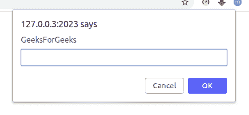
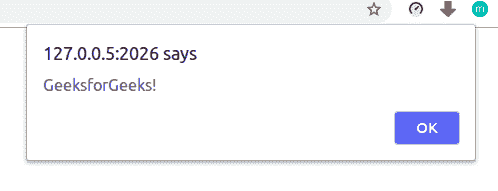

# 如何从 PHP 运行 JavaScript？

> 原文:[https://www . geesforgeks . org/how-run-JavaScript-from-PHP/](https://www.geeksforgeeks.org/how-to-run-javascript-from-php/)

JavaScript 是客户端脚本语言，PHP 是服务器端脚本语言。JavaScript 作为客户端用于检查和验证客户端详细信息，PHP 作为服务器端用于与数据库交互。在 PHP 中，HTML 在代码中用作字符串。为了将其呈现给浏览器，我们在 PHP 代码中以字符串的形式生成 JavaScript 代码。

**示例 1:** 在 PHP 代码中编写 JavaScript 代码

```
<?php 
echo '<script type="text/JavaScript"> 
     prompt("GeeksForGeeks");
     </script>'
;
?>
```

**输出:**


**示例 2:** 在 PHP 代码之外编写 JavaScript 代码(在同一个 PHP 文件中)

```
<?php
    // some php stuff
?>
<script type="text/javascript">
    alert('GeeksforGeeks!');
</script>
```

**输出:**


**示例 3:** JavaScript 函数–DOM 操作(在同一个 PHP 文件中)

```
<?php
    echo "<div id='demo'></div>";
?>
<script type="text/JavaScript">

// Function is called, return 
// value will end up in x
var x = myFunction(11, 10);   
document.getElementById("demo").innerHTML = x;

// Function returns the product of a and b
function myFunction(a, b) {
    return a * b;             
}
</script>
```

**输出:**

```
110
```

JavaScript 最出名的是网页开发，但它也用于各种非浏览器环境。您可以通过以下 [JavaScript 教程](https://www.geeksforgeeks.org/javascript-tutorial/)和 [JavaScript 示例](https://www.geeksforgeeks.org/javascript-examples/)从头开始学习 JavaScript。

PHP 是一种专门为 web 开发设计的服务器端脚本语言。您可以通过以下 [PHP 教程](https://www.geeksforgeeks.org/php-tutorials/)和 [PHP 示例](https://www.geeksforgeeks.org/php-examples/)从头开始学习 PHP。