# 如何在同一个 apache 服务器上为两个项目运行两个 PHP 版本？

> 原文:[https://www . geesforgeks . org/how-to-run-two-PHP-versions-for-two-project-on-同一个 apache-server/](https://www.geeksforgeeks.org/how-to-run-two-php-versions-for-two-projects-on-same-apache-server/)

在本文中，我们将学习在同一个 Apache 服务器上运行两个版本的 PHP。为了管理多个域，Apache 网络服务器在单个实例上使用虚拟主机。

**先决条件:**我们将使用 XAMPP 服务器来使用 Apache 服务器，并掌握一些使用它的知识。

首先，下载旧版本的 XAMPP，可以是任何版本。旧版本是 XAMPP 1.8.2，后来我们安装了最新版本的 XAMPP。XAMPP 的两个版本将拥有相同的 apache 服务器。

**步骤:**

1.  下载 xampp-win32-1.8.2-6-VC9-Installer.exe

    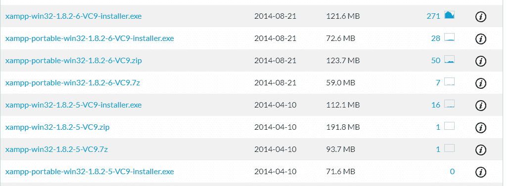

2.  安装软件。

    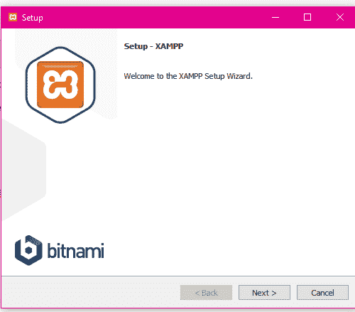

3.  点击下一步。

    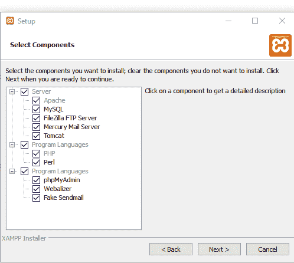

4.  更改名称(最好使用 XAMPP_1_8_2)，以便以后您能够区分新版本和旧版本。

    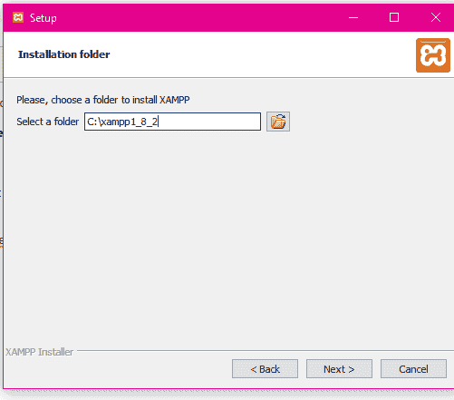

5.  点击“安装”完成安装过程。

    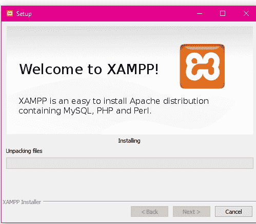

    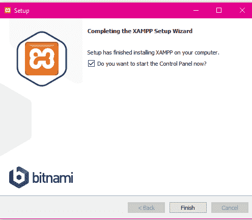

*   打开保存 XAMPP1_8_2 的文件夹位置。
    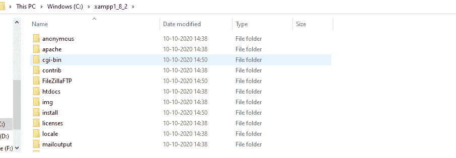
*   点击 XAMPP _ 1 _ 8 _ 2–>阿帕奇
    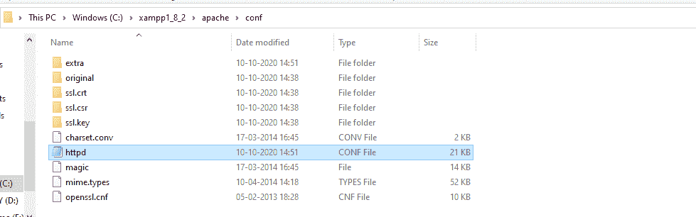

配置文件 httpd CONF 文件以更改新 XAMPP 的端口。由于两个不同版本的 XAMPP 不能在同一个端口上运行，我们需要切换到该端口。

**改变 XAMPP1_8_2 端口的步骤:**

打开文件 HTTP CONF 文件>将端口从 80 更改为 8080。

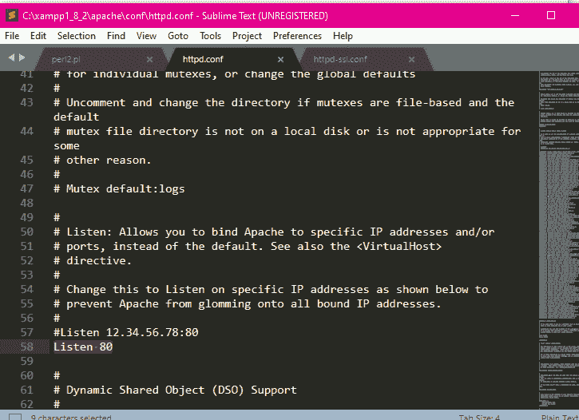

*   更改端口后，单击保存并退出。
*   现在转到额外的文件夹
*   要在 ssl CONF 文件中进行的更改
*   将听音 443 改为 444

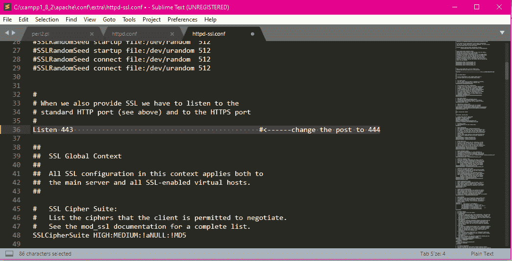

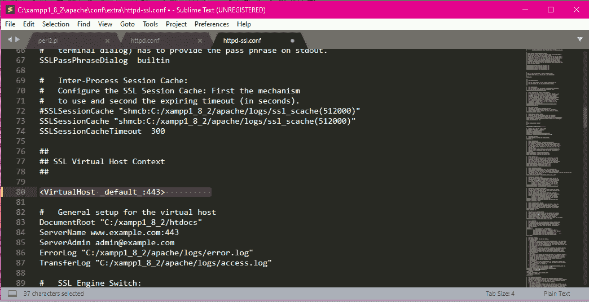
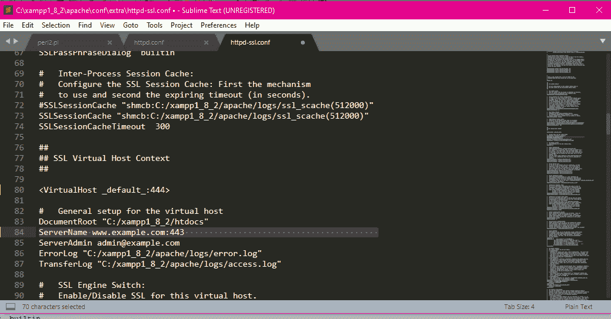

*   全部保存并退出。
*   现在下载 XAMPP 新版本
*   遵循相同的步骤{1、2、3、4、5、6}
*   不要改变任何东西，比如港口。
*   打开 XAMPP1_8_2 控件
*   打开 XAMPP 新版本控制。

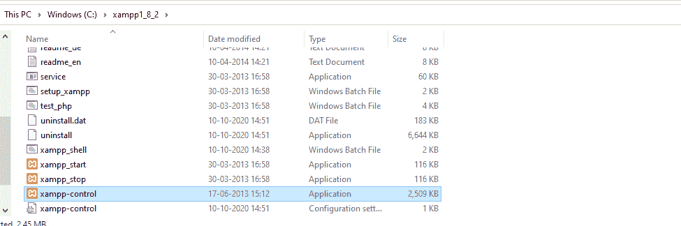
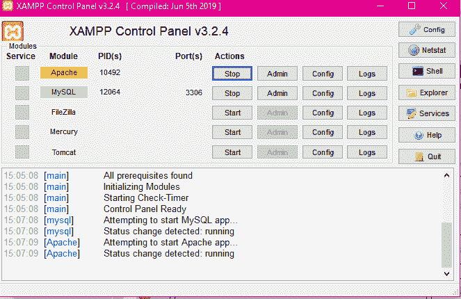

**注意:**你可能会遇到 3306 端口的一些问题。

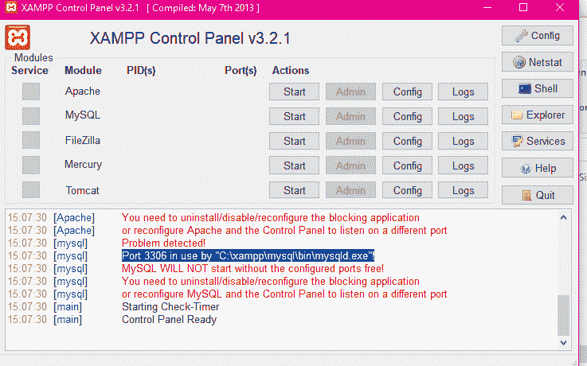

将端口 3306 更改为 3307

**更换端口的步骤:**

*   在“my.ini”文件中更改 MySQL 的配置文件。

    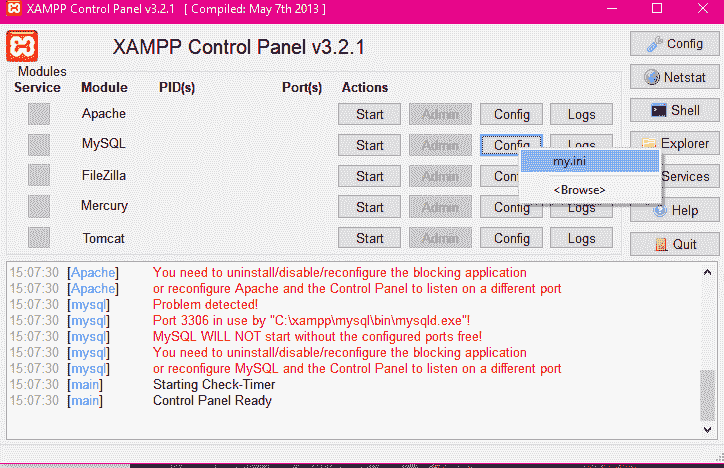

*   将端口更改为 3307

    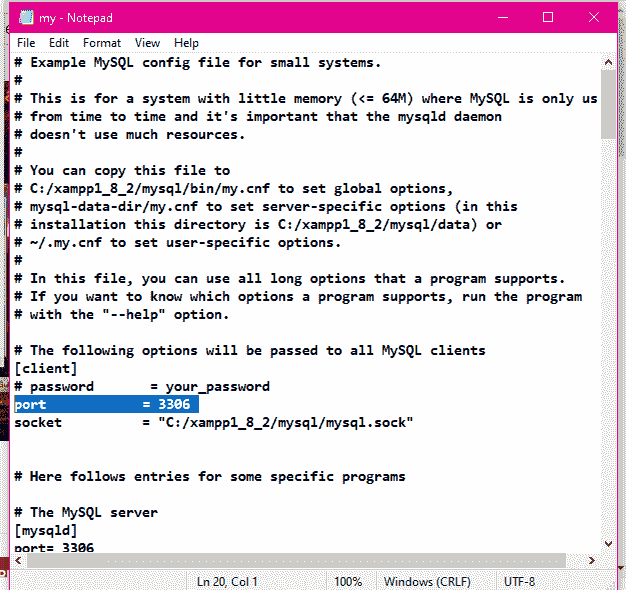

*   运行代码:

    ## 服务器端编程语言（Professional Hypertext Preprocessor 的缩写）

    ```
    <?php
        phpinfo();
    ?>
    ```

*   将上述代码保存在新版本和旧版本的 XAMPP 文件夹的“htdocs”文件夹中。

    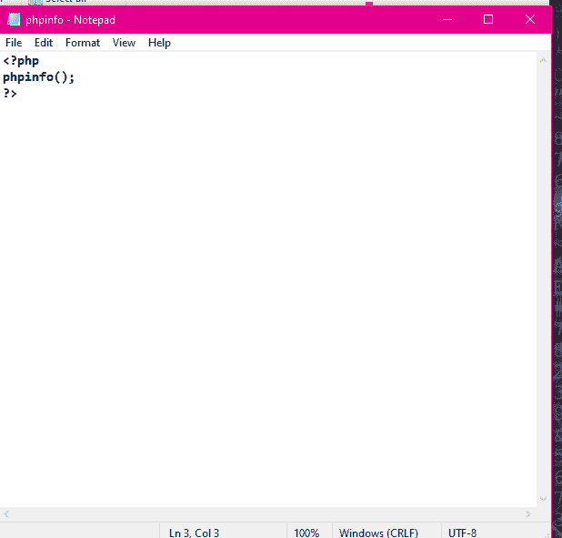

*   保存在 XAMPP 文件夹的“htdocs”文件夹中。

    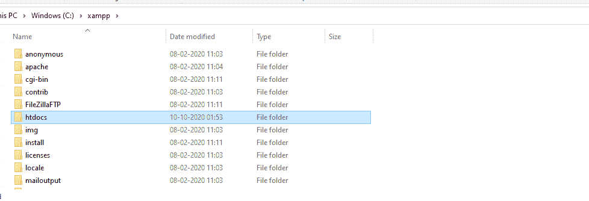

*   XAMPP_1_8_2 也是如此

    现在，打开浏览器，然后键入命令。

    ```
    localhost/phpinfo.php
    ```

    
    **输出:**
    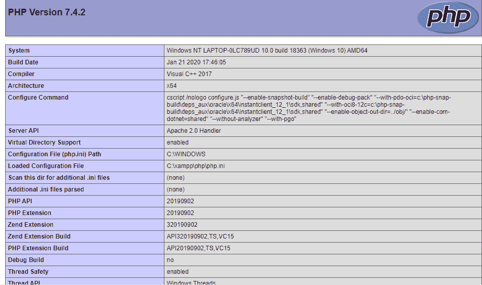

    这是一个版本 **7.4.2** 。

    现在对于第二个版本，键入命令。

    ```
    localhost:8080/phpinfo.php
    ```

    **输出:**
    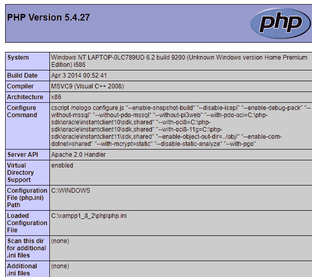

    最后，我们能够在同一个 Apache 服务器上执行两个 PHP 版本(7.4.2 和 5.4.27)。