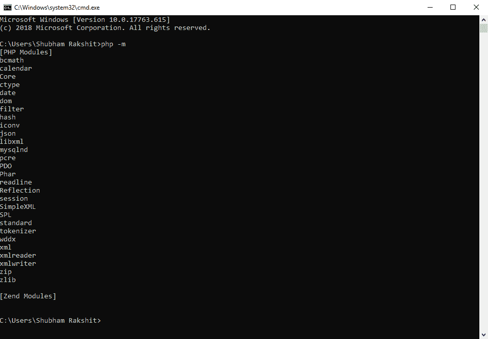
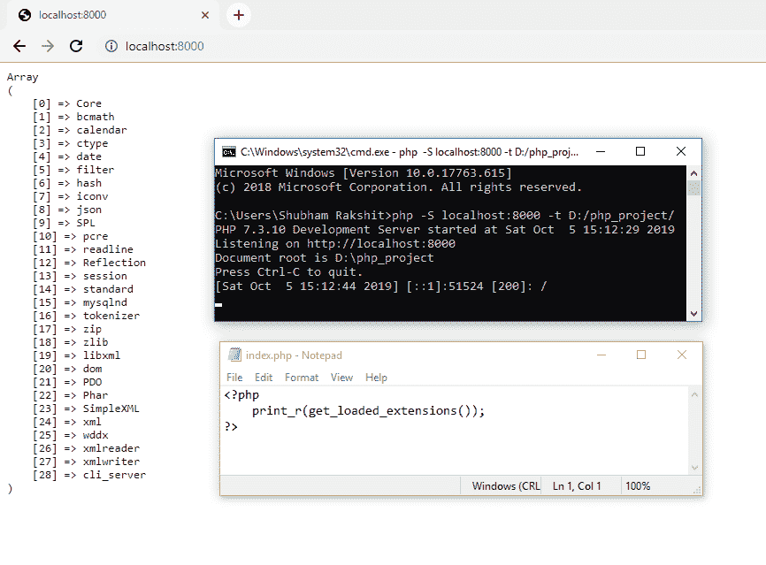

# 如何看到 PHP 加载的扩展？

> 原文:[https://www . geesforgeks . org/如何查看由 php 加载的扩展/](https://www.geeksforgeeks.org/how-to-see-the-extensions-loaded-by-php/)

要查看 PHP 加载的所有扩展，首先我们必须确保 PHP 已成功安装在我们的系统中。之后，我们可以使用以下任何方法来查看加载的扩展列表。

**方法 1:** 在这种方法中，我们将使用命令行检查所有加载的 PHP 扩展。
打开终端或命令行界面，键入以下命令，然后按回车键。

```php
php -m
```

它将显示所有加载的 PHP 扩展的列表。



**方法 2:** 该方法使用 get_loaded_extensions()函数显示所有加载的 PHP 扩展的列表。

**示例:**

```php
<?php 
print_r(get_loaded_extensions());
?> 
```

**输出:**


**注意:**请注意，扩展列表可能因系统而异。