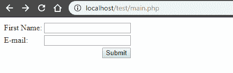
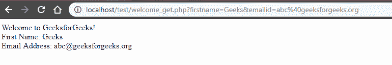

# 如何从 PHP 发送 GET 请求？

> 原文:[https://www . geesforgeks . org/how-send-get-request-from-PHP/](https://www.geeksforgeeks.org/how-to-send-a-get-request-from-php/)

向 web 服务器发送信息的方法主要有两种，如下所示:

*   **GET 方法:**从指定的资源请求数据。
*   **POST 方法:**将需要处理的数据提交给指定的资源。

**Get 方法:**Get 方法发送附加到页面请求的编码用户信息。页面和编码信息用“？”分隔性格。
例如:

```
https://www.google.com/search?q=hello
```

**程序:**这个程序说明了 GET 方法在 PHP 中的使用:

*   **main . PHP:**t0]
*   **welcome.php:**

```
<html>

<body>
    Welcome to GeeksforGeeks!<br>

    First Name: <?php echo $_GET["firstname"]; ?><br>
    Email Address: <?php echo $_GET["emailid"]; ?>
</body>

</html>
```

**输出:**

*   **点击按钮前:**
    
*   **点击按钮后:**
    

上面的代码使用 Get 方法向服务器发送数据。点击提交按钮，页面的网址从`http://localhost/test/main.php`变为`http://localhost/test/welcome_get.php?firstname=Geeks&emailid=abc%40geeksforgeeks.org`

在这里，我们可以看到网址包含一个问号，以及输入字段的名称和在`http://localhost/test/main.php`链接后那些字段中输入的值。但是，必须记住，GET 请求仅用于请求数据，而不是修改。此外，GET 方法仅限于发送最多 1024 个字符。GET 不能用于向服务器发送二进制数据，如图像或 word 文档，也不应用于向服务器发送任何密码或敏感信息。此类操作应使用开机自检方法。