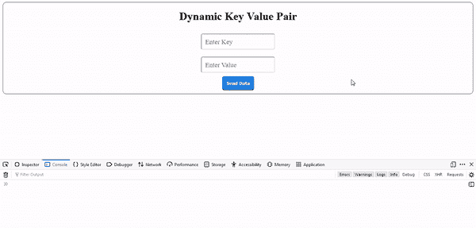

# 如何用 jQuery 向 PHP 发送动态键值对？

> 原文:[https://www . geesforgeks . org/how-send-dynamic-key-value-pair-to-PHP-with-jquery/](https://www.geeksforgeeks.org/how-to-send-dynamic-key-value-pair-to-php-with-jquery/)

本文的目的是在 HTML 文档中使用 jQuery AJAX 向 PHP 后端发送动态键值对。

在一个 HTML 文档中创建两个输入字段，即一个用于键，另一个用于值，以及一个按钮(发送键-值对)。为字段和按钮分配唯一的 id。在 JavaScript 文件中，给按钮添加一个事件监听器，即点击。点击按钮后，使用 jQuery Ajax 请求一个 PHP 文件。

**HTML 代码:**以下代码为结构。

## index.html

```
<!DOCTYPE html>
<html lang="en">

<head>
    <meta charset="UTF-8">

    <meta name="viewport" 
          content="width=device-width, initial-scale=1.0">

    <!-- CSS file -->
    <link rel="stylesheet" href="style.css">

    <!-- jQuery Ajax CDN -->
    <script src=
"https://cdnjs.cloudflare.com/ajax/libs/jquery/3.6.0/jquery.min.js">
    </script>

    <!-- JavaScript file -->
    <script src="script.js"></script>
</head>

<body>
    <div class="container">
        <h1>Dynamic Key Value Pair</h1>

        <!-- Input Field for key -->
        <input type="text" name="key" id="key" 
               placeholder="Enter Key">
        <br>

        <!-- Input Field for value -->
        <input type="text" name="value" id="value"
               placeholder="Enter Value">
        <br>

        <!-- Button to send key value pair -->
        <button type="button" id="btn">
            Send Data
        </button>
    </div>
</body>

</html>
```

**CSS 代码:**以下代码是上述 HTML 代码中使用的文件“style.css”的内容。

## style.css

```
.container {
  border: 1px solid rgb(73, 72, 72);
  border-radius: 10px;
  margin: auto;
  padding: 10px;
  text-align: center;
}

h1 {
  margin-top: 10px;
}

input[type="text"] {
  padding: 10px;
  border-radius: 5px;
  margin: 10px;
  font-family: "Times New Roman", Times, serif;
  font-size: larger;
}

button {
  border-radius: 5px;
  padding: 10px;
  color: #fff;
  background-color: #167deb;
  border-color: #0062cc;
  font-weight: bolder;
  cursor: pointer;
}

button:hover {
  text-decoration: none;
  background-color: #0069d9;
  border-color: #0062cc;
}
```

**JavaScript Code:** 以下代码是上述 HTML 代码中使用的文件“script.js”文件的内容。

## main.js

```
$(document).ready(() => {
  // Adding 'click' event listener to button
  $("#btn").click(() => {
    // Fetching key's input field data
    const key = $("#key").val();

    // Fetching values input field data
    const value = $("#value").val();

    // Initializing array of objects to 
    // store key-value pairs

    let data = {};

    // assigning key-value pair to data object
    data[key] = value;

    // jQuery Ajax Post Request
    $.post(
      "action.php",
      {
        data,
      },
      (response) => {
        // response from PHP back-end
        alert(`Response from sever side is: ${response}`);
      }
    );
  });
});
```

**PHP 代码:**以下是上述 HTML 代码中使用的文件“action.php”的代码。

## action.php

```
<?php
// Checking, if post value is 
// set by user or not 
if (isset($_POST['data'])) {
  // getting key-value pair object 
  // in $data variable
  $data = $_POST['data'];

  // Sending Response 
  echo "Success";
}
?>
```

**输出** :



动态键值对