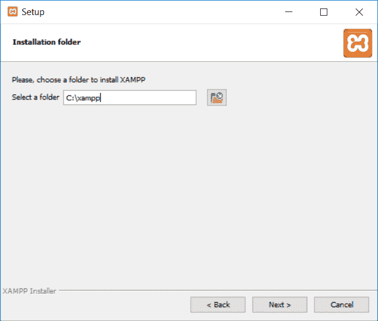
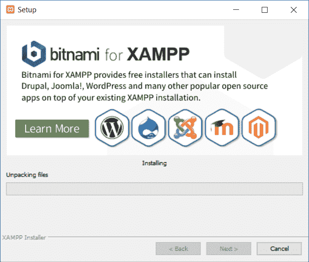
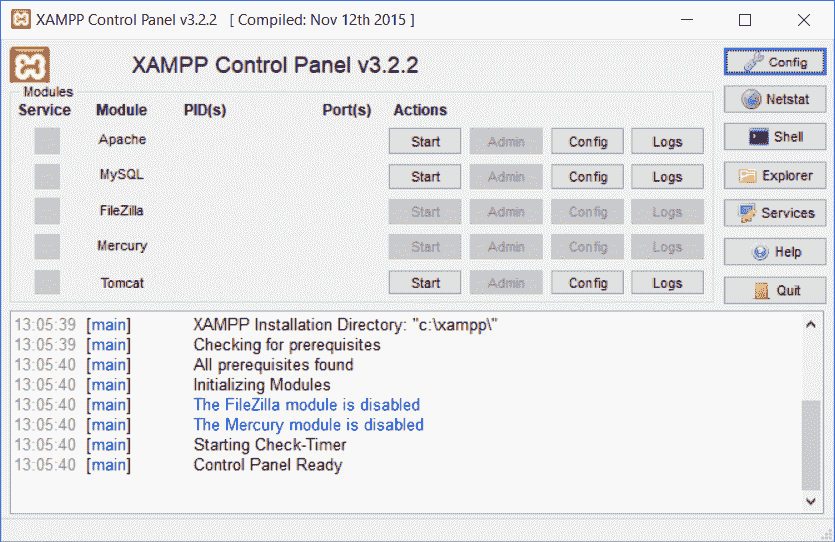
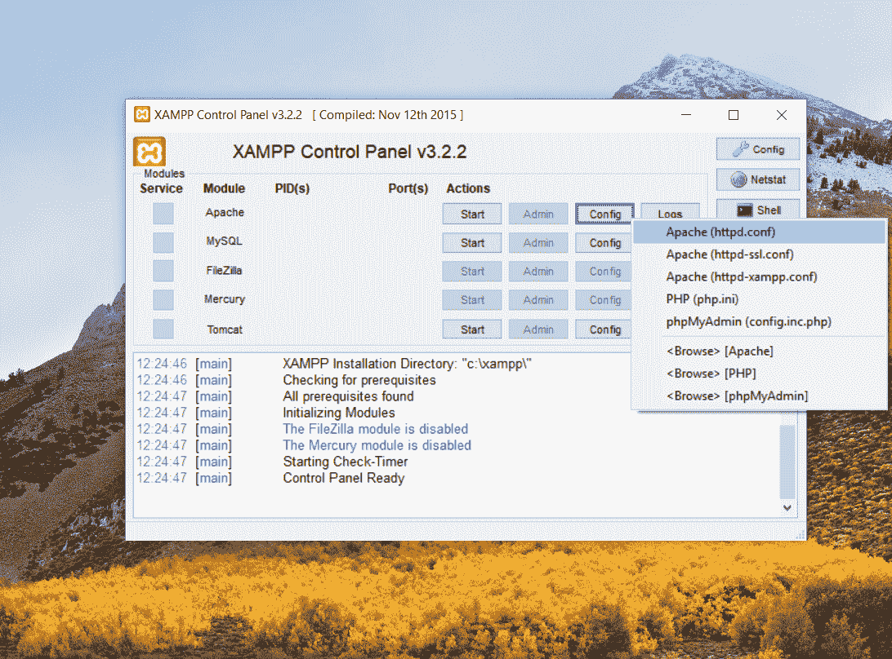
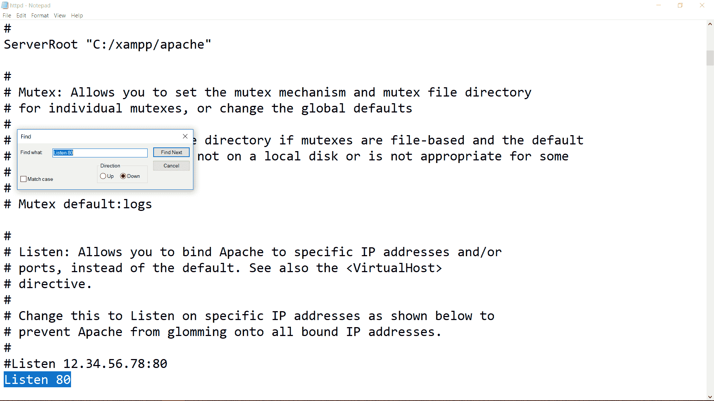
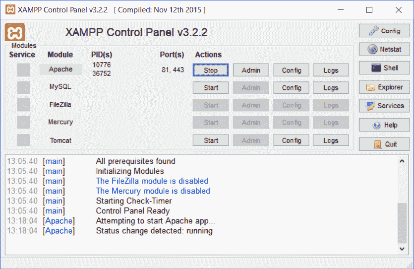
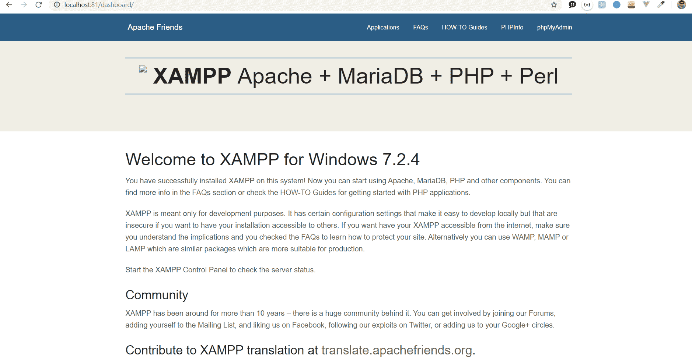
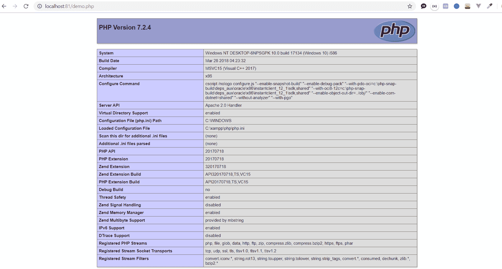

# 如何在 windows 中设置 PHP 开发环境？

> 原文:[https://www . geesforgeks . org/how-set-PHP-development-environment-in-windows/](https://www.geeksforgeeks.org/how-to-set-php-development-environment-in-windows/)

**什么是 PHP？**
[PHP](https://www.geeksforgeeks.org/php-introduction/) (超文本预处理器)是**通用编程语言**，由**拉斯马斯·勒德尔夫**于 1994 年为 web 开发而开发。这是 web 开发中最受初学者欢迎的编程语言之一，因为它的**简单性**、**大型社区**和**可访问性**。
**在本地机器上设置 PHP 环境的步骤:**在本地机器上设置 PHP 的方法基本上有两种，分别是:

*   使用所有在一个包(XAMPP 和 WAP)。**(推荐)**
*   手动安装所有需要的包(MySQL、PHP 和 Apache)并配置它们。

我们将介绍一种在本地机器上安装 PHP 的简单**和几乎**无错误的**方法，该方法通过使用一个名为 **XAMPP** 的包来实现。
**安装 XAMPP 的步骤:**** 

*   ****下载 XAMPP:** 可以在官方网站[这里](https://www.apachefriends.org/download.html)下载最新 windows 版本和最新 PHP 版本的 XAMPP 软件。**
*   ****打开下载的。exe 文件:**打开下载的文件后，你会看到一个弹出窗口，点击**是**并继续。**
*   ****点击【下一步】:**你会看到如下图的 XAMPP 欢迎窗口，点击**下一步**。** 

****

*   ****选择组件:**选择要安装的组件。请选择 **MySQL** 和 **phpMyAdmin** 组件，本教程所有其他组件都是可选的。** 

****

*   ****选择安装位置:**选择想要安装 XAMPP 的位置，默认为 **C:\xampp** 。** 

****

*   ****点击下一步:**你点击下一步，你的安装就开始了。** 

****

*   ****打开 XAMPP 控制面板:**在本地机器上成功安装 XAMPP 后，通过在 windows 搜索栏中搜索“XAMPP 控制面板”或转到 XAMPP 的安装目录来打开控制面板。你会看到一个像下面这样的窗口。** 

****

*   ****配置 Apache*:** 此步骤是**可选的**，即如果您在 windows 10 上遇到一些与**阻塞端口**相关的**问题**。
    打开 Apache 的配置文件，如下图所示。** 

****

*   **按 CTRL + F 并搜索 EN 80 列表。将端口 **80** 换成类似 **81** 的东西，保存文件，重启控制面板。** 

****

*   ****启动阿帕奇服务器:**通过点击**启动**按钮启动阿帕奇服务器，你会看到一个端口号就在阿帕奇列的前面。您可以随时停止服务，只需单击开始按钮即可启动任何服务。** 

****

*   ****检查安装:**进入浏览器，输入 **localhost:81** (如果没有更换端口，也可以简单输入 **localhost** )。你会看到如下页面。** 

****

*   ****检查 PHP 安装:**在安装目录的 htdocs 文件夹中创建一个 **php** 文件。(C:/XAMPP/htdocs)并在其中添加以下代码。** 

## **服务器端编程语言（Professional Hypertext Preprocessor 的缩写）**

```
<?php
    echo phpinfo();
?>
```

*   **将文件保存为**demo.php**并进入您的浏览器，键入 localhost:81/demo.php(或者简单地说 **localhost/demo.php** 以防您没有更改端口)。
    如果安装顺利，您将看到如下结果。** 

****

*   **如果以上所有事情都进展顺利，那么恭喜你！您已经成功地在本地机器上设置了一个 PHP 开发环境。**