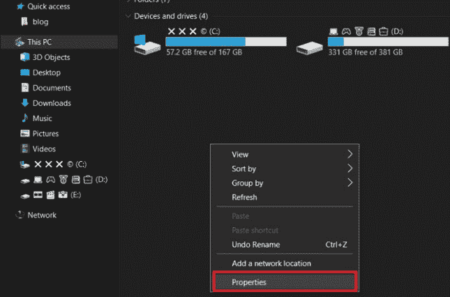
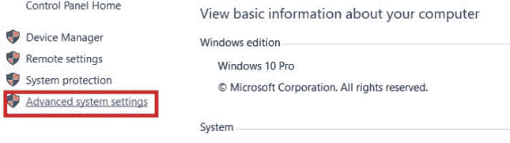
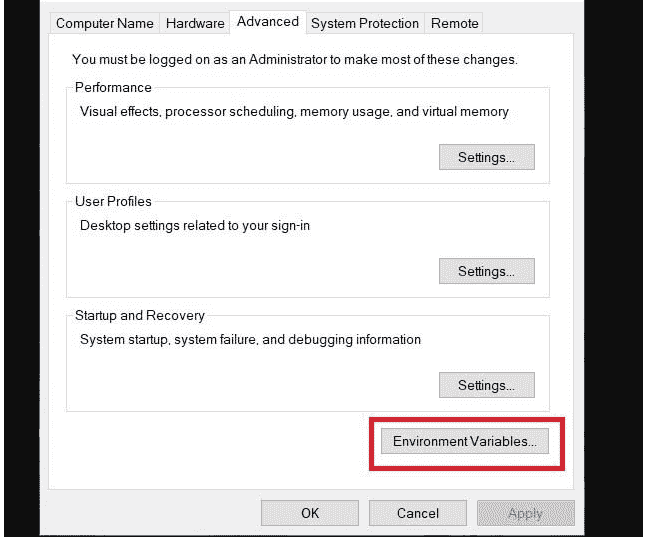
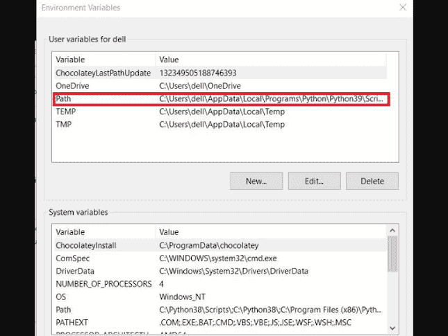
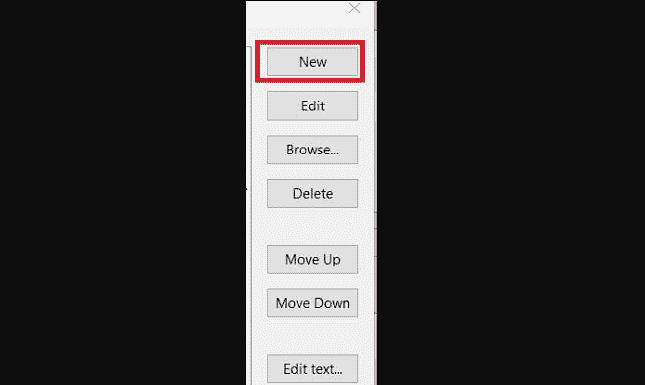
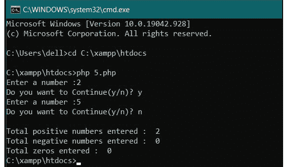

# 如何设置一个 PHP 控制台？

> 原文:[https://www.geeksforgeeks.org/how-to-set-up-a-php-console/](https://www.geeksforgeeks.org/how-to-set-up-a-php-console/)

[**PHP**](https://www.geeksforgeeks.org/php-tutorials/) 是 web 开发的后端服务器端语言。一般来说，我们不需要从控制台获取输入，但有时我们需要运行一个小函数或代码块，为此我们需要从控制台获取输入。

**要求:**

服务器: [xampp](https://www.geeksforgeeks.org/how-to-install-xampp-on-windows/) 或 [WampServer](https://www.geeksforgeeks.org/how-to-install-and-set-up-a-wamp-server/)

**如何设置 PHP Console？**

**步骤 1:** 转到安装 XAMPP 的 c 盘。


xampp(洗发精)

**第二步:**转到 XAMPP 文件夹中的 PHP 文件夹


php 文件夹

**步骤 3:** 复制该文件夹的路径


c\xampp\php

**步骤 4:** 转至系统属性，然后转至高级系统设置





高级系统设置

**第 5 步:**转到环境变量，按照以下步骤粘贴复制的路径，然后按确定。



环境变量





新的


c\xampp\php

**运行 PHP 文件:**打开命令提示符，转到保存代码的目录。

```
cd C:\xampp\htdocs
```

使用这个命令运行 php 代码

```
php file_name.php
```



煤矿管理局