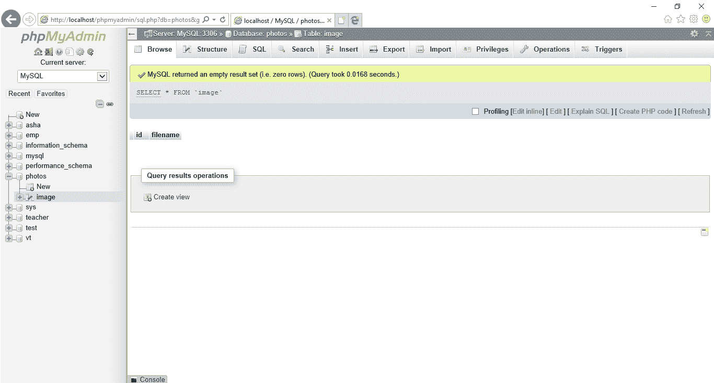

# 如何用 PHP 将图像上传到数据库并显示？

> 原文:[https://www . geesforgeks . org/如何使用 php 将图像上传到数据库并显示出来/](https://www.geeksforgeeks.org/how-to-upload-image-into-database-and-display-it-using-php/)

将图像/视频上传到数据库并使用 PHP 显示是将图像上传到数据库并从数据库中提取图像的方式。使用 PHP 代码，用户上传他们正在安全进入数据库的图像或视频，并且应该通过从数据库获取这些图像来将图像保存到特定的位置。
如果任何网站包含上传带有一些细节的图像/视频的功能，那么通过使用该代码，我们将把图像上传到您的数据库，以及您是否想要确定该人必须上传什么。通过这个代码，上传的图像保存在你的系统中给你的位置。
首先，使用 phpMyAdmin 在 XAMPP/WAMP 服务器上创建数据库，数据库名称为**照片**，表名为**图片**。该表包含两个字段:

*   id–int(11)
*   文件名 – 瓦尔查尔（100）

Id 应该在**自动递增(AI)** 中。创建的数据库图像如下所示:



**程序:**现在，我们将创建一个上传图像/视频文件的表单。

*   **HTML 代码:**

## 超文本标记语言

```html
<!DOCTYPE html>
<html>

<head>
    <title>Image Upload</title>
    <link rel="stylesheet" 
          type="text/css"
          href="style.css" />
</head>

<body>
    <div id="content">

        <form method="POST" 
              action="" 
              enctype="multipart/form-data">
            <input type="file" 
                   name="uploadfile" 
                   value="" />

            <div>
                <button type="submit"
                        name="upload">
                  UPLOAD
                </button>
            </div>
        </form>
    </div>
</body>

</html>
```

*   **CSS 代码:****style . CSS**是将表单样式化为新设计的文件，代码如下。

## 半铸钢ˌ钢性铸铁(Cast Semi-Steel)

```html
#content{
    width: 50%;
    margin: 20px auto;
    border: 1px solid #cbcbcb;
}
form{
    width: 50%;
    margin: 20px auto;
}
form div{
    margin-top: 5px;
}
#img_div{
    width: 80%;
    padding: 5px;
    margin: 15px auto;
    border: 1px solid #cbcbcb;
}
#img_div:after{
    content: "";
    display: block;
    clear: both;
}
img{
    float: left;
    margin: 5px;
    width: 300px;
    height: 140px;
}
```

你可以复制上面的代码，并直接提到主代码中，或者创建一个与 HTML 代码相同的链接，并附上下面给出的主代码。如上所述，如果你链接了**样式表**文件，你应该在**创建另一个文件。css** 格式并保存在主文件要保存的地方。借助 **POST** 方法和**enctype = " multipart/form-data**创建的表单是对文件进行编码并允许您通过 POST 发送的操作。
现在我们正在处理 PHP 代码，用于将图像从系统的任何文件夹传输到您提到的特定文件夹中，并将其作为目录存储到数据库中。

*   **PHP 代码:**PHP 代码是上传图片用的，文件名用**index.php**保存，你也可以用你喜欢的另一个名字保存。

## 服务器端编程语言（Professional Hypertext Preprocessor 的缩写）

```html
<?php
error_reporting(0);
?>
<?php
  $msg = "";

  // If upload button is clicked ...
  if (isset($_POST['upload'])) {

    $filename = $_FILES["uploadfile"]["name"];
    $tempname = $_FILES["uploadfile"]["tmp_name"];    
        $folder = "image/".$filename;

    $db = mysqli_connect("localhost", "root", "", "photos");

        // Get all the submitted data from the form
        $sql = "INSERT INTO image (filename) VALUES ('$filename')";

        // Execute query
        mysqli_query($db, $sql);

        // Now let's move the uploaded image into the folder: image
        if (move_uploaded_file($tempname, $folder))  {
            $msg = "Image uploaded successfully";
        }else{
            $msg = "Failed to upload image";
      }
  }
  $result = mysqli_query($db, "SELECT * FROM image");
?>
```

**解释:**以下是创建 PHP 代码的解释，如下:

*   error_reporting(0)用于在 php 代码运行时获取 0 错误。
*   $_files 是幕后工作。它被用来通过 HTTP POST 方法上传文件并保存文件的属性。
*   $filename 是用于唯一标识存储在文件系统中的计算机文件的名称。
*   $tempname 用于复制上传到数据库的文件的原始名称，作为上传后存储图像的临时名称。
*   $folder 定义上传到数据库中的图像的路径，该路径指向要存储的文件夹。**“图像/”**上传后保存图像的文件夹名称。还有。$filename 用于获取或上传文件。
*   $db，用于连接数据库的任何 PHP 代码的基本行。
*   $sql 用于将图像插入数据库的表名**图像**到变量文件名。
*   mysqli _ query 是执行$db 和$sql 查询的函数。
*   现在，让我们将上传的图像移动到名为图像的文件夹中。名为文件夹的图像保存在 WAMP 或 XAMPP 服务器文件夹中，该文件夹位于 www 文件夹的 c 盘中。
*   $result 函数用于从数据库中检索图像。

**以上代码的组合:**使用 PHP 将图片上传到 MySQL 的最终代码如下。

*   **程序:文件名:index.php**这个文件结合了 HTML 和 PHP 代码。

## 服务器端编程语言（Professional Hypertext Preprocessor 的缩写）

```html
<?php
error_reporting(0);
?>
<?php
  $msg = "";

  // If upload button is clicked ...
  if (isset($_POST['upload'])) {

    $filename = $_FILES["uploadfile"]["name"];
    $tempname = $_FILES["uploadfile"]["tmp_name"];    
        $folder = "image/".$filename;

    $db = mysqli_connect("localhost", "root", "", "photos");

        // Get all the submitted data from the form
        $sql = "INSERT INTO image (filename) VALUES ('$filename')";

        // Execute query
        mysqli_query($db, $sql);

        // Now let's move the uploaded image into the folder: image
        if (move_uploaded_file($tempname, $folder))  {
            $msg = "Image uploaded successfully";
        }else{
            $msg = "Failed to upload image";
      }
  }
  $result = mysqli_query($db, "SELECT * FROM image");
while($data = mysqli_fetch_array($result))
{

      ?>
">

<?php
}
?>

<!DOCTYPE html>
<html>
<head>
<title>Image Upload</title>
<link rel="stylesheet" type= "text/css" href ="style.css"/>
<div id="content">

  <form method="POST" action="" enctype="multipart/form-data">
      <input type="file" name="uploadfile" value=""/>

      <div>
          <button type="submit" name="upload">UPLOAD</button>
        </div>
  </form>
</div>
</body>
</html>
```

*   **输出:**最后，你要上传小于 100 MB 的图片、视频。如果你想超越，那就改变。


**结论:**用 PHP 代码上传到数据库中的图像简单，用途多样。该代码有助于上传图像，然后将图像上传到数据库，并可以在另一个文件夹中显示。
有一点你应该注意，当你运行这个程序的时候，应该有可能上传的图片不会超过 2 MB，因为 PHP 程序已经设置了上传 2 MB 图片和上传 8 MB 图片的默认值。对于超过上传图像的大小，您应该遵循以下步骤:

*   首先，打开 c 盘，然后打开文件夹 WAMP 或 XAMPP 服务器。
*   然后打开**箱**文件夹。
*   打开 PHP 版本文件夹(PHP 5.6.31 文件夹)(请注意，如果您有另一个版本的 PHP，您也应该打开它)
*   然后搜索 **php.ini** 。打开它，然后搜索两个变量并随之改变。变量有:

```html
 upload_max_size = 100M
post_max_filesize = 100M
```

*   保存此更改，然后打开

```html
C:\wamp64\bin\apache\apache2.4.27\bin
```

*   并搜索 **php.ini** 。改变上面提到的同样的事情。
*   重新启动 WAMP 或 XAMPP 服务器，然后运行代码。

HTML 是网页的基础，通过构建网站和网络应用程序用于网页开发。您可以通过以下 [HTML 教程](https://www.geeksforgeeks.org/html-tutorials/)和 [HTML 示例](https://www.geeksforgeeks.org/html-examples/)从头开始学习 HTML。

CSS 是网页的基础，通过设计网站和网络应用程序用于网页开发。你可以通过以下 [CSS 教程](https://www.geeksforgeeks.org/css-tutorials/)和 [CSS 示例](https://www.geeksforgeeks.org/css-examples/)从头开始学习 CSS。

PHP 是一种专门为 web 开发设计的服务器端脚本语言。您可以通过以下 [PHP 教程](https://www.geeksforgeeks.org/php-tutorials/)和 [PHP 示例](https://www.geeksforgeeks.org/php-examples/)从头开始学习 PHP。