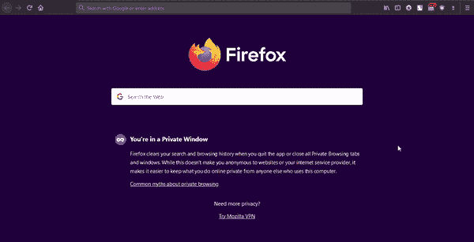

# PHP 中如何使用 cURL 获取 JSON 数据和解码 JSON 数据？

> 原文:[https://www . geesforgeks . org/如何使用-curl-to-get-JSON-data-and-decode-JSON-data-in-PHP/](https://www.geeksforgeeks.org/how-to-use-curl-to-get-json-data-and-decode-json-data-in-php/)

在本文中，我们将看到如何在 PHP 中使用 cURL 来获取 JSON 数据和解码 JSON 数据。

[**cURL**](https://www.geeksforgeeks.org/php-curl/) **:**

*   它代表客户端网址。
*   它是一个命令行工具，用于使用 URL 语法发送和获取文件。
*   cURL 允许使用 HTTP、FTP、Telnet 等与其他服务器通信。

**进场:**

*   我们将从一个免费网站获取 JSON 数据，该网站提供 JSON 数据用于测试，即 reqres.in
*   首先，我们使用 curl_init()方法初始化 curl。
*   使用 curl_setopt()方法和 CURLOPT _ URL 向 reqres.in 服务器发送 GET 请求以获取 json 数据。
*   之后，我们必须告诉 curl 将 json 数据存储在一个变量中，而不是转储到屏幕上。这是通过在 curl_setopt()函数中使用 CURLOPT_RETURNTRANSFER 参数来实现的。
*   使用 curl_exec()方法执行 curl。
*   最后，使用 curl_close()方法关闭卷曲。

**示例:**

## 服务器端编程语言（Professional Hypertext Preprocessor 的缩写）

```php
<?php

// Initializing curl
$curl = curl_init();

// Sending GET request to reqres.in
// server to get JSON data
curl_setopt($curl, CURLOPT_URL, 
    "https://reqres.in/api/users?page=2");

// Telling curl to store JSON
// data in a variable instead
// of dumping on screen
curl_setopt($curl, 
    CURLOPT_RETURNTRANSFER, true);

// Executing curl
$response = curl_exec($curl);

// Checking if any error occurs 
// during request or not
if($e = curl_error($curl)) {
    echo $e;
} else {

    // Decoding JSON data
    $decodedData = 
        json_decode($response, true); 

    // Outputing JSON data in
    // Decoded form
    var_dump($decodedData);
}

// Closing curl
curl_close($curl);
?>
```

**输出:**



使用 cURL 获取请求