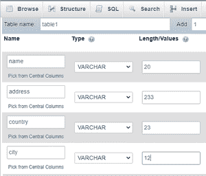
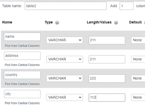

# 使用 PHP 将数据从一个表插入到另一个表中

> 原文:[https://www . geesforgeks . org/insert-data-从一个表到另一个表-使用-php/](https://www.geeksforgeeks.org/insert-data-from-one-table-to-another-table-using-php/)

在本文中，我们将使用 [PHP](https://www.geeksforgeeks.org/php-tutorials/) 将数据从现有表插入到另一个表中。

**要求:**

*   [xampp web 服务器](https://www.geeksforgeeks.org/how-to-install-xampp-on-windows/)

PHP 代表超文本预处理器。 [MySQL](https://www.geeksforgeeks.org/mysql-common-mysql-queries/) 是执行数据库操作的数据库查询语言。我们将使用 MySQL 服务器将数据从一个表插入到另一个表中。

MySQL 服务器是一个开源的关系数据库管理系统，用于 web 应用程序。

*   插入查询语法:

    ```php
    insert table_2 select * from table_1.
    ```

**按照以下步骤操作:**

*   打开 XAMPP 服务器，启动 Apache 和 MySQL。
*   打开浏览器，输入*“localhost/phpmyadmin”。* [创建](https://www.geeksforgeeks.org/sql-create/)一个名为“*极客 _ 数据库*”
    的数据库
*   现在[创建一个名为*的表*](https://www.geeksforgeeks.org/sql-create/)，表 1 有 4 列，点击保存。
    
*   Now open the SQL column in the database server and [insert](https://www.geeksforgeeks.org/sql-insert-statement/) records into it.
    

    **MySQL 代码:**以下是在表 1 中插入数据的 SQL 语句。

    > INSERT INTO `table1`(`name`、` address`、` country`、` city `)VALUES(` SRA van '、` kakumanu '、` india '、` guntur ')；
    > INSERT INTO `table1`(`name`、` address `、` country `、` city`) VALUES ('sudheer '、' chebrolu '、' india '、' guntur ')；
    > INSERT INTO `table1`(`name `、` address `、` country `、` city`) VALUES ('vani '、' kakumanu '、' india '、' guntur ')；
    > INSERT INTO `table1`(`name `、` address `、` country `、` city `) VALUES(` radha '、` tenali '、` india '、` guntur ')；

    **输出:**表 1 包括以下数据。

    

*   在 XAMPP SQL server 的同一个数据库*极客 _ 数据库*中编写 create table 2

*   Now insert records in table 2 using PHP code from table1.

    **PHP 代码:**

    ## 服务器端编程语言（Professional Hypertext Preprocessor 的缩写）

    ```php
    <?php 
    // creating a connection by passing server name, 
    // username, password and database name
    // servername=localhost
    // username=root
    // password=empty
    // database name= geeks_database
    $connection_link = new mysqli("localhost", "root", "","geeks_database"); 

    if ($connection_link === false) { 
        die("ERROR: Not connected. ".$connection_link->connect_error); 
    } 

    //sql query to perform copying data from one table to another
    $sql_query  =  "insert table2 select * from table1"; 
        if ($connection_link->query($sql_query) === true) 
    { 
        echo "Data Copied Successfully."; 
    } 
    else
    { 
        echo "ERROR: Could not able to proceed $sql_query. "
            .$connection_link->error; 
    } 

    // Close the  connection 
    $connection_link->close(); 
    ?> 
    ```

*   将此代码保存为 xampp- > htdocs 文件夹下的*copy _ data . PHP*。
    T3】
*   **输出:**

    *   Open web browser and type “*http://localhost/copying_data.php*“.

        数据复制图像

    *   最后，查看您的*表 2。*表 1 数据复制成功。
        T3】