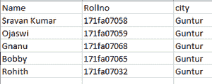
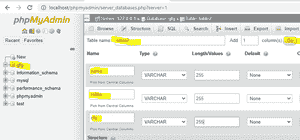
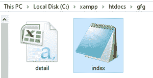
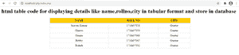
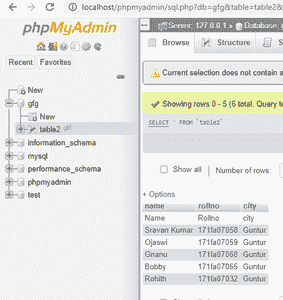

# 使用 PHP 将 CSV 数据加载到 MySQL 服务器中

> 原文:[https://www . geesforgeks . org/load-CSV-data-into-MySQL-server-use-PHP/](https://www.geeksforgeeks.org/load-csv-data-into-mysql-server-using-php/)

在本文中，我们将使用 XAMPP 服务器中的 PHP 将 CSV 文件中的数据存储到 MySQL 数据库中，并在 web 浏览器中显示这些数据。

**逗号分隔值(CSV)** 是包含数据内容的文本文件。它有助于在类似表的结构中存储数据。CSV 文件以 CSV 扩展名存储。可以使用任何文本编辑器创建 CSV 文件，如 *【记事本】**【记事本+* 等。将内容添加到记事本中的文本文件后，使用 **将其存储为 csv 文件。csv** 扩展。

**要求:** [XAMPP 服务器](https://www.geeksforgeeks.org/how-to-install-xampp-on-windows/)

**步骤:**

*   创建到数据库的连接
*   加载 CSV
*   执行查询并验证结果

**带分步的语法:**

1.创建到数据库的连接

```html
<?php
$db=new mysqli(‘servername’,’username’,’password’,’databasename’);
if ($db->connect_errno) {
 echo “Failed ” . $db->connect_error;
 exit();
}
?>
Here, Servername is the localhost, username is your user default is root, password is empty by default. database name is name of your database.
```

2.使用 fopen 函数获取 CSV 文件

```html
It is used to open a file
fopen(filename, mode, include_path, context)
Here:
filename is used to specify the file or URL to open
mode is to  Specify the type of access you require to the file/stream.
```

3.获取 CSV 文件:我们可以使用 fgetcsv()函数获取 CSV 文件

4.数据库查询

```html
Now we can write database query to insert data
$db->query(‘INSERT INTO table VALUES (“‘ . $row[0] . ‘”, “‘ . $row[1] . ‘”, “‘ . $row[2] . ‘” . . . “‘ . $row[n] . ‘”)’);
Query is used to take query
row[n] represents the number of rows to be taken to load
```

**创建数据库和表格的过程**

1.考虑名为 **detail.csv** 的 CSV 文件



2.打开 XAMPP，启动 MySQL，Apache 服务


3.在浏览器中键入“http://localhost/phpmyadmin/”

4.点击新建并创建名为“gfg”的数据库


5.创建名为“table2”的表



**执行步骤:**

1.将 **detail.csv** 和**index.php**代码文件存储在一个文件夹中，路径为“C:\xampp\htdocs\gfg”



2.打开 index.php 文件，输入下面给出的代码:

## 服务器端编程语言（Professional Hypertext Preprocessor 的缩写）

```html
<?php

// Create connection
// Localhost is the server name, 
// root is the username, 
// password is empty
// database name is gfg
$db = new mysqli('localhost', 'root', '', 'gfg');

// Checking connection
if ($db->connect_errno) {
  echo "Failed " . $db->connect_error;
  exit();
}
?>

<h1>
    html table code for displaying 
    details like name, rollno, city 
    in tabular format and store in 
    database
</h1>

<table align="center" width="800" 
    border="1" style=
    "border-collapse: collapse; 
    border:1px solid #ddd;" 
    cellpadding="5"
    cellspacing="0">

    <thead>
        <tr bgcolor="#FFCC00">
            <th>
                <center>NAME</center>
            </th>
            <th>
                <center>ROLL NO</center>
            </th>
            <th>
                <center>CITY</center>
            </th>

        </tr>
    </thead>
    <tbody>
        <?php

        // Get csv file
        if(($handle = fopen("detail.csv", 
                        "r")) !== FALSE) {
            $n = 1;
            while(($row = fgetcsv($handle)) 
                                !== FALSE) {

                // SQL query to store data in 
                // database our table name is
                // table2
                $db->query('INSERT INTO table2 
                VALUES ("'.$row[0].'","'.$row[1].'",
                "'.$row[2].'")');

                // row[0] = name
                // row[1] = rollno
                // row[2] = city
                if($n>1) {
                ?>
                <tr>
                    <td>
                        <center>
                            <?php echo $row[0];?>
                        </center>
                    </td>
                    <td>
                        <center>
                            <?php echo $row[1];?>
                        </center>
                    </td>
                    <td>
                        <center>
                            <?php echo $row[2];?>
                        </center>
                    </td>
                </tr>
                    <?php
                }

                // Increment records
                $n++;
            }

        // Closing the file
        fclose($handle);
    }
    ?>
    </tbody>
</table>
```

**输出:**



网页输出

转到 *localhost/phpmyadmin* ，刷新 gfg 数据库，查看存储的数据。

