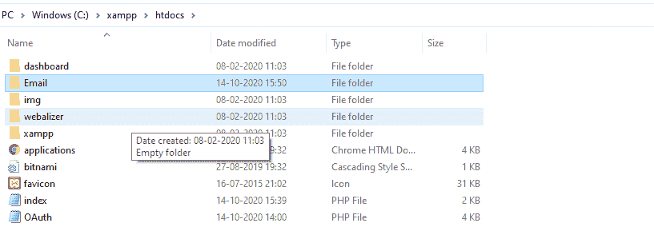
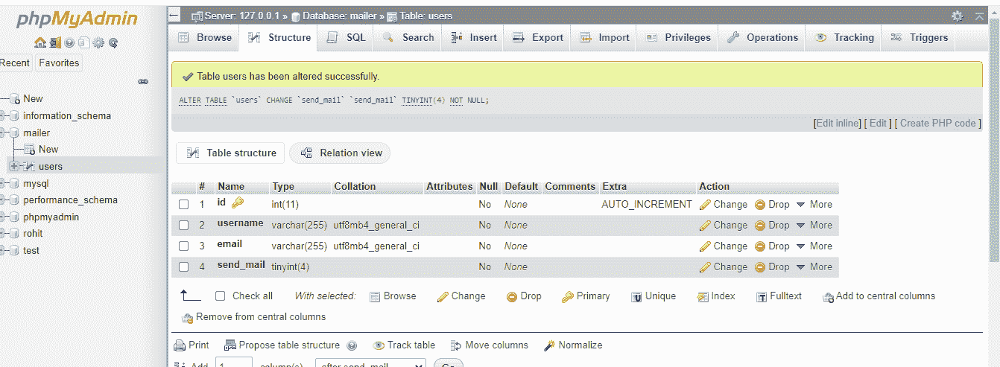
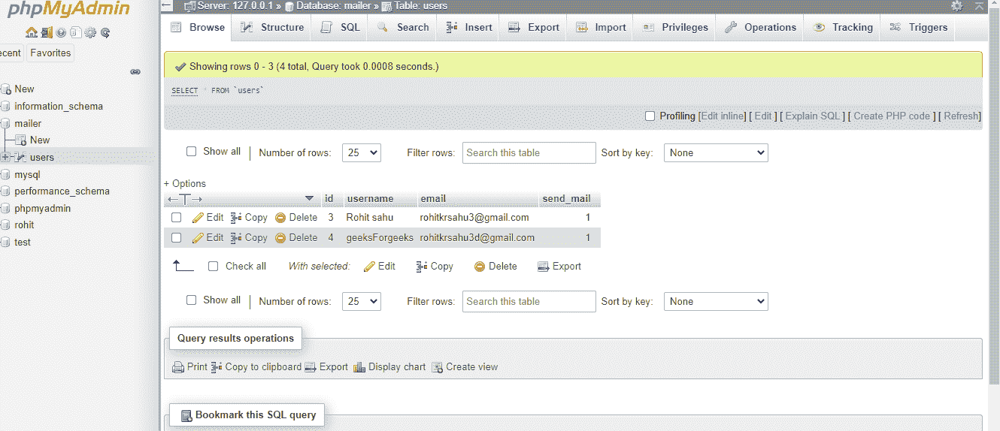
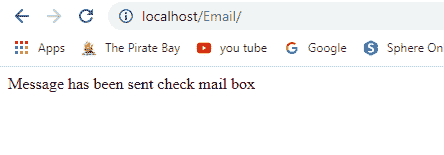
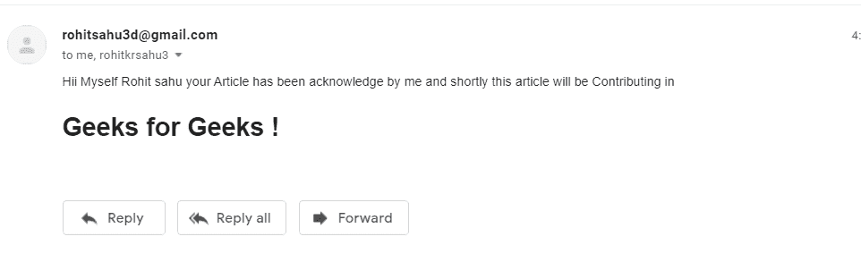
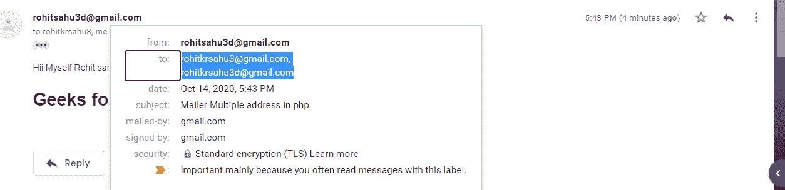

# PHP 中的邮件多地址

> 原文:[https://www . geesforgeks . org/mail-多地址 php/](https://www.geeksforgeeks.org/mailer-multiple-address-in-php/)

在本文中，我们将演示如何使用 PHP 将邮件从数据库发送到多个地址。

PHPMailer 库用于通过 XAMPP 网络服务器使用 PHP 代码将未知电子邮件中的任何电子邮件安全地发送给任何邮件 id。

本[中提到的所有先决条件的安装过程如何使用 PHPMailer](https://www.geeksforgeeks.org/how-to-send-an-email-using-phpmailer/) 链接发送电子邮件。

**先决条件:**本项目需要以下 PHP 文件。

*   phpmailerautoload . php
*   phpMailer.php
*   oauth . php
*   SMTP.php

请按照步骤操作。

1.  转到 **xampp** 文件夹的 **htdocs** 。创建如图所示的文件夹，然后将 PHPMailer 库安装到该文件夹中。

    

2.  创建“index.php”文件，代码实现应该在这里完成。

3.  创建数据库，这样我们就可以手动存储用户的 *email_ID* 。

    ```php
    db_name="mailer";
    table_name="users";

    ```

4.  创建 *dataBase= "邮件程序"*

    

5.  创建表名*“用户”*

    

    **PHP 代码:**

    ## 服务器端编程语言（Professional Hypertext Preprocessor 的缩写）

    ```php
    <?php

    $conn= mysqli_connect("localhost", 
                    "root", "", "mailer");

    require "PHPMailer.php";
    require "SMTP.php" ;
    require "PHPMailer-master/src/Exception.php" ;

    // Server settings
    $mail = new PHPMailer\PHPMailer\PHPMailer();

    // Enable verbose debug output
    $mail->isSMTP(); 

    // Send using SMTP
    $mail->Host = "smtp.gmail.com";
    $mail->SMTPAuth = true;

    // SMTP username
    $mail->Username = "YOUR SMTP USERNAME"; 

    // SMTP password                   
    $mail->Password = "YOUR PASSWORD";
    $mail->SMTPAuth = "tls";
    $mail->Port = 587;           

    //Recipients
    // This email-id will be taken
    // from your database
    $mail->setFrom("###");

    // Selecting the mail-id having
    // the send-mail =1
    $sql = "select * from users where send_mail=1";

    // Query for the makeing the connection.
    $res = mysqli_query($conn, $sql);

    if(mysqli_num_rows($res) > 0) {
        while($x = mysqli_fetch_assoc($res)) {
            $mail->addAddress($x['email']);
        }

        // Set email format to HTML
        $mail->isHTML(true);
        $mail->Subject = 
            "Mailer Multiple address in php";

        $mail->Body = "Hii </p>Myself </h1>Rohit 
        sahu</h1> your Article has been acknowledge 
        by me and shortly this article will be 
        contributing in</p> <h1>Geeks for Geeks !</h1>";

        $mail->AltBody = "Welcome to Geeks for geeks";

        if($mail->send())
        {
           echo "Message has been sent check mailbox"; 
        }
        else{
            echo "failure due to the google security";
        }
    } 

    ?>
    ```

    执行代码后，邮件将被发送到多个 id。

    **输出:**
    

    用户收到的电子邮件

    

    同时接收多个信号。

    