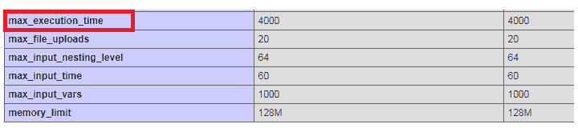

# 一个 PHP 脚本所花费的最大执行时间

> 原文:[https://www . geesforgeks . org/max-execution-time-by-a-PHP-script/](https://www.geeksforgeeks.org/maximum-execution-time-taken-by-a-php-script/)

PHP 程序的一个重要方面是执行一个脚本的最长时间是 30 秒。时间限制因托管公司而异，但最长执行时间在 30 到 60 秒之间。用户可能会因大量导入或导出文件或程序(包括向许多收件人发送邮件)而收到超过最长时间限制的错误。为了避免这种情况，您需要增加执行时间限制。

本文描述了如何更改或控制 PHP 脚本的最大执行时间。

**必需的先决条件:**
您已经在应用程序中设置了自定义的 *php.ini* 文件，或者必须向维护该文件的所有者提出请求。如果一些 PHP 脚本需要更长的时间，那么服务器就会停止并抛出一个错误:

```
Fatal error: Maximum execution time of..seconds exceeded in this_file.php on line...

```

为了避免这种情况，您可以在 *php.ini* 配置文件中更改 *max_execution_time* 指令。让我们看看用 PHP 设置脚本执行时间的方法。下面列出了这些内容:

*   Search for *max_execution_time* directive in the *php.ini* file and edit the value of it, as required by the PHP script.

    ```
    ; Maximum execution time of each script, in seconds
    ; http://php.net/max-execution-time
    ; Note: This directive is hardcoded to 0 for the CLI SAPI
    max_execution_time = 4000

    ```

    指令的默认值会根据需要进行更改。
    

    **注意:**一旦配置文件中的更改完成，我们必须重新启动网络服务器。通过此设置，配置对所有 PHP 脚本都是全局的。以不正确的方式对此文件进行更改会给 web 服务器或实时项目带来问题。

*   Use PHP inbuilt function set_time_limit(seconds) where seconds is the argument passed which is the time limit in seconds. It is used, when the user changes the setting outside the **php.ini** file. The function is called within your own PHP code. Use *set_time_limit(0)* when the *safe mode* is off.

    **注意:**如果函数在程序刚开始的时候被调用，那么传递给函数的值将是脚本执行的时间限制。否则，如果在代码中间调用该函数，则执行部分脚本，然后对脚本的其余部分应用时间限制。

*   Use PHP inbuilt function *ini_set(option, value)* where the paramaters are the given configuration option and the value to be set.

    ```
    // The program is executed for 3mns.
    <?php
    ini_set('max_execution_time', 180);
    ?>
    ```

    当您需要在运行时重写配置值时使用它。这个函数是从你自己的 PHP 代码中调用的，只会影响调用这个函数的脚本。当您想要为脚本设置无限执行时间时，请使用*init _ set(' max _ execution _ time ' 0)*。

    **注意:**当*安全模式*关闭时，使用 *init_set()* 功能。

    ```
    <?php
    // Sets to unlimited period of time
    ini_set('max_execution_time', 0);
    ?>
    ```

    **注意:**这个以‘0’为参数的函数不是很好的编程实践，但可以用于开发和测试目的。在将代码移动到实时或生产模式之前，请确保撤销设置。

*   为了允许永远运行脚本并忽略用户中止，设置 PHP 内置函数 *ignore_user_abort(true)。*默认情况下，它设置为 False，这将在客户端中止停止脚本时引发致命错误。

    ```
    <?php
    ignore_user_abort();
    ?>
    ```

*   Use *php_value* command to change the settings in Apache configuration files and *.htaccess* files.
    **Syntax:**

    ```
    php_value name value
    ```

    这将为指定的特定指令设置值。

    ```
    php_value max_execution_time 200
    ```

*   使用 cPanel 配置设置选项来更改脚本的执行时间。这可以在 cPanel 的仪表板中完成，并可用于设置 PHP 脚本的时间限制。